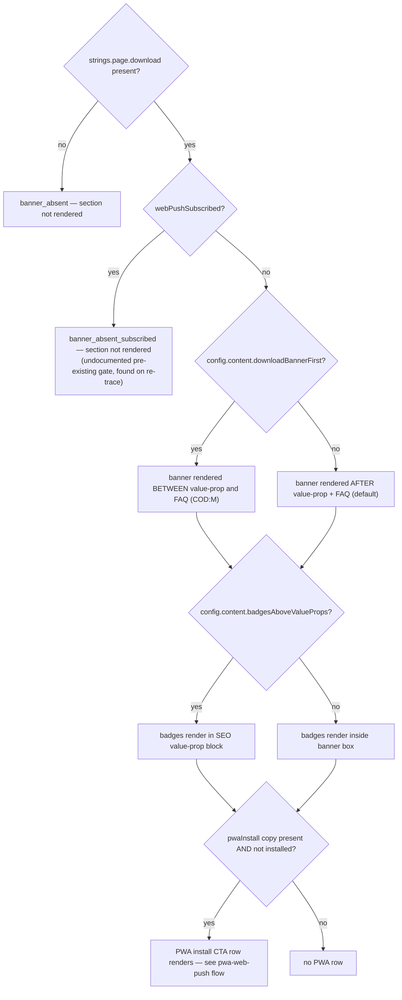
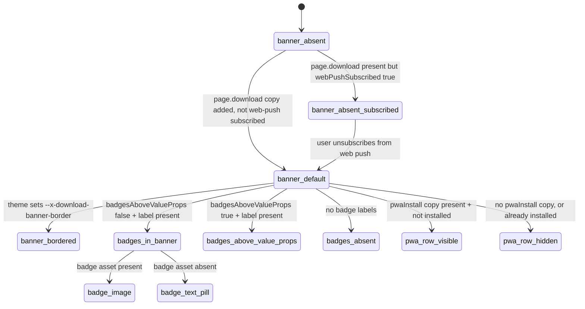

# Download Banner — App Store / Google Play / PWA Install

> Site-wide "get the app" banner: heading/body, optional PWA-install CTA row, optional store badges — one bordered box, no standalone component.

**This file is generated.** Every resolved token value below was read from the actual CSS in `src/tokens/` at export time — never hand-transcribed. Regenerate with `npm run handoff:export`. The live, always-current version of everything here is at `/handoff/download-banner` in the running prototype.

## 1. Components

### DownloadBanner (inline App.vue block)
Source: `src/App.vue:2280-2333`

No standalone .vue component — a real, isolated DownloadBanner component is the right call for a rebuild (this doc's prototype-vs-target note), but nothing here requires mirroring the "inline in the page template" structure. Box background is a per-store scrim gradient (derived from --x-bg-page, see notes.gotchas) over an optional background photo, so heading/body/badges stay legible over any art.

**Same value at every store:**

| Token | Value |
|---|---|
| `--x-fx-ripple-color-dark` | `oklch(0 0 0 / 0.15)` |
| `--x-pad-surface-xl` | `24px` |
| `--x-pad-surface-l` | `16px` |
| `--x-gap-content-default` | `8px` |
| `--x-gap-content-tight` | `2px` |
| `--x-gap-content-loose` | `12px` |
| `--x-gap-content-narrow` | `4px` |
| `--x-gap-content-separation` | `16px` |
| `--x-gap-control-m` | `8px` |
| `--x-size-control-m` | `40px` |
| `--border-weight-default` | `1px` |
| `--x-material-metal-gloss-shimmer-core` | `oklch(1 0 0 / 0.70)` |
| `--x-motion-sku-hover` | `150ms cubic-bezier(0.4, 0, 0.2, 1)` |

**Diverges per store:**

| Token | CODASHOP | CODM | DIABLOIMMORTAL | EFOOTBALL | FCM | MGSSE | PVZ3 | ROGUETRADER | TDR | YGODL | YGOMD | ZZZ |
|---|---|---|---|---|---|---|---|---|---|---|---|---|
| `--x-text-header-default` | `oklch(1.000 0.000 305)` | `oklch(0.992 0.003 286.4)` | `oklch(0.993 0.001 56.0)` | `oklch(1 0 0)` | `oklch(1 0 0)` | `oklch(0.975 0 0)` | `oklch(0.975 0.005 140)` | `oklch(0.972 0.03 80)` | `oklch(0.992 0.002 258)` | `oklch(0.992 0.002 255)` | `oklch(0.995 0.0024 279.3)` | `oklch(1 0 0)` |
| `--x-text-body-default` | `oklch(1.000 0.000 305)` | `oklch(0.992 0.003 286.4)` | `oklch(0.993 0.001 56.0)` | `oklch(1 0 0)` | `oklch(1 0 0)` | `oklch(0.975 0 0)` | `oklch(0.975 0.005 140)` | `oklch(0.972 0.03 80)` | `oklch(0.992 0.002 258)` | `oklch(0.992 0.002 255)` | `oklch(0.995 0.0024 279.3)` | `oklch(1 0 0)` |
| `--x-text-hyperlink-default` | `oklch(0.905 0.195 116)` | `oklch(0.919 0.192 101.8)` | `oklch(0.768 0.095 75.1)` | `oklch(0.968 0.211 109.8)` | `oklch(0.857 0.234 150)` | `oklch(0.583 0.198 142.5)` | `oklch(0.72 0.19 142.5)` | `oklch(0.672 0.142 133.1)` | `oklch(0.720 0.195 48)` | `oklch(0.550 0.215 264)` | `oklch(0.843 0.106 88.3)` | `oklch(0.910 0.246 128.9)` |
| `--x-text-on-primary` | `oklch(0.905 0.195 116)` | `oklch(0.241 0.012 278.0)` | `oklch(0.286 0.007 56.0)` | `oklch(0.494 0.283 269.5)` | `oklch(0.094 0.004 196.5)` | `oklch(0.225 0 0)` | `oklch(0.225 0.02 140)` | `oklch(0.225 0.011 80)` | `oklch(0.235 0.011 258)` | `oklch(0.225 0.018 255)` | `oklch(0.228 0.0301 279.3)` | `oklch(0.145 0 0)` |
| `--x-bg-action-primary` | `oklch(0.620 0.245 293)` | `oklch(0.919 0.192 101.8)` | `oklch(0.768 0.095 75.1)` | `oklch(0.968 0.211 109.8)` | `oklch(0.857 0.234 150)` | `oklch(0.583 0.198 142.5)` | `oklch(0.72 0.19 142.5)` | `oklch(0.672 0.142 133.1)` | `oklch(0.720 0.195 48)` | `oklch(0.550 0.215 264)` | `oklch(0.843 0.106 88.3)` | `oklch(0.910 0.246 128.9)` |
| `--x-border-card-default` | `oklch(1 0 0 / 0.08)` | `oklch(0.310 0.011 271.0)` | `oklch(0.297 0.085 33.9)` | `oklch(0.95 0 0)` | `oklch(0.158 0.002 197)` | `oklch(0.583 0.198 142.5 / 0.18)` | `oklch(0.3 0.02 140)` | `oklch(0.8 0.07 80 / 0.16)` | `oklch(0.300 0.010 258)` | `oklch(0.290 0.016 255)` | `oklch(0.843 0.106 88.3 / 0.18)` | `oklch(0.290 0 0)` |
| `--x-radius-container-l` | `16px` | `12px` | `0px` | `12px` | `12px` | `0px` | `12px` | `0px` | `12px` | `12px` | `0px` | `12px` |
| `--x-radius-control-full` | `999px` | `2px` | `0px` | `8px` | `999px` | `0px` | `2px` | `0px` | `2px` | `2px` | `999px` | `999px` |
| `--x-download-banner-border` | _(resolve live)_ | `1px solid oklch(0.310 0.011 271.0)` | _(resolve live)_ | _(resolve live)_ | _(resolve live)_ | _(resolve live)_ | _(resolve live)_ | _(resolve live)_ | _(resolve live)_ | _(resolve live)_ | _(resolve live)_ | `1px solid oklch(0.290 0 0)` |
| `--x-gradient-download-banner-scrim` | `linear-gradient(0deg, oklch(0.180 0.035 305) 0%, color-mix(in oklab, oklch(0.180 0.035 305) 70%, transparent) 100%)` | `linear-gradient(0deg, oklch(0.166 0.017 273.5) 0%, color-mix(in oklab, oklch(0.166 0.017 273.5) 70%, transparent) 100%)` | `linear-gradient(0deg, oklch(0.207 0.006 56.0) 0%, color-mix(in oklab, oklch(0.207 0.006 56.0) 70%, transparent) 100%)` | `linear-gradient(0deg, oklch(0.231 0.160 264.1) 0%, color-mix(in oklab, oklch(0.231 0.160 264.1) 70%, transparent) 100%)` | `linear-gradient(0deg, oklch(0 0 0) 0%, color-mix(in oklab, oklch(0 0 0) 70%, transparent) 100%)` | `linear-gradient(0deg, oklch(0.134 0.0 0) 0%, color-mix(in oklab, oklch(0.134 0.0 0) 70%, transparent) 100%)` | `linear-gradient(0deg, oklch(0.2 0.02 140) 0%, color-mix(in oklab, oklch(0.2 0.02 140) 70%, transparent) 100%)` | `linear-gradient(0deg, oklch(0.147 0.003 17.6) 0%, color-mix(in oklab, oklch(0.147 0.003 17.6) 70%, transparent) 100%)` | `linear-gradient(0deg, oklch(0.165 0.012 258) 0%, color-mix(in oklab, oklch(0.165 0.012 258) 70%, transparent) 100%)` | `linear-gradient(0deg, oklch(0.160 0.020 255) 0%, color-mix(in oklab, oklch(0.160 0.020 255) 70%, transparent) 100%)` | `linear-gradient(0deg, oklch(0.163 0.033 279.3) 0%, color-mix(in oklab, oklch(0.163 0.033 279.3) 70%, transparent) 100%)` | `linear-gradient( 0deg, color-mix(in oklab, oklch(0 0 0) 55%, transparent) 0%, color-mix(in oklab, oklch(0 0 0) 25%, transparent) 100% )` |

### Badges (banner-mounted)
Source: `src/App.vue:2929-2942 (banner mount point)`

One badges partial, two mount points (here, and the SEO value-prop block below) — same classes, same v-if guard on the labels, never a second implementation. Each badge (App Store / Google Play) independently falls back to a text pill when its asset is absent.

**Same value at every store:**

| Token | Value |
|---|---|
| `--x-fx-ripple-color-dark` | `oklch(0 0 0 / 0.15)` |
| `--x-size-control-m` | `40px` |
| `--border-weight-default` | `1px` |
| `--x-motion-sku-hover` | `150ms cubic-bezier(0.4, 0, 0.2, 1)` |

**Diverges per store:**

| Token | CODASHOP | CODM | DIABLOIMMORTAL | EFOOTBALL | FCM | MGSSE | PVZ3 | ROGUETRADER | TDR | YGODL | YGOMD | ZZZ |
|---|---|---|---|---|---|---|---|---|---|---|---|---|
| `--x-text-hyperlink-default` | `oklch(0.905 0.195 116)` | `oklch(0.919 0.192 101.8)` | `oklch(0.768 0.095 75.1)` | `oklch(0.968 0.211 109.8)` | `oklch(0.857 0.234 150)` | `oklch(0.583 0.198 142.5)` | `oklch(0.72 0.19 142.5)` | `oklch(0.672 0.142 133.1)` | `oklch(0.720 0.195 48)` | `oklch(0.550 0.215 264)` | `oklch(0.843 0.106 88.3)` | `oklch(0.910 0.246 128.9)` |
| `--x-bg-action-primary` | `oklch(0.620 0.245 293)` | `oklch(0.919 0.192 101.8)` | `oklch(0.768 0.095 75.1)` | `oklch(0.968 0.211 109.8)` | `oklch(0.857 0.234 150)` | `oklch(0.583 0.198 142.5)` | `oklch(0.72 0.19 142.5)` | `oklch(0.672 0.142 133.1)` | `oklch(0.720 0.195 48)` | `oklch(0.550 0.215 264)` | `oklch(0.843 0.106 88.3)` | `oklch(0.910 0.246 128.9)` |
| `--x-border-card-default` | `oklch(1 0 0 / 0.08)` | `oklch(0.310 0.011 271.0)` | `oklch(0.297 0.085 33.9)` | `oklch(0.95 0 0)` | `oklch(0.158 0.002 197)` | `oklch(0.583 0.198 142.5 / 0.18)` | `oklch(0.3 0.02 140)` | `oklch(0.8 0.07 80 / 0.16)` | `oklch(0.300 0.010 258)` | `oklch(0.290 0.016 255)` | `oklch(0.843 0.106 88.3 / 0.18)` | `oklch(0.290 0 0)` |
| `--x-radius-control-full` | `999px` | `2px` | `0px` | `8px` | `999px` | `0px` | `2px` | `0px` | `2px` | `2px` | `999px` | `999px` |

### Badges (SEO-value-prop-mounted)
Source: `src/App.vue:2229-2261`

Structurally identical markup to the banner-mounted badges (same classes, same v-if on the labels) — mounted inside the SEO value-prop section instead, gated on config.content.badgesAboveValueProps. This block's v-if is nested inside the SEO section's own v-if="strings.page.seo" guard — a store enabling badgesAboveValueProps without SEO copy gets no badges anywhere (see notes.gotchas).

**Same value at every store:**

| Token | Value |
|---|---|
| `--x-size-control-m` | `40px` |

**Diverges per store:**

| Token | CODASHOP | CODM | DIABLOIMMORTAL | EFOOTBALL | FCM | MGSSE | PVZ3 | ROGUETRADER | TDR | YGODL | YGOMD | ZZZ |
|---|---|---|---|---|---|---|---|---|---|---|---|---|
| `--x-text-hyperlink-default` | `oklch(0.905 0.195 116)` | `oklch(0.919 0.192 101.8)` | `oklch(0.768 0.095 75.1)` | `oklch(0.968 0.211 109.8)` | `oklch(0.857 0.234 150)` | `oklch(0.583 0.198 142.5)` | `oklch(0.72 0.19 142.5)` | `oklch(0.672 0.142 133.1)` | `oklch(0.720 0.195 48)` | `oklch(0.550 0.215 264)` | `oklch(0.843 0.106 88.3)` | `oklch(0.910 0.246 128.9)` |
| `--x-bg-action-primary` | `oklch(0.620 0.245 293)` | `oklch(0.919 0.192 101.8)` | `oklch(0.768 0.095 75.1)` | `oklch(0.968 0.211 109.8)` | `oklch(0.857 0.234 150)` | `oklch(0.583 0.198 142.5)` | `oklch(0.72 0.19 142.5)` | `oklch(0.672 0.142 133.1)` | `oklch(0.720 0.195 48)` | `oklch(0.550 0.215 264)` | `oklch(0.843 0.106 88.3)` | `oklch(0.910 0.246 128.9)` |
| `--x-border-card-default` | `oklch(1 0 0 / 0.08)` | `oklch(0.310 0.011 271.0)` | `oklch(0.297 0.085 33.9)` | `oklch(0.95 0 0)` | `oklch(0.158 0.002 197)` | `oklch(0.583 0.198 142.5 / 0.18)` | `oklch(0.3 0.02 140)` | `oklch(0.8 0.07 80 / 0.16)` | `oklch(0.300 0.010 258)` | `oklch(0.290 0.016 255)` | `oklch(0.843 0.106 88.3 / 0.18)` | `oklch(0.290 0 0)` |
| `--x-radius-control-full` | `999px` | `2px` | `0px` | `8px` | `999px` | `0px` | `2px` | `0px` | `2px` | `2px` | `999px` | `999px` |

### PWA install CTA row
Source: `src/App.vue:2302-2308`

Visibility only — the CTA's own click behaviour and install state machine are FULLY OWNED by pwa-web-push.flow.js; this flow never re-derives promptInstall/shouldOfferIos/IosInstallSheet logic. Uses fx-shimmer fx-shimmer--metal-gloss (material-fx skill) with --x-material-metal-gloss-shimmer-core set to --x-bg-action-primary, making it the visually dominant action in the banner — deliberately outranking the plain badge pills below it.

**Same value at every store:**

| Token | Value |
|---|---|
| `--x-fx-ripple-color-dark` | `oklch(0 0 0 / 0.15)` |
| `--x-gap-content-loose` | `12px` |
| `--x-gap-content-narrow` | `4px` |
| `--x-gap-control-m` | `8px` |
| `--x-size-control-m` | `40px` |
| `--x-motion-sku-hover` | `150ms cubic-bezier(0.4, 0, 0.2, 1)` |
| `--x-material-metal-gloss-shimmer-core` | `oklch(1 0 0 / 0.70)` |

**Diverges per store:**

| Token | CODASHOP | CODM | DIABLOIMMORTAL | EFOOTBALL | FCM | MGSSE | PVZ3 | ROGUETRADER | TDR | YGODL | YGOMD | ZZZ |
|---|---|---|---|---|---|---|---|---|---|---|---|---|
| `--x-text-on-primary` | `oklch(0.905 0.195 116)` | `oklch(0.241 0.012 278.0)` | `oklch(0.286 0.007 56.0)` | `oklch(0.494 0.283 269.5)` | `oklch(0.094 0.004 196.5)` | `oklch(0.225 0 0)` | `oklch(0.225 0.02 140)` | `oklch(0.225 0.011 80)` | `oklch(0.235 0.011 258)` | `oklch(0.225 0.018 255)` | `oklch(0.228 0.0301 279.3)` | `oklch(0.145 0 0)` |
| `--x-bg-action-primary` | `oklch(0.620 0.245 293)` | `oklch(0.919 0.192 101.8)` | `oklch(0.768 0.095 75.1)` | `oklch(0.968 0.211 109.8)` | `oklch(0.857 0.234 150)` | `oklch(0.583 0.198 142.5)` | `oklch(0.72 0.19 142.5)` | `oklch(0.672 0.142 133.1)` | `oklch(0.720 0.195 48)` | `oklch(0.550 0.215 264)` | `oklch(0.843 0.106 88.3)` | `oklch(0.910 0.246 128.9)` |
| `--x-radius-control-full` | `999px` | `2px` | `0px` | `8px` | `999px` | `0px` | `2px` | `0px` | `2px` | `2px` | `999px` | `999px` |

## 2. State inventory

| State | Description | Entry | Exit |
|---|---|---|---|
| `banner_absent` | #download-banner section does not render at all — no DOM, not just hidden. | strings.page.download is falsy | store adds page.download copy |
| `banner_absent_subscribed` | Section does not render even though strings.page.download IS present. NOT documented in the prior hand-written spec — found during this flow's re-trace. | webPushSubscribed (useWebPush()) is true | user unsubscribes from web push |
| `banner_default` | Box background = --x-gradient-download-banner-scrim over optional background image, no visible border. | strings.page.download present, !webPushSubscribed, --x-download-banner-border unset for the theme | never (base state, combines with all below) |
| `banner_bordered` | 1px solid hairline border around the box, colour = theme's --x-border-card-default. | theme defines --x-download-banner-border (CODM, ZZZ today) | theme removes the override |
| `bg_image_present` | Banner background shows the art (cover, centred) under the scrim gradient. | storeAssets.content.downloadBannerBg supplies an asset | asset removed |
| `bg_image_absent` | Banner shows only the flat scrim gradient, no photo. | no downloadBannerBg asset | asset added |
| `badges_in_banner` | Badges row renders inside .download-banner__copy, directly under the PWA row / body. | !config.content?.badgesAboveValueProps AND (appStoreLabel or googlePlayLabel present) | flag flips true |
| `badges_above_value_props` | Badges row renders in the SEO value-prop section instead, right after the benefit grid; the banner box itself has NO badges row in this state. | config.content?.badgesAboveValueProps true AND (appStoreLabel or googlePlayLabel present) | flag flips false |
| `badges_absent` | No badges row renders in EITHER placement — both v-if guards share this same OR condition. | neither appStoreLabel nor googlePlayLabel present | either label added |
| `badge_image` | Badge renders as an  at --x-size-control-m height, width: auto. Per-badge, independent for App Store vs Google Play. | storeAssets.content.appStoreBadge / googlePlayBadge supplies an asset | asset removed |
| `badge_text_pill` | Badge renders as a bordered pill () with the label text. | corresponding badge asset absent | asset added |
| `pwa_row_visible` | PWA install CTA row renders above the badges, inside .download-banner__copy. See pwa-web-push.flow.js for what happens after tap. | strings.page.pwaInstall present AND !pwaInstalled | pwaInstalled flips true, or the copy is removed |
| `pwa_row_hidden` | Row does not render; badges (if any) sit directly under the body text instead. | no pwaInstall copy, or pwaInstalled already true | — |

Total states: **13**

## 3. Transitions

| From | To | Trigger | Motion tokens |
|---|---|---|---|
| `badge_image` | `badge_image` | pointer over, pointer-fine (hover) | `--x-motion-sku-hover` |
| `badge_text_pill` | `badge_text_pill` | pointer over, pointer-fine (hover) | `--x-motion-sku-hover` |
| `pwa_row_visible` | `pwa_row_visible` | pointer over, pointer-fine (hover) — filter: brightness(1.05) | `--x-motion-sku-hover` |
| `banner_absent_subscribed` | `banner_default` | user unsubscribes from web push (webPushSubscribed flips false) — instant re-render, no transition |  |

## 4. Choreography

| Beat | Delay | Duration token | Resolved (per store) | Easing token | Resolved (per store) | Target |
|---|---|---|---|---|---|---|

## 5. User flow

## 6. State diagram

## 7. Notes (authored)

**Rationale:** Migrated from the hand-written docs/Handoff/download-banner/ (re-traced 2026-09-12). Pure render-time content/config feature, no choreography. The PWA-install CTA row is a visibility gate only — its own state machine is fully owned by pwa-web-push.flow.js; wire the CTA's click behaviour from that flow's build order, never re-derive it here.

**Build order:**
1. Static banner structure & content-gated rendering (banner_absent, banner_absent_subscribed, banner_default, bg_image_present/absent) — render nothing when content is absent OR the visitor is web-push subscribed.
2. Badge rendering & placement variant (badges_in_banner, badges_above_value_props, badges_absent, badge_image, badge_text_pill) — one badges component, two mount points, per-badge independent fallback.
3. PWA install CTA row (pwa_row_visible, pwa_row_hidden) — visibility gate only; wire click behaviour and the install state machine entirely from pwa-web-push.flow.js's own build order.
4. Section ordering variant (downloadBannerFirst) — support both mount positions from one config flag, no markup duplication.

**Gotchas:**
- REAL DRIFT vs. the retired hand-written spec: the section's own v-if now also gates on !webPushSubscribed (App.vue ~L2280) — a visitor already subscribed to web push never sees this banner at all, even with page.download content present. No source comment explains the rationale; carried forward as banner_absent_subscribed pending a reviewer's call (see openQuestions).
- The badges row's top margin is a DERIVED value: --x-gap-content-separation (16px) minus the parent's own flex gap (--x-gap-content-default, 8px already applied) — the combined space above the badges lands at 16px total, not 16px stacked on an existing 8px (24px). Don't port either literal without checking what gap it stacks on top of.
- badgesAboveValueProps true but strings.page.seo absent: the badges-above block lives inside the SEO section's own v-if="strings.page.seo" guard, so a store setting the flag without SEO copy gets no badges anywhere — not in the banner either, since the flag suppressed that placement.
- --x-gradient-download-banner-scrim is store-specific by construction (colour-mix derived from that store's own --x-bg-page) — map it as "page-background-tinted scrim over the banner art," never as a literal colour to copy per-store.
- The PWA CTA is deliberately the visually dominant action (solid shimmer pill) over the plain badge pills below it — preserve that hierarchy: install-CTA first, app-store badges secondary.
- No custom :focus-visible treatment exists anywhere in this feature (badges or PWA CTA) — browser default outline applies. A real, verified gap, not an intentional "keep it invisible" choice.
- No broken-image fallback exists for appStoreBadge/googlePlayBadge assets (no @error handler) — a broken URL renders a broken-image icon, not the text pill.

**Prohibitions:**
- Never copy App.vue wholesale or mirror "inline template block" as the target architecture — build a real, isolated component.
- Never re-derive a second PWA-install state machine here — pwa-web-push.flow.js is the sole authority once the CTA is tapped.
- Never duplicate the badges markup/logic between the two mount points — one component, two mount points.
- Never substitute a visually-similar token for a missing semantic role — add the role.

**Open questions:**
- Why does webPushSubscribed suppress the ENTIRE banner (not just the PWA row)? No source comment explains this. Is the assumption "once subscribed to push, the download-banner's job is redundant," or is this an unrelated interaction that happens to share a condition? Non-blocking — carry the gate forward as observed until a reviewer confirms the intent.
- If badgesAboveValueProps is true but strings.page.seo is absent, badges render nowhere. Acceptable configuration constraint (a store must supply both or neither), or should a rebuild decouple the two? Non-blocking.
- No :focus-visible styling exists for badges or the PWA CTA — intentional silence, or a gap to close in a rebuild? Non-blocking.

## 8. Constraints & prohibitions

- Never hardcode a resolved literal that a token above already provides — map to the equivalent semantic token in your system.
- Every state in §2 must be reachable in your rebuild. A missing state is an incomplete task.
- Cross-check the live oracle at `/handoff/download-banner` in the running prototype before treating this static export as final — it is a snapshot, the live surface is the source of truth at any given moment.

## 9. Verification

| # | State | Reachable | Matches reference |
|---|---|---|---|
| 1 | `banner_absent` | ☐ | ☐ |
| 2 | `banner_absent_subscribed` | ☐ | ☐ |
| 3 | `banner_default` | ☐ | ☐ |
| 4 | `banner_bordered` | ☐ | ☐ |
| 5 | `bg_image_present` | ☐ | ☐ |
| 6 | `bg_image_absent` | ☐ | ☐ |
| 7 | `badges_in_banner` | ☐ | ☐ |
| 8 | `badges_above_value_props` | ☐ | ☐ |
| 9 | `badges_absent` | ☐ | ☐ |
| 10 | `badge_image` | ☐ | ☐ |
| 11 | `badge_text_pill` | ☐ | ☐ |
| 12 | `pwa_row_visible` | ☐ | ☐ |
| 13 | `pwa_row_hidden` | ☐ | ☐ |
