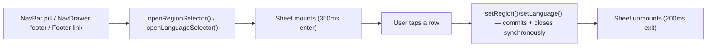
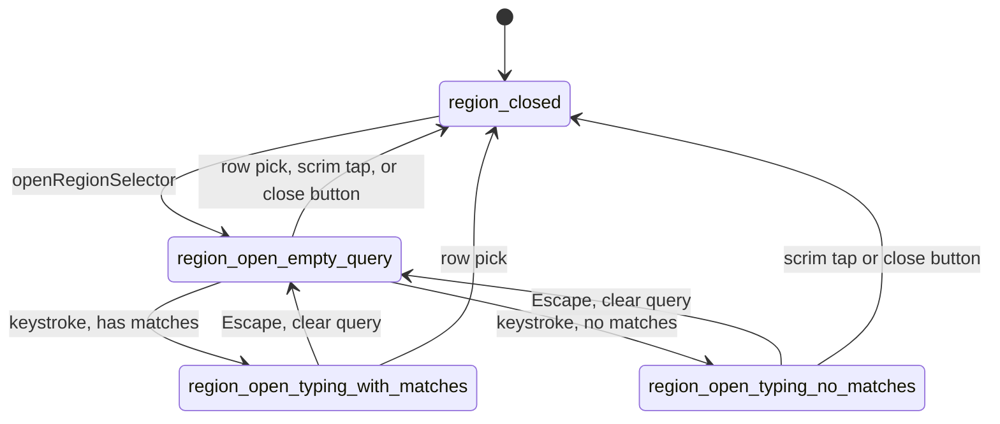

# Locale Selector Sheets

> Region & language picker sheets — searchable market list + flat language list.

**This file is generated.** Every resolved token value below was read from the actual CSS in `src/tokens/` at export time — never hand-transcribed. Regenerate with `npm run handoff:export`. The live, always-current version of everything here is at `/handoff/locale-selector-sheets` in the running prototype.

## 1. Components

### RegionSelectorSheet
Source: `src/components/RegionSelectorSheet.vue`

Searchable, continent-grouped market picker. Search never filters the visible list — it opens a separate floating typeahead card.

**Same value at every store:**

| Token | Value |
|---|---|
| `--x-text-header-strong` | `oklch(1 0 0)` |
| `--x-bg-input-default` | `oklch(0 0 0 / 0.10)` |
| `--x-pad-surface-l` | `16px` |
| `--x-pad-surface-m` | `12px` |
| `--x-pad-surface-s` | `8px` |
| `--x-pad-surface-xl` | `24px` |
| `--x-gap-content-default` | `8px` |
| `--x-gap-content-narrow` | `4px` |
| `--x-gap-content-loose` | `12px` |
| `--x-gap-content-separation` | `16px` |
| `--x-size-icon-l` | `24px` |
| `--x-size-icon-m` | `20px` |
| `--x-size-img-xl` | `64px` |
| `--border-weight-default` | `1px` |
| `--x-shadow-sheet` | `0 -8px 16px oklch(0.17 0.02 80 / 0.30)` |
| `--x-motion-modal-enter` | `350ms cubic-bezier(0, 0, 0.2, 1)` |
| `--x-motion-modal-exit` | `200ms cubic-bezier(0.4, 0, 1, 1)` |
| `--x-motion-sku-hover` | `150ms cubic-bezier(0.4, 0, 0.2, 1)` |
| `--x-motion-hover` | `150ms cubic-bezier(0.4, 0, 0.2, 1)` |
| `--x-motion-ripple` | `350ms` |

**Diverges per store:**

| Token | CODASHOP | CODM | DIABLOIMMORTAL | EFOOTBALL | FCM | MGSSE | PVZ3 | ROGUETRADER | TDR | YGODL | YGOMD | ZZZ |
|---|---|---|---|---|---|---|---|---|---|---|---|---|
| `--x-scrim` | `color-mix(in oklab, oklch(0.180 0.035 305) 60%, transparent)` | `color-mix(in oklab, oklch(0.166 0.017 273.5) 60%, transparent)` | `color-mix(in oklab, oklch(0.207 0.006 56.0) 60%, transparent)` | `color-mix(in oklab, oklch(0.231 0.160 264.1) 60%, transparent)` | `color-mix(in oklab, oklch(0 0 0) 60%, transparent)` | `color-mix(in oklab, oklch(0.134 0.0 0) 60%, transparent)` | `color-mix(in oklab, oklch(0.2 0.02 140) 60%, transparent)` | `color-mix(in oklab, oklch(0.147 0.003 17.6) 60%, transparent)` | `color-mix(in oklab, oklch(0.165 0.012 258) 60%, transparent)` | `color-mix(in oklab, oklch(0.160 0.020 255) 60%, transparent)` | `color-mix(in oklab, oklch(0.163 0.033 279.3) 60%, transparent)` | `color-mix(in oklab, oklch(0 0 0) 60%, transparent)` |
| `--x-bg-sheet` | `linear-gradient(0deg, oklch(0.377 0.010 278 / 0.08), oklch(0.786 0.006 275 / 0.08))` | `linear-gradient(0deg, oklch(0.377 0.010 278 / 0.08), oklch(0.786 0.006 275 / 0.08))` | `url("data:image/svg+xml,%3Csvg%20xmlns%3D%22http%3A//www.w3.org/2000/svg%22%20width%3D%2296%22%20height%3D%2296%22%3E%3Cfilter%20id%3D%22n%22%3E%3CfeTurbulence%20type%3D%22fractalNoise%22%20baseFrequency%3D%220.75%22%20numOctaves%3D%222%22%20stitchTiles%3D%22stitch%22%20result%3D%22t%22/%3E%3CfeColorMatrix%20in%3D%22t%22%20type%3D%22matrix%22%20values%3D%220%200%200%200%200%20%200%200%200%200%200%20%200%200%200%200%200%20%200.9%200.9%200.9%200%200%22/%3E%3CfeComponentTransfer%3E%3CfeFuncA%20type%3D%22linear%22%20slope%3D%220.09%22/%3E%3C/feComponentTransfer%3E%3C/filter%3E%3Crect%20width%3D%22100%25%22%20height%3D%22100%25%22%20filter%3D%22url%28%23n%29%22/%3E%3C/svg%3E"), linear-gradient(0deg, oklch(0.239 0.059 33.9), oklch(0.239 0.059 33.9))` | `linear-gradient( oklch(0.304 0.211 264.1 / 0.60), oklch(0.304 0.211 264.1 / 0.60) )` | `linear-gradient(180deg, oklch(0.95 0 0 / 0.08) 0%, oklch(0.81 0 0 / 0.08) 100%), linear-gradient(180deg, oklch(0.047 0 0 / 0.6), oklch(0.047 0 0 / 0.6))` | `oklch(0.225 0 0)` | `linear-gradient(0deg, oklch(0.377 0.010 278 / 0.08), oklch(0.786 0.006 275 / 0.08))` | `linear-gradient(0deg, oklch(0.225 0.011 80 / 0.55), oklch(0.3 0.011 80 / 0.55))` | `linear-gradient(0deg, oklch(0.370 0.009 258 / 0.08), oklch(0.786 0.005 258 / 0.08))` | `linear-gradient(to bottom, oklch(0 0 0 / 0.56) 24.519%, oklch(0 0 0 / 0.88))` | `oklch(0.228 0.0301 279.3)` | `oklch(0 0 0)` |
| `--x-bg-page` | `oklch(0.180 0.035 305)` | `oklch(0.166 0.017 273.5)` | `oklch(0.207 0.006 56.0)` | `oklch(0.231 0.160 264.1)` | `oklch(0 0 0)` | `oklch(0.134 0.0 0)` | `oklch(0.2 0.02 140)` | `oklch(0.147 0.003 17.6)` | `oklch(0.165 0.012 258)` | `oklch(0.160 0.020 255)` | `oklch(0.163 0.033 279.3)` | `oklch(0 0 0)` |
| `--x-border-sheet` | `oklch(1 0 0 / 0.16)` | `oklch(1 0 0 / 0.16)` | `oklch(0.297 0.085 33.9)` | `oklch(0.95 0 0 / 0.12)` | `oklch(0.95 0 0 / 0.08)` | `oklch(0.583 0.198 142.5 / 0.18)` | `oklch(1 0 0 / 0.16)` | `oklch(0.82 0.07 80 / 0.22)` | `oklch(1 0 0 / 0.16)` | `oklch(1 0 0 / 0.16)` | `oklch(0.843 0.106 88.3 / 0.18)` | `oklch(0.290 0 0)` |
| `--x-text-header-default` | `oklch(1.000 0.000 305)` | `oklch(0.992 0.003 286.4)` | `oklch(0.993 0.001 56.0)` | `oklch(1 0 0)` | `oklch(1 0 0)` | `oklch(0.975 0 0)` | `oklch(0.975 0.005 140)` | `oklch(0.972 0.03 80)` | `oklch(0.992 0.002 258)` | `oklch(0.992 0.002 255)` | `oklch(0.995 0.0024 279.3)` | `oklch(1 0 0)` |
| `--x-text-body-default` | `oklch(1.000 0.000 305)` | `oklch(0.992 0.003 286.4)` | `oklch(0.993 0.001 56.0)` | `oklch(1 0 0)` | `oklch(1 0 0)` | `oklch(0.975 0 0)` | `oklch(0.975 0.005 140)` | `oklch(0.972 0.03 80)` | `oklch(0.992 0.002 258)` | `oklch(0.992 0.002 255)` | `oklch(0.995 0.0024 279.3)` | `oklch(1 0 0)` |
| `--x-text-placeholder` | `oklch(0.795 0.009 305)` | `oklch(0.584 0.008 277.1)` | `oklch(0.759 0.002 56.0)` | `oklch(0.561 0.154 280.2)` | `oklch(0.455 0.006 106.6)` | `oklch(0.585 0 0)` | `oklch(0.585 0.014 140)` | `oklch(0.585 0.01 80)` | `oklch(0.580 0.007 258)` | `oklch(0.580 0.010 255)` | `oklch(0.583 0.0167 279.3)` | `oklch(0.590 0 0)` |
| `--x-border-input-default` | `oklch(0.539 0.020 305)` | `oklch(0.377 0.010 278.3)` | `oklch(0.444 0.006 56.0)` | `oklch(0.364 0.217 268.7)` | `oklch(0.199 0.002 197)` | `oklch(0.375 0 0)` | `oklch(0.375 0.018 140)` | `oklch(0.375 0.011 80)` | `oklch(0.370 0.009 258)` | `oklch(0.360 0.014 255)` | `oklch(0.363 0.0234 279.3)` | `oklch(0.290 0 0)` |
| `--x-border-input-focused` | `oklch(0.620 0.245 293)` | `oklch(0.919 0.192 101.8)` | `oklch(0.768 0.095 75.1)` | `oklch(0.968 0.211 109.8)` | `oklch(0.857 0.234 150)` | `oklch(0.583 0.198 142.5)` | `oklch(0.72 0.19 142.5)` | `oklch(0.672 0.142 133.1)` | `oklch(0.720 0.195 48)` | `oklch(0.550 0.215 264)` | `oklch(0.843 0.106 88.3)` | `oklch(0.910 0.246 128.9)` |
| `--x-bg-card-default` | `linear-gradient(0deg, oklch(0.377 0.010 278 / 0.08), oklch(0.786 0.006 275 / 0.08))` | `linear-gradient(0deg, oklch(0.377 0.010 278 / 0.08), oklch(0.786 0.006 275 / 0.08))` | `url("data:image/svg+xml,%3Csvg%20xmlns%3D%22http%3A//www.w3.org/2000/svg%22%20width%3D%2296%22%20height%3D%2296%22%3E%3Cfilter%20id%3D%22n%22%3E%3CfeTurbulence%20type%3D%22fractalNoise%22%20baseFrequency%3D%220.75%22%20numOctaves%3D%222%22%20stitchTiles%3D%22stitch%22%20result%3D%22t%22/%3E%3CfeColorMatrix%20in%3D%22t%22%20type%3D%22matrix%22%20values%3D%220%200%200%200%200%20%200%200%200%200%200%20%200%200%200%200%200%20%200.9%200.9%200.9%200%200%22/%3E%3CfeComponentTransfer%3E%3CfeFuncA%20type%3D%22linear%22%20slope%3D%220.09%22/%3E%3C/feComponentTransfer%3E%3C/filter%3E%3Crect%20width%3D%22100%25%22%20height%3D%22100%25%22%20filter%3D%22url%28%23n%29%22/%3E%3C/svg%3E"), linear-gradient(0deg, oklch(0.239 0.059 33.9), oklch(0.239 0.059 33.9))` | `linear-gradient( oklch(0.304 0.211 264.1 / 0.60), oklch(0.304 0.211 264.1 / 0.60) )` | `linear-gradient(180deg, oklch(0.95 0 0 / 0.08) 0%, oklch(0.81 0 0 / 0.08) 100%), linear-gradient(180deg, oklch(0.047 0 0 / 0.6), oklch(0.047 0 0 / 0.6))` | `oklch(0.225 0 0)` | `linear-gradient(0deg, oklch(0.377 0.010 278 / 0.08), oklch(0.786 0.006 275 / 0.08))` | `linear-gradient(0deg, oklch(0.225 0.011 80 / 0.55), oklch(0.3 0.011 80 / 0.55))` | `linear-gradient(0deg, oklch(0.370 0.009 258 / 0.08), oklch(0.786 0.005 258 / 0.08))` | `linear-gradient(to bottom, oklch(0 0 0 / 0.56) 24.519%, oklch(0 0 0 / 0.88))` | `oklch(0.228 0.0301 279.3)` | `oklch(0 0 0)` |
| `--x-border-card-default` | `oklch(1 0 0 / 0.08)` | `oklch(0.310 0.011 271.0)` | `oklch(0.297 0.085 33.9)` | `oklch(0.95 0 0)` | `oklch(0.158 0.002 197)` | `oklch(0.583 0.198 142.5 / 0.18)` | `oklch(0.3 0.02 140)` | `oklch(0.8 0.07 80 / 0.16)` | `oklch(0.300 0.010 258)` | `oklch(0.290 0.016 255)` | `oklch(0.843 0.106 88.3 / 0.18)` | `oklch(0.290 0 0)` |
| `--x-bg-indicator-neutral-default` | `oklch(0.539 0.020 305)` | `oklch(0.377 0.010 278.3)` | `oklch(0.444 0.006 56.0)` | `oklch(0.364 0.217 268.7)` | `oklch(0.199 0.002 197)` | `oklch(0.375 0 0)` | `oklch(0.375 0.018 140)` | `oklch(0.375 0.011 80)` | `oklch(0.370 0.009 258)` | `oklch(0.360 0.014 255)` | `oklch(0.363 0.0234 279.3)` | `oklch(0.290 0 0)` |
| `--x-gradient-scroll-fade-bottom` | `linear-gradient(to top, color-mix(in oklab, oklch(0.180 0.035 305) 80%, transparent) 0%, transparent 100%)` | `linear-gradient(to top, color-mix(in oklab, oklch(0.166 0.017 273.5) 80%, transparent) 0%, transparent 100%)` | `linear-gradient(to top, color-mix(in oklab, oklch(0.207 0.006 56.0) 80%, transparent) 0%, transparent 100%)` | `linear-gradient(to top, color-mix(in oklab, oklch(0.231 0.160 264.1) 80%, transparent) 0%, transparent 100%)` | `linear-gradient(to top, color-mix(in oklab, oklch(0 0 0) 80%, transparent) 0%, transparent 100%)` | `linear-gradient(to top, color-mix(in oklab, oklch(0.134 0.0 0) 80%, transparent) 0%, transparent 100%)` | `linear-gradient(to top, color-mix(in oklab, oklch(0.2 0.02 140) 80%, transparent) 0%, transparent 100%)` | `linear-gradient(to top, color-mix(in oklab, oklch(0.147 0.003 17.6) 80%, transparent) 0%, transparent 100%)` | `linear-gradient(to top, color-mix(in oklab, oklch(0.165 0.012 258) 80%, transparent) 0%, transparent 100%)` | `linear-gradient(to top, color-mix(in oklab, oklch(0.160 0.020 255) 80%, transparent) 0%, transparent 100%)` | `linear-gradient(to top, color-mix(in oklab, oklch(0.163 0.033 279.3) 80%, transparent) 0%, transparent 100%)` | `linear-gradient(to top, color-mix(in oklab, oklch(0 0 0) 80%, transparent) 0%, transparent 100%)` |
| `--x-radius-container-s` | `8px` | `8px` | `0px` | `8px` | `8px` | `0px` | `8px` | `0px` | `8px` | `8px` | `0px` | `8px` |
| `--x-radius-input-m` | `8px` | `8px` | `0px` | `8px` | `8px` | `0px` | `8px` | `0px` | `8px` | `8px` | `4px` | `8px` |
| `--x-radius-control-full` | `999px` | `2px` | `0px` | `8px` | `999px` | `0px` | `2px` | `0px` | `2px` | `2px` | `999px` | `999px` |
| `--x-blur-container` | _(resolve live)_ | _(resolve live)_ | _(resolve live)_ | `16px` | _(resolve live)_ | _(resolve live)_ | _(resolve live)_ | _(resolve live)_ | _(resolve live)_ | `8px` | _(resolve live)_ | _(resolve live)_ |

### LanguageSelectorSheet
Source: `src/components/LanguageSelectorSheet.vue`

Flat list of languages available in the current region. Selected row shows a check icon + hyperlink tint — no border ring or fill.

**Same value at every store:**

| Token | Value |
|---|---|
| `--x-pad-surface-l` | `16px` |
| `--x-pad-surface-m` | `12px` |
| `--x-pad-surface-s` | `8px` |
| `--x-gap-content-default` | `8px` |
| `--x-size-icon-l` | `24px` |
| `--x-size-icon-s` | `16px` |
| `--x-size-img-xl` | `64px` |
| `--border-weight-default` | `1px` |
| `--x-shadow-sheet` | `0 -8px 16px oklch(0.17 0.02 80 / 0.30)` |
| `--x-motion-modal-enter` | `350ms cubic-bezier(0, 0, 0.2, 1)` |
| `--x-motion-modal-exit` | `200ms cubic-bezier(0.4, 0, 1, 1)` |
| `--x-motion-sku-hover` | `150ms cubic-bezier(0.4, 0, 0.2, 1)` |
| `--x-motion-hover` | `150ms cubic-bezier(0.4, 0, 0.2, 1)` |
| `--x-motion-ripple` | `350ms` |

**Diverges per store:**

| Token | CODASHOP | CODM | DIABLOIMMORTAL | EFOOTBALL | FCM | MGSSE | PVZ3 | ROGUETRADER | TDR | YGODL | YGOMD | ZZZ |
|---|---|---|---|---|---|---|---|---|---|---|---|---|
| `--x-scrim` | `color-mix(in oklab, oklch(0.180 0.035 305) 60%, transparent)` | `color-mix(in oklab, oklch(0.166 0.017 273.5) 60%, transparent)` | `color-mix(in oklab, oklch(0.207 0.006 56.0) 60%, transparent)` | `color-mix(in oklab, oklch(0.231 0.160 264.1) 60%, transparent)` | `color-mix(in oklab, oklch(0 0 0) 60%, transparent)` | `color-mix(in oklab, oklch(0.134 0.0 0) 60%, transparent)` | `color-mix(in oklab, oklch(0.2 0.02 140) 60%, transparent)` | `color-mix(in oklab, oklch(0.147 0.003 17.6) 60%, transparent)` | `color-mix(in oklab, oklch(0.165 0.012 258) 60%, transparent)` | `color-mix(in oklab, oklch(0.160 0.020 255) 60%, transparent)` | `color-mix(in oklab, oklch(0.163 0.033 279.3) 60%, transparent)` | `color-mix(in oklab, oklch(0 0 0) 60%, transparent)` |
| `--x-bg-sheet` | `linear-gradient(0deg, oklch(0.377 0.010 278 / 0.08), oklch(0.786 0.006 275 / 0.08))` | `linear-gradient(0deg, oklch(0.377 0.010 278 / 0.08), oklch(0.786 0.006 275 / 0.08))` | `url("data:image/svg+xml,%3Csvg%20xmlns%3D%22http%3A//www.w3.org/2000/svg%22%20width%3D%2296%22%20height%3D%2296%22%3E%3Cfilter%20id%3D%22n%22%3E%3CfeTurbulence%20type%3D%22fractalNoise%22%20baseFrequency%3D%220.75%22%20numOctaves%3D%222%22%20stitchTiles%3D%22stitch%22%20result%3D%22t%22/%3E%3CfeColorMatrix%20in%3D%22t%22%20type%3D%22matrix%22%20values%3D%220%200%200%200%200%20%200%200%200%200%200%20%200%200%200%200%200%20%200.9%200.9%200.9%200%200%22/%3E%3CfeComponentTransfer%3E%3CfeFuncA%20type%3D%22linear%22%20slope%3D%220.09%22/%3E%3C/feComponentTransfer%3E%3C/filter%3E%3Crect%20width%3D%22100%25%22%20height%3D%22100%25%22%20filter%3D%22url%28%23n%29%22/%3E%3C/svg%3E"), linear-gradient(0deg, oklch(0.239 0.059 33.9), oklch(0.239 0.059 33.9))` | `linear-gradient( oklch(0.304 0.211 264.1 / 0.60), oklch(0.304 0.211 264.1 / 0.60) )` | `linear-gradient(180deg, oklch(0.95 0 0 / 0.08) 0%, oklch(0.81 0 0 / 0.08) 100%), linear-gradient(180deg, oklch(0.047 0 0 / 0.6), oklch(0.047 0 0 / 0.6))` | `oklch(0.225 0 0)` | `linear-gradient(0deg, oklch(0.377 0.010 278 / 0.08), oklch(0.786 0.006 275 / 0.08))` | `linear-gradient(0deg, oklch(0.225 0.011 80 / 0.55), oklch(0.3 0.011 80 / 0.55))` | `linear-gradient(0deg, oklch(0.370 0.009 258 / 0.08), oklch(0.786 0.005 258 / 0.08))` | `linear-gradient(to bottom, oklch(0 0 0 / 0.56) 24.519%, oklch(0 0 0 / 0.88))` | `oklch(0.228 0.0301 279.3)` | `oklch(0 0 0)` |
| `--x-bg-page` | `oklch(0.180 0.035 305)` | `oklch(0.166 0.017 273.5)` | `oklch(0.207 0.006 56.0)` | `oklch(0.231 0.160 264.1)` | `oklch(0 0 0)` | `oklch(0.134 0.0 0)` | `oklch(0.2 0.02 140)` | `oklch(0.147 0.003 17.6)` | `oklch(0.165 0.012 258)` | `oklch(0.160 0.020 255)` | `oklch(0.163 0.033 279.3)` | `oklch(0 0 0)` |
| `--x-border-sheet` | `oklch(1 0 0 / 0.16)` | `oklch(1 0 0 / 0.16)` | `oklch(0.297 0.085 33.9)` | `oklch(0.95 0 0 / 0.12)` | `oklch(0.95 0 0 / 0.08)` | `oklch(0.583 0.198 142.5 / 0.18)` | `oklch(1 0 0 / 0.16)` | `oklch(0.82 0.07 80 / 0.22)` | `oklch(1 0 0 / 0.16)` | `oklch(1 0 0 / 0.16)` | `oklch(0.843 0.106 88.3 / 0.18)` | `oklch(0.290 0 0)` |
| `--x-text-header-default` | `oklch(1.000 0.000 305)` | `oklch(0.992 0.003 286.4)` | `oklch(0.993 0.001 56.0)` | `oklch(1 0 0)` | `oklch(1 0 0)` | `oklch(0.975 0 0)` | `oklch(0.975 0.005 140)` | `oklch(0.972 0.03 80)` | `oklch(0.992 0.002 258)` | `oklch(0.992 0.002 255)` | `oklch(0.995 0.0024 279.3)` | `oklch(1 0 0)` |
| `--x-text-body-default` | `oklch(1.000 0.000 305)` | `oklch(0.992 0.003 286.4)` | `oklch(0.993 0.001 56.0)` | `oklch(1 0 0)` | `oklch(1 0 0)` | `oklch(0.975 0 0)` | `oklch(0.975 0.005 140)` | `oklch(0.972 0.03 80)` | `oklch(0.992 0.002 258)` | `oklch(0.992 0.002 255)` | `oklch(0.995 0.0024 279.3)` | `oklch(1 0 0)` |
| `--x-text-hyperlink-default` | `oklch(0.905 0.195 116)` | `oklch(0.919 0.192 101.8)` | `oklch(0.768 0.095 75.1)` | `oklch(0.968 0.211 109.8)` | `oklch(0.857 0.234 150)` | `oklch(0.583 0.198 142.5)` | `oklch(0.72 0.19 142.5)` | `oklch(0.672 0.142 133.1)` | `oklch(0.720 0.195 48)` | `oklch(0.550 0.215 264)` | `oklch(0.843 0.106 88.3)` | `oklch(0.910 0.246 128.9)` |
| `--x-bg-indicator-neutral-default` | `oklch(0.539 0.020 305)` | `oklch(0.377 0.010 278.3)` | `oklch(0.444 0.006 56.0)` | `oklch(0.364 0.217 268.7)` | `oklch(0.199 0.002 197)` | `oklch(0.375 0 0)` | `oklch(0.375 0.018 140)` | `oklch(0.375 0.011 80)` | `oklch(0.370 0.009 258)` | `oklch(0.360 0.014 255)` | `oklch(0.363 0.0234 279.3)` | `oklch(0.290 0 0)` |
| `--x-gradient-scroll-fade-bottom` | `linear-gradient(to top, color-mix(in oklab, oklch(0.180 0.035 305) 80%, transparent) 0%, transparent 100%)` | `linear-gradient(to top, color-mix(in oklab, oklch(0.166 0.017 273.5) 80%, transparent) 0%, transparent 100%)` | `linear-gradient(to top, color-mix(in oklab, oklch(0.207 0.006 56.0) 80%, transparent) 0%, transparent 100%)` | `linear-gradient(to top, color-mix(in oklab, oklch(0.231 0.160 264.1) 80%, transparent) 0%, transparent 100%)` | `linear-gradient(to top, color-mix(in oklab, oklch(0 0 0) 80%, transparent) 0%, transparent 100%)` | `linear-gradient(to top, color-mix(in oklab, oklch(0.134 0.0 0) 80%, transparent) 0%, transparent 100%)` | `linear-gradient(to top, color-mix(in oklab, oklch(0.2 0.02 140) 80%, transparent) 0%, transparent 100%)` | `linear-gradient(to top, color-mix(in oklab, oklch(0.147 0.003 17.6) 80%, transparent) 0%, transparent 100%)` | `linear-gradient(to top, color-mix(in oklab, oklch(0.165 0.012 258) 80%, transparent) 0%, transparent 100%)` | `linear-gradient(to top, color-mix(in oklab, oklch(0.160 0.020 255) 80%, transparent) 0%, transparent 100%)` | `linear-gradient(to top, color-mix(in oklab, oklch(0.163 0.033 279.3) 80%, transparent) 0%, transparent 100%)` | `linear-gradient(to top, color-mix(in oklab, oklch(0 0 0) 80%, transparent) 0%, transparent 100%)` |
| `--x-radius-container-s` | `8px` | `8px` | `0px` | `8px` | `8px` | `0px` | `8px` | `0px` | `8px` | `8px` | `0px` | `8px` |
| `--x-radius-control-full` | `999px` | `2px` | `0px` | `8px` | `999px` | `0px` | `2px` | `0px` | `2px` | `2px` | `999px` | `999px` |
| `--x-blur-container` | _(resolve live)_ | _(resolve live)_ | _(resolve live)_ | `16px` | _(resolve live)_ | _(resolve live)_ | _(resolve live)_ | _(resolve live)_ | _(resolve live)_ | `8px` | _(resolve live)_ | _(resolve live)_ |

## 2. State inventory

| State | Description | Entry | Exit |
|---|---|---|---|
| `region_closed` | Not rendered. | initial mount / any close action | regionSelectorOpen set true |
| `region_open_empty_query` | Search empty, placeholder visible, full grouped list visible, no typeahead card. | sheet opens (query resets to '') | user types a character |
| `region_open_typing_with_matches` | Floating typeahead card renders above the unchanged grouped list; matched substring bolded. | query non-empty and ≥1 market matches | query cleared / Escape / a match picked / sheet closes |
| `region_open_typing_no_matches` | Typeahead card does not render; grouped list still visible; no "no results" message. | query non-empty and 0 markets match | same as above |
| `region_row_hover` | Row label text-colour shifts (list) or result row background tints (typeahead). Pointer-fine only. | pointer over a row/result | pointer leaves |
| `region_list_scrollable` | Bottom scroll-fade opacity 0→1. | grouped list content overflows the body | content no longer overflows |
| `region_list_scrolled_to_end` | Bottom scroll-fade opacity 1→0. | scrolled within 1px of the end | scrolled back up |
| `region_search_permanent_scrim` | Fixed gradient always visible under the search box, regardless of scroll. | always, while sheet is open | never (not scroll-gated) |
| `region_layout_mobile` | Bottom sheet, 85% viewport height, position: absolute. | isMobile === true | prop flips to false |
| `region_layout_responsive` | Centered modal, max-width 560px, max-height 80vh, position: fixed. | isMobile === false and viewport ≥ 801px | prop flips or viewport narrows |
| `language_closed` | Not rendered. | initial mount / any close action | languageSelectorOpen set true |
| `language_open` | Flat list of availableLanguages renders. | openLanguageSelector() | any close trigger |
| `language_row_default` | Plain row, no check icon. | row not currently selected | selected, hover, or press |
| `language_row_selected` | Row tinted --x-text-hyperlink-default, trailing check_circle icon (16px), aria-pressed="true". | l.code === language | a different row is picked |
| `language_row_hover` | Row background tints. Pointer-fine only. | pointer over any row | pointer leaves |
| `language_list_scrollable` | Bottom scroll-fade opacity 0→1. | availableLanguages overflows the body | no longer overflows |
| `language_list_scrolled_to_end` | Bottom scroll-fade opacity 1→0. | scrolled within 1px of the end | scrolled back up |
| `language_layout_mobile` | Bottom sheet, content-height up to 85%, position: absolute. | isMobile === true | prop flips |
| `language_layout_responsive` | Centered modal, max-width 420px, max-height 80vh, position: fixed. | isMobile === false and viewport ≥ 801px | prop flips or viewport narrows |

Total states: **19**

## 3. Transitions

| From | To | Trigger | Motion tokens |
|---|---|---|---|
| `region_closed` | `region_open_empty_query` | openRegionSelector() called by a trigger surface | `--x-motion-modal-enter` |
| `region_open_empty_query` | `region_closed` | row pick / scrim tap / close button | `--x-motion-modal-exit` |
| `region_open_typing_with_matches` | `region_open_empty_query` | Escape (1st press, query non-empty) |  |
| `region_open_empty_query` | `region_closed` | Escape (2nd press, query already empty) | `--x-motion-modal-exit` |
| `region_open_empty_query` | `region_open_typing_with_matches` | keystroke with ≥1 match |  |
| `region_open_empty_query` | `region_open_typing_no_matches` | keystroke with 0 matches |  |
| `region_list_scrollable` | `region_list_scrolled_to_end` | scroll to within 1px of end | `--x-motion-hover` |
| `language_closed` | `language_open` | openLanguageSelector() | `--x-motion-modal-enter` |
| `language_open` | `language_closed` | row pick / scrim tap / close button / Escape | `--x-motion-modal-exit` |
| `language_row_default` | `language_row_selected` | setLanguage(code) commits | `--x-motion-sku-hover` |
| `language_list_scrollable` | `language_list_scrolled_to_end` | scroll to within 1px of end | `--x-motion-hover` |

## 4. Choreography

| Beat | Delay | Duration token | Resolved (per store) | Easing token | Resolved (per store) | Target |
|---|---|---|---|---|---|---|
| Trigger fires; *SelectorOpen.value = true | 0ms | `--x-motion-sys-duration-instant` | codashop: 0ms; codm: 0ms; diabloimmortal: 0ms; efootball: 0ms; fcm: 0ms; mgsse: 0ms; pvz3: 0ms; roguetrader: 0ms; tdr: 0ms; ygodl: 0ms; ygomd: 0ms; zzz: 0ms | `--x-motion-sys-ease-standard` | codashop: cubic-bezier(0.4, 0, 0.2, 1); codm: cubic-bezier(0.4, 0, 0.2, 1); diabloimmortal: cubic-bezier(0.4, 0, 0.2, 1); efootball: cubic-bezier(0.4, 0, 0.2, 1); fcm: cubic-bezier(0.4, 0, 0.2, 1); mgsse: cubic-bezier(0.4, 0, 0.2, 1); pvz3: cubic-bezier(0.4, 0, 0.2, 1); roguetrader: cubic-bezier(0.4, 0, 0.2, 1); tdr: cubic-bezier(0.4, 0, 0.2, 1); ygodl: cubic-bezier(0.4, 0, 0.2, 1); ygomd: cubic-bezier(0.4, 0, 0.2, 1); zzz: cubic-bezier(0.4, 0, 0.2, 1) | singleton state |
| Scrim fades in, panel slides/scales in | 0ms | `--x-motion-sys-duration-slow` | codashop: 350ms; codm: 350ms; diabloimmortal: 350ms; efootball: 350ms; fcm: 350ms; mgsse: 350ms; pvz3: 350ms; roguetrader: 350ms; tdr: 350ms; ygodl: 350ms; ygomd: 350ms; zzz: 350ms | `--x-motion-sys-ease-decelerate` | codashop: cubic-bezier(0, 0, 0.2, 1); codm: cubic-bezier(0, 0, 0.2, 1); diabloimmortal: cubic-bezier(0, 0, 0.2, 1); efootball: cubic-bezier(0, 0, 0.2, 1); fcm: cubic-bezier(0, 0, 0.2, 1); mgsse: cubic-bezier(0, 0, 0.2, 1); pvz3: cubic-bezier(0, 0, 0.2, 1); roguetrader: cubic-bezier(0, 0, 0.2, 1); tdr: cubic-bezier(0, 0, 0.2, 1); ygodl: cubic-bezier(0, 0, 0.2, 1); ygomd: cubic-bezier(0, 0, 0.2, 1); zzz: cubic-bezier(0, 0, 0.2, 1) | scrim + panel |
| Entrance complete; sheet fully interactive | 350ms | `--x-motion-sys-duration-instant` | codashop: 0ms; codm: 0ms; diabloimmortal: 0ms; efootball: 0ms; fcm: 0ms; mgsse: 0ms; pvz3: 0ms; roguetrader: 0ms; tdr: 0ms; ygodl: 0ms; ygomd: 0ms; zzz: 0ms | `--x-motion-sys-ease-standard` | codashop: cubic-bezier(0.4, 0, 0.2, 1); codm: cubic-bezier(0.4, 0, 0.2, 1); diabloimmortal: cubic-bezier(0.4, 0, 0.2, 1); efootball: cubic-bezier(0.4, 0, 0.2, 1); fcm: cubic-bezier(0.4, 0, 0.2, 1); mgsse: cubic-bezier(0.4, 0, 0.2, 1); pvz3: cubic-bezier(0.4, 0, 0.2, 1); roguetrader: cubic-bezier(0.4, 0, 0.2, 1); tdr: cubic-bezier(0.4, 0, 0.2, 1); ygodl: cubic-bezier(0.4, 0, 0.2, 1); ygomd: cubic-bezier(0.4, 0, 0.2, 1); zzz: cubic-bezier(0.4, 0, 0.2, 1) | sheet |
| Scrim fades out, panel slides/scales out (on close) | 0ms | `--x-motion-sys-duration-exit` | codashop: 200ms; codm: 200ms; diabloimmortal: 200ms; efootball: 200ms; fcm: 200ms; mgsse: 200ms; pvz3: 200ms; roguetrader: 200ms; tdr: 200ms; ygodl: 200ms; ygomd: 200ms; zzz: 200ms | `--x-motion-sys-ease-accelerate` | codashop: cubic-bezier(0.4, 0, 1, 1); codm: cubic-bezier(0.4, 0, 1, 1); diabloimmortal: cubic-bezier(0.4, 0, 1, 1); efootball: cubic-bezier(0.4, 0, 1, 1); fcm: cubic-bezier(0.4, 0, 1, 1); mgsse: cubic-bezier(0.4, 0, 1, 1); pvz3: cubic-bezier(0.4, 0, 1, 1); roguetrader: cubic-bezier(0.4, 0, 1, 1); tdr: cubic-bezier(0.4, 0, 1, 1); ygodl: cubic-bezier(0.4, 0, 1, 1); ygomd: cubic-bezier(0.4, 0, 1, 1); zzz: cubic-bezier(0.4, 0, 1, 1) | scrim + panel |
| Sheet unmounted | 200ms | `--x-motion-sys-duration-instant` | codashop: 0ms; codm: 0ms; diabloimmortal: 0ms; efootball: 0ms; fcm: 0ms; mgsse: 0ms; pvz3: 0ms; roguetrader: 0ms; tdr: 0ms; ygodl: 0ms; ygomd: 0ms; zzz: 0ms | `--x-motion-sys-ease-standard` | codashop: cubic-bezier(0.4, 0, 0.2, 1); codm: cubic-bezier(0.4, 0, 0.2, 1); diabloimmortal: cubic-bezier(0.4, 0, 0.2, 1); efootball: cubic-bezier(0.4, 0, 0.2, 1); fcm: cubic-bezier(0.4, 0, 0.2, 1); mgsse: cubic-bezier(0.4, 0, 0.2, 1); pvz3: cubic-bezier(0.4, 0, 0.2, 1); roguetrader: cubic-bezier(0.4, 0, 0.2, 1); tdr: cubic-bezier(0.4, 0, 0.2, 1); ygodl: cubic-bezier(0.4, 0, 0.2, 1); ygomd: cubic-bezier(0.4, 0, 0.2, 1); zzz: cubic-bezier(0.4, 0, 0.2, 1) | v-if false |

## 5. User flow

## 6. State diagram

## 7. Notes (authored)

**Rationale:** Both sheets share one singleton (useLocale.js) and one transition scheme (name="sheet", 350ms decelerate enter, 200ms accelerate exit) — the house rule for every sheet in the app. Migrated here to validate the in-app handoff framework against the most complete existing hand-written spec.

**Build order:**
1. T1 — static structure + both layout modes (no motion, no search, no selection).
2. T2 — selection, hover/press, and the region→language reset rule.
3. T3 — region search & typeahead.
4. T4 — scroll scrims, entrance/exit motion, RTL handling.

**Gotchas:**
- The region search input never filters the visible list — it opens a separate floating typeahead card, so "0 matches" and "no results message" are deliberately different states.
- Picking any row both commits the selection AND closes the sheet in the same handler — there is no confirm step.
- Picking a region that doesn’t offer the current language silently resets language to ‘en’, even though LanguageSelectorSheet is closed at the time.
- RTL market native names substitute to englishName while the active UI language is itself LTR (useLocale.js) — do not treat this as a rendering bug.

**Prohibitions:**
- Never hardcode a resolved literal that has a token above — this framework exists precisely so resolved values are read live, never transcribed.
- Never add a confirm step between picking a row and closing — the reference has none.
- Never add a "no results" message to the region search — the full list staying visible IS the fallback.

## 8. Constraints & prohibitions

- Never hardcode a resolved literal that a token above already provides — map to the equivalent semantic token in your system.
- Every state in §2 must be reachable in your rebuild. A missing state is an incomplete task.
- Cross-check the live oracle at `/handoff/locale-selector-sheets` in the running prototype before treating this static export as final — it is a snapshot, the live surface is the source of truth at any given moment.

## 9. Verification

| # | State | Reachable | Matches reference |
|---|---|---|---|
| 1 | `region_closed` | ☐ | ☐ |
| 2 | `region_open_empty_query` | ☐ | ☐ |
| 3 | `region_open_typing_with_matches` | ☐ | ☐ |
| 4 | `region_open_typing_no_matches` | ☐ | ☐ |
| 5 | `region_row_hover` | ☐ | ☐ |
| 6 | `region_list_scrollable` | ☐ | ☐ |
| 7 | `region_list_scrolled_to_end` | ☐ | ☐ |
| 8 | `region_search_permanent_scrim` | ☐ | ☐ |
| 9 | `region_layout_mobile` | ☐ | ☐ |
| 10 | `region_layout_responsive` | ☐ | ☐ |
| 11 | `language_closed` | ☐ | ☐ |
| 12 | `language_open` | ☐ | ☐ |
| 13 | `language_row_default` | ☐ | ☐ |
| 14 | `language_row_selected` | ☐ | ☐ |
| 15 | `language_row_hover` | ☐ | ☐ |
| 16 | `language_list_scrollable` | ☐ | ☐ |
| 17 | `language_list_scrolled_to_end` | ☐ | ☐ |
| 18 | `language_layout_mobile` | ☐ | ☐ |
| 19 | `language_layout_responsive` | ☐ | ☐ |
