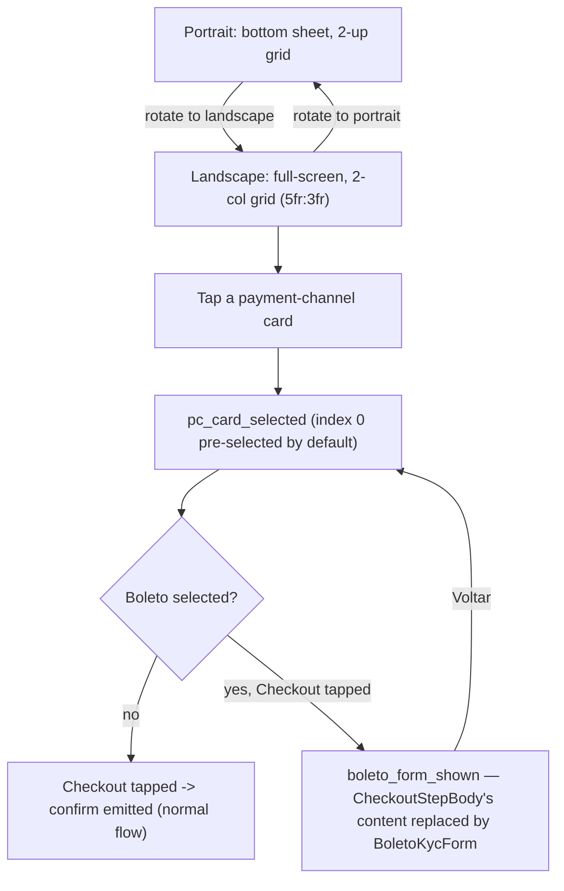

# Payment Channel Sheet — Landscape

> CheckoutStepBody/Footer's full-screen landscape layout (Figma 6060:3935): a 2-col grid (5fr:3fr) replacing the portrait bottom sheet, plus a promo-code field and the Boleto BR KYC form.

**This file is generated.** Every resolved token value below was read from the actual CSS in `src/tokens/` at export time — never hand-transcribed. Regenerate with `npm run handoff:export`. The live, always-current version of everything here is at `/handoff/payment-channel-sheet` in the running prototype.

## 1. Components

### Full sheet (landscape, composed)
Source: `src/components/base/BaseSheet.vue + src/components/steps/CheckoutStepBody.vue + src/components/steps/CheckoutStepFooter.vue`

Composed preview only — mounts BaseSheet with both CheckoutStepBody and CheckoutStepFooter together (via PaymentChannelSheetComposed.vue, a handoff-only wrapper), so the actual 2-col landscape grid is visible in one render. The two entries below stage the body and footer in isolation instead — that's the right view for auditing each one's own contract/tokens, but neither shows the composed page. Not a real app component — no separate token contract of its own (covered by the two entries below).

### CheckoutStepBody
Source: `src/components/steps/CheckoutStepBody.vue`

Left column in landscape-full: heading + 3-up payment-channel grid (2-up in portrait) + PromoCode field (landscape only). Swaps its ENTIRE rendered content for BoletoKycForm (both orientations) when useCheckout().showBoletoKyc is set, via a <Transition mode="out-in"> cross-fade.

**Same value at every store:**

| Token | Value |
|---|---|
| `--x-size-img-xl` | `64px` |
| `--x-gradient-thumb-gloss` | `linear-gradient(135deg, oklch(0.992 0.003 286 / 0.12), oklch(0.992 0.003 286 / 0.02))` |
| `--x-border-soft` | `oklch(0.992 0.003 286 / 0.08)` |
| `--x-text-header-strong` | `oklch(1 0 0)` |
| `--border-weight-default` | `1px` |
| `--border-weight-selected` | `2px` |
| `--x-pad-surface-s` | `8px` |
| `--x-pad-surface-m` | `12px` |
| `--x-gap-content-tight` | `2px` |
| `--x-gap-content-narrow` | `4px` |
| `--x-gap-content-default` | `8px` |
| `--x-gap-content-loose` | `12px` |
| `--x-size-icon-l` | `24px` |
| `--x-motion-sku-hover` | `150ms cubic-bezier(0.4, 0, 0.2, 1)` |
| `--x-motion-sys-duration-fast` | `150ms` |
| `--x-motion-sys-duration-base` | `250ms` |
| `--x-motion-sys-ease-accelerate` | `cubic-bezier(0.4, 0, 1, 1)` |
| `--x-motion-sys-ease-decelerate` | `cubic-bezier(0, 0, 0.2, 1)` |

**Diverges per store:**

| Token | CODASHOP | CODM | DIABLOIMMORTAL | EFOOTBALL | FCM | MGSSE | PVZ3 | ROGUETRADER | TDR | YGODL | YGOMD | ZZZ |
|---|---|---|---|---|---|---|---|---|---|---|---|---|
| `--x-bg-indicator-neutral-default` | `oklch(0.539 0.020 305)` | `oklch(0.377 0.010 278.3)` | `oklch(0.444 0.006 56.0)` | `oklch(0.364 0.217 268.7)` | `oklch(0.199 0.002 197)` | `oklch(0.375 0 0)` | `oklch(0.375 0.018 140)` | `oklch(0.375 0.011 80)` | `oklch(0.370 0.009 258)` | `oklch(0.360 0.014 255)` | `oklch(0.363 0.0234 279.3)` | `oklch(0.290 0 0)` |
| `--x-gradient-checkout-banner` | `linear-gradient(color-mix(in oklab, oklch(0.180 0.035 305) 72%, transparent), color-mix(in oklab, oklch(0.180 0.035 305) 72%, transparent)), radial-gradient(120% 140% at 80% 0%, oklch(0.26 0.08 290) 0%, oklch(0.18 0.006 56) 70%)` | `linear-gradient(color-mix(in oklab, oklch(0.166 0.017 273.5) 72%, transparent), color-mix(in oklab, oklch(0.166 0.017 273.5) 72%, transparent)), radial-gradient(120% 140% at 80% 0%, oklch(0.26 0.08 290) 0%, oklch(0.18 0.006 56) 70%)` | `linear-gradient(color-mix(in oklab, oklch(0.207 0.006 56.0) 72%, transparent), color-mix(in oklab, oklch(0.207 0.006 56.0) 72%, transparent)), radial-gradient(120% 140% at 80% 0%, oklch(0.26 0.08 290) 0%, oklch(0.18 0.006 56) 70%)` | `linear-gradient(color-mix(in oklab, oklch(0.231 0.160 264.1) 72%, transparent), color-mix(in oklab, oklch(0.231 0.160 264.1) 72%, transparent)), radial-gradient(120% 140% at 80% 0%, oklch(0.26 0.08 290) 0%, oklch(0.18 0.006 56) 70%)` | `linear-gradient(color-mix(in oklab, oklch(0 0 0) 72%, transparent), color-mix(in oklab, oklch(0 0 0) 72%, transparent)), radial-gradient(120% 140% at 80% 0%, oklch(0.26 0.08 290) 0%, oklch(0.18 0.006 56) 70%)` | `linear-gradient(color-mix(in oklab, oklch(0.134 0.0 0) 72%, transparent), color-mix(in oklab, oklch(0.134 0.0 0) 72%, transparent)), radial-gradient(120% 140% at 80% 0%, oklch(0.26 0.08 290) 0%, oklch(0.18 0.006 56) 70%)` | `linear-gradient(color-mix(in oklab, oklch(0.2 0.02 140) 72%, transparent), color-mix(in oklab, oklch(0.2 0.02 140) 72%, transparent)), radial-gradient(120% 140% at 80% 0%, oklch(0.26 0.08 290) 0%, oklch(0.18 0.006 56) 70%)` | `linear-gradient(color-mix(in oklab, oklch(0.147 0.003 17.6) 72%, transparent), color-mix(in oklab, oklch(0.147 0.003 17.6) 72%, transparent)), radial-gradient(120% 140% at 80% 0%, oklch(0.26 0.08 290) 0%, oklch(0.18 0.006 56) 70%)` | `linear-gradient(color-mix(in oklab, oklch(0.165 0.012 258) 72%, transparent), color-mix(in oklab, oklch(0.165 0.012 258) 72%, transparent)), radial-gradient(120% 140% at 80% 0%, oklch(0.26 0.08 290) 0%, oklch(0.18 0.006 56) 70%)` | `linear-gradient(color-mix(in oklab, oklch(0.160 0.020 255) 72%, transparent), color-mix(in oklab, oklch(0.160 0.020 255) 72%, transparent)), radial-gradient(120% 140% at 80% 0%, oklch(0.26 0.08 290) 0%, oklch(0.18 0.006 56) 70%)` | `linear-gradient(color-mix(in oklab, oklch(0.163 0.033 279.3) 72%, transparent), color-mix(in oklab, oklch(0.163 0.033 279.3) 72%, transparent)), radial-gradient(120% 140% at 80% 0%, oklch(0.26 0.08 290) 0%, oklch(0.18 0.006 56) 70%)` | `linear-gradient(color-mix(in oklab, oklch(0 0 0) 72%, transparent), color-mix(in oklab, oklch(0 0 0) 72%, transparent)), radial-gradient(120% 140% at 80% 0%, oklch(0.26 0.08 290) 0%, oklch(0.18 0.006 56) 70%)` |
| `--x-text-header-default` | `oklch(1.000 0.000 305)` | `oklch(0.992 0.003 286.4)` | `oklch(0.993 0.001 56.0)` | `oklch(1 0 0)` | `oklch(1 0 0)` | `oklch(0.975 0 0)` | `oklch(0.975 0.005 140)` | `oklch(0.972 0.03 80)` | `oklch(0.992 0.002 258)` | `oklch(0.992 0.002 255)` | `oklch(0.995 0.0024 279.3)` | `oklch(1 0 0)` |
| `--x-text-body-default` | `oklch(1.000 0.000 305)` | `oklch(0.992 0.003 286.4)` | `oklch(0.993 0.001 56.0)` | `oklch(1 0 0)` | `oklch(1 0 0)` | `oklch(0.975 0 0)` | `oklch(0.975 0.005 140)` | `oklch(0.972 0.03 80)` | `oklch(0.992 0.002 258)` | `oklch(0.992 0.002 255)` | `oklch(0.995 0.0024 279.3)` | `oklch(1 0 0)` |
| `--x-text-bonus-amount` | `oklch(0.749 0.166 293)` | `oklch(0.930 0.164 101.5)` | `oklch(0.809 0.085 75.1)` | `oklch(0.975 0.149 108.9)` | `oklch(0.861 0.202 153.1)` | `oklch(0.642 0.183 142.5)` | `oklch(0.77 0.16 142.5)` | `oklch(0.74 0.131 133.1)` | `oklch(0.780 0.180 50)` | `oklch(0.890 0.155 96)` | `oklch(0.902 0.098 88.3)` | `oklch(0.934 0.185 128.9)` |
| `--x-text-hyperlink-default` | `oklch(0.905 0.195 116)` | `oklch(0.919 0.192 101.8)` | `oklch(0.768 0.095 75.1)` | `oklch(0.968 0.211 109.8)` | `oklch(0.857 0.234 150)` | `oklch(0.583 0.198 142.5)` | `oklch(0.72 0.19 142.5)` | `oklch(0.672 0.142 133.1)` | `oklch(0.720 0.195 48)` | `oklch(0.550 0.215 264)` | `oklch(0.843 0.106 88.3)` | `oklch(0.910 0.246 128.9)` |
| `--x-text-body-soft` | `oklch(0.909 0.004 305)` | `oklch(0.719 0.006 274.9)` | `oklch(0.893 0.001 56.0)` | `oklch(0.738 0.088 284.0)` | `oklch(0.571 0.008 106.6)` | `oklch(0.73 0 0)` | `oklch(0.73 0.01 140)` | `oklch(0.725 0.016 80)` | `oklch(0.718 0.006 258)` | `oklch(0.720 0.007 255)` | `oklch(0.723 0.0117 279.3)` | `oklch(0.790 0 0)` |
| `--x-text-final-price` | `oklch(0.878 0.091 340)` | `oklch(0.919 0.192 101.8)` | `oklch(0.768 0.095 75.1)` | `oklch(0.968 0.211 109.8)` | `oklch(0.857 0.234 150)` | `oklch(0.583 0.198 142.5)` | `oklch(0.72 0.19 142.5)` | `oklch(0.672 0.142 133.1)` | `oklch(0.720 0.195 48)` | `oklch(0.550 0.215 264)` | `oklch(0.843 0.106 88.3)` | `oklch(0.910 0.246 128.9)` |
| `--x-bg-card-default` | `linear-gradient(0deg, oklch(0.377 0.010 278 / 0.08), oklch(0.786 0.006 275 / 0.08))` | `linear-gradient(0deg, oklch(0.377 0.010 278 / 0.08), oklch(0.786 0.006 275 / 0.08))` | `url("data:image/svg+xml,%3Csvg%20xmlns%3D%22http%3A//www.w3.org/2000/svg%22%20width%3D%2296%22%20height%3D%2296%22%3E%3Cfilter%20id%3D%22n%22%3E%3CfeTurbulence%20type%3D%22fractalNoise%22%20baseFrequency%3D%220.75%22%20numOctaves%3D%222%22%20stitchTiles%3D%22stitch%22%20result%3D%22t%22/%3E%3CfeColorMatrix%20in%3D%22t%22%20type%3D%22matrix%22%20values%3D%220%200%200%200%200%20%200%200%200%200%200%20%200%200%200%200%200%20%200.9%200.9%200.9%200%200%22/%3E%3CfeComponentTransfer%3E%3CfeFuncA%20type%3D%22linear%22%20slope%3D%220.09%22/%3E%3C/feComponentTransfer%3E%3C/filter%3E%3Crect%20width%3D%22100%25%22%20height%3D%22100%25%22%20filter%3D%22url%28%23n%29%22/%3E%3C/svg%3E"), linear-gradient(0deg, oklch(0.239 0.059 33.9), oklch(0.239 0.059 33.9))` | `linear-gradient( oklch(0.304 0.211 264.1 / 0.60), oklch(0.304 0.211 264.1 / 0.60) )` | `linear-gradient(180deg, oklch(0.95 0 0 / 0.08) 0%, oklch(0.81 0 0 / 0.08) 100%), linear-gradient(180deg, oklch(0.047 0 0 / 0.6), oklch(0.047 0 0 / 0.6))` | `oklch(0.225 0 0)` | `linear-gradient(0deg, oklch(0.377 0.010 278 / 0.08), oklch(0.786 0.006 275 / 0.08))` | `linear-gradient(0deg, oklch(0.225 0.011 80 / 0.55), oklch(0.3 0.011 80 / 0.55))` | `linear-gradient(0deg, oklch(0.370 0.009 258 / 0.08), oklch(0.786 0.005 258 / 0.08))` | `linear-gradient(to bottom, oklch(0 0 0 / 0.56) 24.519%, oklch(0 0 0 / 0.88))` | `oklch(0.228 0.0301 279.3)` | `oklch(0 0 0)` |
| `--x-bg-card-selected` | `oklch(0.205 0.039 293)` | `oklch(0.217 0.027 98.3)` | `oklch(0.140 0.017 75.1)` | `oklch(0.380 0.092 56.8)` | `oklch(0.334 0.083 152.3)` | `oklch(0.165 0.079 142.5)` | `oklch(0.212 0.109 142.5)` | `oklch(0.19 0.057 133.1)` | `oklch(0.205 0.045 45)` | `oklch(0.460 0.180 264)` | `oklch(0.425 0.042 88.3)` | `oklch(0.166 0.045 128.9)` |
| `--x-border-sku-card-default` | `linear-gradient( 160deg, oklch(0.99 0.004 247 / 0.04) 0%, oklch(0.99 0.004 247 / 0.22) 45%, oklch(0.99 0.004 247 / 0.58) 100% )` | `linear-gradient( 160deg, oklch(0.99 0.004 247 / 0.04) 0%, oklch(0.99 0.004 247 / 0.22) 45%, oklch(0.99 0.004 247 / 0.58) 100% )` | `oklch(0.297 0.085 33.9)` | `oklch(0.95 0 0 / 0.10)` | `oklch(0.95 0 0 / 0.08)` | `oklch(0.583 0.198 142.5 / 0.22)` | `linear-gradient( 160deg, oklch(0.99 0.004 247 / 0.04) 0%, oklch(0.99 0.004 247 / 0.22) 45%, oklch(0.99 0.004 247 / 0.58) 100% )` | `linear-gradient( 160deg, oklch(0.8 0.07 80 / 0.10) 0%, oklch(0.8 0.07 80 / 0.32) 45%, oklch(0.82 0.08 80 / 0.62) 100% )` | `linear-gradient( 160deg, oklch(0.99 0.004 258 / 0.04) 0%, oklch(0.99 0.004 258 / 0.22) 45%, oklch(0.99 0.004 258 / 0.58) 100% )` | `linear-gradient( 160deg, oklch(0.99 0.004 255 / 0.05) 0%, oklch(0.99 0.004 255 / 0.24) 45%, oklch(0.99 0.004 255 / 0.60) 100% )` | `oklch(0.843 0.106 88.3 / 0.22)` | `oklch(0.290 0 0)` |
| `--x-border-sku-card-hover` | `linear-gradient( 160deg, oklch(0.99 0.004 247 / 0.08) 0%, oklch(0.99 0.004 247 / 0.35) 45%, oklch(0.99 0.004 247 / 0.78) 100% )` | `linear-gradient( 160deg, oklch(0.99 0.004 247 / 0.08) 0%, oklch(0.99 0.004 247 / 0.35) 45%, oklch(0.99 0.004 247 / 0.78) 100% )` | `oklch(0.355 0.109 33.9)` | `oklch(0.95 0 0 / 0.22)` | `oklch(0.95 0 0 / 0.16)` | `oklch(0.583 0.198 142.5 / 0.45)` | `linear-gradient( 160deg, oklch(0.99 0.004 247 / 0.08) 0%, oklch(0.99 0.004 247 / 0.35) 45%, oklch(0.99 0.004 247 / 0.78) 100% )` | `linear-gradient( 160deg, oklch(0.84 0.08 80 / 0.16) 0%, oklch(0.84 0.08 80 / 0.45) 45%, oklch(0.88 0.09 80 / 0.85) 100% )` | `linear-gradient( 160deg, oklch(0.99 0.004 258 / 0.08) 0%, oklch(0.99 0.004 258 / 0.35) 45%, oklch(0.99 0.004 258 / 0.78) 100% )` | `linear-gradient( 160deg, oklch(0.99 0.004 255 / 0.10) 0%, oklch(0.99 0.004 255 / 0.38) 45%, oklch(0.99 0.004 255 / 0.80) 100% )` | `oklch(0.843 0.106 88.3 / 0.45)` | `oklch(0.910 0.246 128.9)` |
| `--x-border-divider` | `oklch(0.431 0.024 305)` | `oklch(0.310 0.011 271.0)` | `oklch(0.349 0.007 56.0)` | `oklch(0.335 0.216 266.4)` | `oklch(0.158 0.002 197)` | `oklch(0.3 0 0)` | `oklch(0.3 0.02 140)` | `oklch(0.3 0.011 80)` | `oklch(0.300 0.010 258)` | `oklch(0.290 0.016 255)` | `oklch(0.293 0.0268 279.3)` | `oklch(0.205 0 0)` |
| `--x-radius-container-xs` | `4px` | `4px` | `0px` | `4px` | `4px` | `0px` | `4px` | `0px` | `4px` | `4px` | `0px` | `4px` |

### CheckoutStepFooter
Source: `src/components/steps/CheckoutStepFooter.vue`

Right column in landscape-full: item (thumb + title/subtitle) + a Selected Payment row + Subtotal (net of any promo discount) + the Checkout CTA — all right-aligned. Checkout's onBuyNow() sets showBoletoKyc instead of emitting confirm when the Boleto channel is selected.

**Same value at every store:**

| Token | Value |
|---|---|
| `--x-size-img-xl` | `64px` |
| `--x-gradient-thumb-gloss` | `linear-gradient(135deg, oklch(0.992 0.003 286 / 0.12), oklch(0.992 0.003 286 / 0.02))` |
| `--x-border-soft` | `oklch(0.992 0.003 286 / 0.08)` |
| `--border-weight-default` | `1px` |
| `--x-gap-content-tight` | `2px` |
| `--x-gap-content-narrow` | `4px` |
| `--x-gap-content-default` | `8px` |
| `--x-gap-content-separation` | `16px` |
| `--x-pad-surface-s` | `8px` |

**Diverges per store:**

| Token | CODASHOP | CODM | DIABLOIMMORTAL | EFOOTBALL | FCM | MGSSE | PVZ3 | ROGUETRADER | TDR | YGODL | YGOMD | ZZZ |
|---|---|---|---|---|---|---|---|---|---|---|---|---|
| `--x-radius-container-xs` | `4px` | `4px` | `0px` | `4px` | `4px` | `0px` | `4px` | `0px` | `4px` | `4px` | `0px` | `4px` |
| `--x-text-header-default` | `oklch(1.000 0.000 305)` | `oklch(0.992 0.003 286.4)` | `oklch(0.993 0.001 56.0)` | `oklch(1 0 0)` | `oklch(1 0 0)` | `oklch(0.975 0 0)` | `oklch(0.975 0.005 140)` | `oklch(0.972 0.03 80)` | `oklch(0.992 0.002 258)` | `oklch(0.992 0.002 255)` | `oklch(0.995 0.0024 279.3)` | `oklch(1 0 0)` |
| `--x-text-body-default` | `oklch(1.000 0.000 305)` | `oklch(0.992 0.003 286.4)` | `oklch(0.993 0.001 56.0)` | `oklch(1 0 0)` | `oklch(1 0 0)` | `oklch(0.975 0 0)` | `oklch(0.975 0.005 140)` | `oklch(0.972 0.03 80)` | `oklch(0.992 0.002 258)` | `oklch(0.992 0.002 255)` | `oklch(0.995 0.0024 279.3)` | `oklch(1 0 0)` |
| `--x-text-hyperlink-default` | `oklch(0.905 0.195 116)` | `oklch(0.919 0.192 101.8)` | `oklch(0.768 0.095 75.1)` | `oklch(0.968 0.211 109.8)` | `oklch(0.857 0.234 150)` | `oklch(0.583 0.198 142.5)` | `oklch(0.72 0.19 142.5)` | `oklch(0.672 0.142 133.1)` | `oklch(0.720 0.195 48)` | `oklch(0.550 0.215 264)` | `oklch(0.843 0.106 88.3)` | `oklch(0.910 0.246 128.9)` |
| `--x-border-divider` | `oklch(0.431 0.024 305)` | `oklch(0.310 0.011 271.0)` | `oklch(0.349 0.007 56.0)` | `oklch(0.335 0.216 266.4)` | `oklch(0.158 0.002 197)` | `oklch(0.3 0 0)` | `oklch(0.3 0.02 140)` | `oklch(0.3 0.011 80)` | `oklch(0.300 0.010 258)` | `oklch(0.290 0.016 255)` | `oklch(0.293 0.0268 279.3)` | `oklch(0.205 0 0)` |

### BoletoKycForm
Source: `src/components/checkout/BoletoKycForm.vue`

Fixed Portuguese copy (Boleto is a Brazil-only instrument — not run through the locale system, same precedent as the channel grid's own hardcoded "PayPal"/"Cash App" labels). Prototype-only: local unwired inputs, no submit action. Field chrome copies StepZipCode.vue/StepDetails.vue's existing <input> convention — no shared Input component exists in this repo.

**Same value at every store:**

| Token | Value |
|---|---|
| `--x-bg-input-default` | `oklch(0 0 0 / 0.10)` |
| `--x-size-input-m` | `40px` |
| `--border-weight-default` | `1px` |
| `--x-gap-content-tight` | `2px` |
| `--x-gap-content-narrow` | `4px` |
| `--x-gap-content-default` | `8px` |
| `--x-gap-content-loose` | `12px` |
| `--x-size-icon-m` | `20px` |

**Diverges per store:**

| Token | CODASHOP | CODM | DIABLOIMMORTAL | EFOOTBALL | FCM | MGSSE | PVZ3 | ROGUETRADER | TDR | YGODL | YGOMD | ZZZ |
|---|---|---|---|---|---|---|---|---|---|---|---|---|
| `--x-border-input-default` | `oklch(0.539 0.020 305)` | `oklch(0.377 0.010 278.3)` | `oklch(0.444 0.006 56.0)` | `oklch(0.364 0.217 268.7)` | `oklch(0.199 0.002 197)` | `oklch(0.375 0 0)` | `oklch(0.375 0.018 140)` | `oklch(0.375 0.011 80)` | `oklch(0.370 0.009 258)` | `oklch(0.360 0.014 255)` | `oklch(0.363 0.0234 279.3)` | `oklch(0.290 0 0)` |
| `--x-border-input-focused` | `oklch(0.620 0.245 293)` | `oklch(0.919 0.192 101.8)` | `oklch(0.768 0.095 75.1)` | `oklch(0.968 0.211 109.8)` | `oklch(0.857 0.234 150)` | `oklch(0.583 0.198 142.5)` | `oklch(0.72 0.19 142.5)` | `oklch(0.672 0.142 133.1)` | `oklch(0.720 0.195 48)` | `oklch(0.550 0.215 264)` | `oklch(0.843 0.106 88.3)` | `oklch(0.910 0.246 128.9)` |
| `--x-text-body-default` | `oklch(1.000 0.000 305)` | `oklch(0.992 0.003 286.4)` | `oklch(0.993 0.001 56.0)` | `oklch(1 0 0)` | `oklch(1 0 0)` | `oklch(0.975 0 0)` | `oklch(0.975 0.005 140)` | `oklch(0.972 0.03 80)` | `oklch(0.992 0.002 258)` | `oklch(0.992 0.002 255)` | `oklch(0.995 0.0024 279.3)` | `oklch(1 0 0)` |
| `--x-text-placeholder` | `oklch(0.795 0.009 305)` | `oklch(0.584 0.008 277.1)` | `oklch(0.759 0.002 56.0)` | `oklch(0.561 0.154 280.2)` | `oklch(0.455 0.006 106.6)` | `oklch(0.585 0 0)` | `oklch(0.585 0.014 140)` | `oklch(0.585 0.01 80)` | `oklch(0.580 0.007 258)` | `oklch(0.580 0.010 255)` | `oklch(0.583 0.0167 279.3)` | `oklch(0.590 0 0)` |
| `--x-radius-input-s` | `4px` | `4px` | `0px` | `4px` | `4px` | `0px` | `4px` | `0px` | `4px` | `4px` | `4px` | `4px` |

### BaseSheet (landscapeFull)
Source: `src/components/base/BaseSheet.vue`

Owns the actual full-screen mechanics: `landscapeFull` prop (true only when isMobile && useOrientation() === 'landscape'); the panel goes edge-to-edge with a flat --x-bg-page fill (no --x-bg-sheet gradient/blur — this is a page, not a floating glass panel), grid-template-columns: 5fr 3fr, 12px panel padding/gap. The header uses the SAME chrome every other sheet gets (no override) plus an added 8px bottom padding. Both grid cells (.sheet__body / .sheet__footer) become their own L1 container — --x-bg-sku-card-default fill, --x-radius-container-s radius, 12px/8px padding, 8px gap, NO border (unlike the PC-card tiles inside them, which do have a border).

**Same value at every store:**

| Token | Value |
|---|---|
| `--x-pad-surface-m` | `12px` |
| `--x-pad-surface-s` | `8px` |

**Diverges per store:**

| Token | CODASHOP | CODM | DIABLOIMMORTAL | EFOOTBALL | FCM | MGSSE | PVZ3 | ROGUETRADER | TDR | YGODL | YGOMD | ZZZ |
|---|---|---|---|---|---|---|---|---|---|---|---|---|
| `--x-bg-page` | `oklch(0.180 0.035 305)` | `oklch(0.166 0.017 273.5)` | `oklch(0.207 0.006 56.0)` | `oklch(0.231 0.160 264.1)` | `oklch(0 0 0)` | `oklch(0.134 0.0 0)` | `oklch(0.2 0.02 140)` | `oklch(0.147 0.003 17.6)` | `oklch(0.165 0.012 258)` | `oklch(0.160 0.020 255)` | `oklch(0.163 0.033 279.3)` | `oklch(0 0 0)` |
| `--x-bg-sku-card-default` | `radial-gradient( ellipse 100% 32% at 35% 0%, oklch(0.992 0.003 286 / 0.04) 0%, transparent 100% )` | `radial-gradient( ellipse 100% 32% at 35% 0%, oklch(0.992 0.003 286 / 0.04) 0%, transparent 100% )` | `url("data:image/svg+xml,%3Csvg%20xmlns%3D%22http%3A//www.w3.org/2000/svg%22%20width%3D%2296%22%20height%3D%2296%22%3E%3Cfilter%20id%3D%22n%22%3E%3CfeTurbulence%20type%3D%22fractalNoise%22%20baseFrequency%3D%220.75%22%20numOctaves%3D%222%22%20stitchTiles%3D%22stitch%22%20result%3D%22t%22/%3E%3CfeColorMatrix%20in%3D%22t%22%20type%3D%22matrix%22%20values%3D%220%200%200%200%200%20%200%200%200%200%200%20%200%200%200%200%200%20%200.9%200.9%200.9%200%200%22/%3E%3CfeComponentTransfer%3E%3CfeFuncA%20type%3D%22linear%22%20slope%3D%220.09%22/%3E%3C/feComponentTransfer%3E%3C/filter%3E%3Crect%20width%3D%22100%25%22%20height%3D%22100%25%22%20filter%3D%22url%28%23n%29%22/%3E%3C/svg%3E"), linear-gradient(0deg, oklch(0.187 0.035 33.9), oklch(0.187 0.035 33.9))` | `linear-gradient( oklch(0.304 0.211 264.1 / 0.60), oklch(0.304 0.211 264.1 / 0.60) )` | `linear-gradient(180deg, oklch(0.95 0 0 / 0.04) 0%, oklch(0.81 0 0 / 0.04) 100%), linear-gradient(180deg, oklch(0.047 0 0 / 0.6), oklch(0.047 0 0 / 0.6))` | `oklch(0.134 0.0 0)` | `radial-gradient( ellipse 100% 32% at 35% 0%, oklch(0.992 0.003 286 / 0.04) 0%, transparent 100% )` | `radial-gradient( ellipse 100% 32% at 50% 0%, oklch(0.85 0.08 80 / 0.06) 0%, transparent 100% )` | `radial-gradient( ellipse 100% 32% at 50% 0%, oklch(0.992 0.003 258 / 0.04) 0%, transparent 100% )` | `linear-gradient(to bottom, oklch(0 0 0 / 0.64) 24.519%, oklch(0 0 0))` | `oklch(0.163 0.033 279.3)` | `oklch(0.145 0 0)` |
| `--x-radius-container-s` | `8px` | `8px` | `0px` | `8px` | `8px` | `0px` | `8px` | `0px` | `8px` | `8px` | `0px` | `8px` |

### DeviceFrame (landscape corner-square)
Source: `src/components/DeviceFrame.vue`

The framed device preview's overlay layer squares off ALL FOUR corners in landscape (previously only the bottom did, for CategoryNav's full-bleed bar) — without this, the full-screen sheet's square panel corners would still get visually clipped into a curve by the overlay's own rounded-corner mask, even though the panel's own border-radius is 0. Nothing else currently renders flush against the overlay's top corners, so this is a no-op everywhere else in the app.

## 2. State inventory

| State | Description | Entry | Exit |
|---|---|---|---|
| `layout_portrait` | Bottom sheet (85% height), single scrolling column: account row, item banner, 2-up payment grid, static T&Cs bar. Footer is a horizontal price+CTA bar. | !isMobile \|\| useOrientation() !== 'landscape' | framed device rotates to landscape |
| `layout_landscape_full` | Edge-to-edge full-screen page, square corners, 2-col grid (payment list : summary, 5fr:3fr). Account row, item banner, and T&Cs bar move out of the left column (banner content re-renders in the right column instead; account/T&Cs simply have no room and are omitted). | isMobile && useOrientation() === 'landscape' | framed device rotates to portrait |
| `pc_grid_2up` | Payment-channel cards, 2 per row, flex-grow:0 so a lone last-row card (5 channels is an odd count) stays half-width instead of stretching. | layout_portrait | layout_landscape_full |
| `pc_grid_3up` | Payment-channel cards, 3 per row, same flex-grow:0 rule (a lone last-row card stays a third-width, not full-width). Every card also shows its price line, absent in earlier iterations. | layout_landscape_full | layout_portrait |
| `pc_card_default` | Card shows logo (or, absent a logo, label text only — e.g. no fabricated Boleto mark before the real asset shipped) + label (+ price, once an item is selected upstream). | selectedChannel !== this card's index | card tapped |
| `pc_card_selected` | 2px --x-text-hyperlink-default gradient ring (border-weight-selected) + --x-bg-card-selected fill. | selectedChannel === this card's index — index 0 by default (see channel_preselected below) | a different card tapped |
| `channel_preselected` | The first channel (index 0) reads selected with no user interaction at all. | useCheckout().selectedChannel defaults to 0 (was null before this feature) | user taps a different card |
| `promo_absent` | No promo-code field at all. | layout_portrait | layout_landscape_full |
| `promo_collapsed` | "Have a promo code?" accordion header only, form hidden. | layout_landscape_full, PromoCode mounts closed | header tapped |
| `promo_expanded_form` | Code input + Apply button + helper text visible. | accordion opened, status !== 'applied' | valid code applied, or accordion re-collapsed |
| `promo_applied` | Success pill replaces the form; Subtotal in the right column drops by the discount amount. | PromoCode emits applied(discount) — demo code SAVE10, 10% off | pill's close (x) tapped |
| `selected_payment_row_visible` | A row above Subtotal shows the chosen channel's label, right-aligned. | layout_landscape_full and a channel is selected (always true — see channel_preselected) | layout_portrait |
| `boleto_form_hidden` | CheckoutStepBody renders its normal content (grid/banner/terms as appropriate to orientation). | useCheckout().showBoletoKyc === false | Checkout tapped with Boleto selected |
| `boleto_form_shown` | CheckoutStepBody's ENTIRE content (both orientations) is replaced by BoletoKycForm — name/last-name/phone/email/DOB/CPF fields, Portuguese copy, a "Voltar" back link. | CheckoutStepFooter's onBuyNow() sets showBoletoKyc = true, gated on data.channels[selectedChannel]?.key === 'boleto' | "Voltar" tapped (returns to boleto_form_hidden, selection unchanged) or the whole sheet closes (useCheckout().closeCheckout() resets showBoletoKyc) |
| `dob_field_default` | Bordered box, calendar_today icon (--x-text-body-default) + "Data de nascimento" placeholder. | always, while boleto_form_shown | n/a — no further state |
| `phone_field_default` | Bordered box: a non-editable "+55" chip, a vertical divider, then the phone input. | always, while boleto_form_shown | n/a — no further state |
| `header_close_default` | Standard close (×) button, same chrome as every other sheet's header. | always | n/a — this state has no variant; noted because an earlier iteration of this layout had a padding override that made the button intermittently disappear at some viewport scales (fixed, not a real state) |

Total states: **17**

## 3. Transitions

| From | To | Trigger | Motion tokens |
|---|---|---|---|
| `layout_portrait` | `layout_landscape_full` | framed device rotated to landscape (useOrientation().toggle(), DeviceToolbar's rotate control) |  |
| `pc_card_default` | `pc_card_selected` | tap | `--x-motion-sku-hover` |
| `promo_collapsed` | `promo_expanded_form` | accordion header tap |  |
| `promo_expanded_form` | `promo_applied` | Apply tapped with the valid demo code |  |
| `boleto_form_hidden` | `boleto_form_shown` | Checkout tapped, Boleto selected | `--x-motion-sys-duration-fast`, `--x-motion-sys-ease-accelerate`, `--x-motion-sys-duration-base`, `--x-motion-sys-ease-decelerate` |
| `boleto_form_shown` | `boleto_form_hidden` | "Voltar" tapped | `--x-motion-sys-duration-fast`, `--x-motion-sys-ease-accelerate`, `--x-motion-sys-duration-base`, `--x-motion-sys-ease-decelerate` |

## 4. Choreography

| Beat | Delay | Duration token | Resolved (per store) | Easing token | Resolved (per store) | Target |
|---|---|---|---|---|---|---|
| Old content (grid or form) fades out | 0ms | `--x-motion-sys-duration-fast` | codashop: 150ms; codm: 150ms; diabloimmortal: 150ms; efootball: 150ms; fcm: 150ms; mgsse: 150ms; pvz3: 150ms; roguetrader: 150ms; tdr: 150ms; ygodl: 150ms; ygomd: 150ms; zzz: 150ms | `--x-motion-sys-ease-accelerate` | codashop: cubic-bezier(0.4, 0, 1, 1); codm: cubic-bezier(0.4, 0, 1, 1); diabloimmortal: cubic-bezier(0.4, 0, 1, 1); efootball: cubic-bezier(0.4, 0, 1, 1); fcm: cubic-bezier(0.4, 0, 1, 1); mgsse: cubic-bezier(0.4, 0, 1, 1); pvz3: cubic-bezier(0.4, 0, 1, 1); roguetrader: cubic-bezier(0.4, 0, 1, 1); tdr: cubic-bezier(0.4, 0, 1, 1); ygodl: cubic-bezier(0.4, 0, 1, 1); ygomd: cubic-bezier(0.4, 0, 1, 1); zzz: cubic-bezier(0.4, 0, 1, 1) | .checkout-step-body or BoletoKycForm root |
| New content fades in | 0ms | `--x-motion-sys-duration-base` | codashop: 250ms; codm: 250ms; diabloimmortal: 250ms; efootball: 250ms; fcm: 250ms; mgsse: 250ms; pvz3: 250ms; roguetrader: 250ms; tdr: 250ms; ygodl: 250ms; ygomd: 250ms; zzz: 250ms | `--x-motion-sys-ease-decelerate` | codashop: cubic-bezier(0, 0, 0.2, 1); codm: cubic-bezier(0, 0, 0.2, 1); diabloimmortal: cubic-bezier(0, 0, 0.2, 1); efootball: cubic-bezier(0, 0, 0.2, 1); fcm: cubic-bezier(0, 0, 0.2, 1); mgsse: cubic-bezier(0, 0, 0.2, 1); pvz3: cubic-bezier(0, 0, 0.2, 1); roguetrader: cubic-bezier(0, 0, 0.2, 1); tdr: cubic-bezier(0, 0, 0.2, 1); ygodl: cubic-bezier(0, 0, 0.2, 1); ygomd: cubic-bezier(0, 0, 0.2, 1); zzz: cubic-bezier(0, 0, 0.2, 1) | .checkout-step-body or BoletoKycForm root |

## 5. User flow

## 6. State diagram

```mermaid
stateDiagram-v2
    [*] --> layout_portrait
    layout_portrait --> layout_landscape_full: rotate to landscape
    layout_landscape_full --> layout_portrait: rotate to portrait
    layout_portrait --> pc_grid_2up
    layout_landscape_full --> pc_grid_3up
    pc_card_default --> pc_card_selected: tap
    [*] --> channel_preselected
    channel_preselected --> pc_card_selected
    promo_collapsed --> promo_expanded_form: header tap
    promo_expanded_form --> promo_applied: valid code
    boleto_form_hidden --> boleto_form_shown: Checkout tapped, Boleto selected
    boleto_form_shown --> boleto_form_hidden: Voltar tapped
```

## 7. Notes (authored)

**Rationale:** The landscape layout exists because the portrait bottom sheet wastes most of a landscape framed device's width on empty page background either side of a narrow centred column — going full-screen with a 2-col grid uses that width for the payment grid and order summary side by side instead of stacking them. Boleto BR needed a KYC form (a Brazilian payment instrument requires buyer identity/CPF up front) — it replaces this step's content in place rather than opening a new sheet, since the alternative (a whole new PurchaseSheet step wired through usePurchaseFlow.js) was unwarranted for a single payment-method's extra form.

**Build order:**
1. T1 — Portrait layout unchanged (regression check): confirm the existing bottom-sheet/2-up-grid layout is untouched by this feature when not in landscape.
2. T2 — Landscape full-screen shell: BaseSheet's landscapeFull grid (5fr:3fr), flat page background, square corners (both the panel and the parent overlay/device-frame level), L1 container columns with 12px/8px padding and 8px gap.
3. T3 — Landscape content split: 3-up payment grid (equal-width cards) in the left column; item + Selected Payment row + Subtotal + Checkout CTA in the right column, right-aligned.
4. T4 — Promo code: PromoCode field after the grid (landscape only), wired so its discount reaches the right column's Subtotal without a prop bridge.
5. T5 — Boleto BR channel: 5th tile with its real logo; selecting it + tapping Checkout swaps the whole step's content (both orientations) for the KYC form via a cross-fade, with a working back link.

**Gotchas:**
- The landscape overlay corner-squaring lives in DeviceFrame.vue, not BaseSheet — a full-screen sheet's own border-radius:0 is not enough on its own; the PARENT overlay clips with its own rounded-corner mask regardless of the panel's own radius. Any future full-bleed-to-the-very-corner surface needs the same overlay-level fix, not a panel-level one.
- selectedChannel defaults to 0 (not null) app-wide, not just in this layout — dismissBuyNow() also resets it to 0, not null. checkoutReady's null-check (selectedChannel != null) still works since 0 != null.
- The Checkout CTA label ("Checkout") is a literal in sheetContent.js's checkoutDescriptor(), NOT the shared strings.checkout.actionLabel — that string still drives the Info step's and the FCM payment step's own CTAs, which keep "Buy Now". Do not repoint those to share this literal.
- The right column's "Selected Payment" row label is also a local literal in CheckoutStepFooter.vue, deliberately distinct from data.selectPaymentHeading (the picker's own "Select Payment" grid heading in the left column) — the same underlying string reused for both would read wrong on one side.
- Boleto's payment-tile logo is a real shipped asset (src/shared/pc/light/boleto.svg) — earlier iterations of this feature used a text-only tile (no fabricated brand mark) before the asset was provided; don't reintroduce a placeholder now that a real logo exists.
- BoletoKycForm's copy is fixed Portuguese regardless of the active store locale — it is not routed through the locale/strings system, the same way the payment-channel labels ("PayPal", "Cash App") are hardcoded English literals rather than localized strings.
- The DOB field's calendar icon needed a NEW entry in MaterialIcon.vue's icon allowlist (calendar_today was never registered) — that component resolves icons from an explicit imported map, not a generic dynamic import, so a new icon always needs a manifest entry there before it renders anything.

**Prohibitions:**
- Never let a lone last-row payment card stretch to fill its row — every card in a row must stay equal width, in both the 2-up and 3-up grids.
- Never reuse the picker's "Select Payment" heading string for the summary column's "Selected Payment" row — they read correctly only because they are different strings.
- Never wire the Boleto form's copy through the locale/strings system — it is deliberately fixed Portuguese.
- Never invent a submit action for the Boleto KYC form — it is intentionally unwired in this prototype; a production port needs a real one, not an invented placeholder.
- Never square a sheet's own panel corners without ALSO squaring the parent overlay's corners in landscape — the panel-level fix alone is insufficient, the overlay still clips it.

**Open questions:**
- What happens after the Boleto KYC form is filled in and submitted — no submit action exists yet (prototype scope only, matching PromoCode.vue's own "no real backend" precedent). A production build needs a real submit behaviour and validation before this ships.
- Should Boleto also appear in the FCM payment-step view (PaymentStepBody/PaymentStepFooter, config.checkout.channels-driven)? This handoff only covers the default (non-FCM) checkout step CheckoutStepBody/Footer render.

## 8. Constraints & prohibitions

- Never hardcode a resolved literal that a token above already provides — map to the equivalent semantic token in your system.
- Every state in §2 must be reachable in your rebuild. A missing state is an incomplete task.
- Cross-check the live oracle at `/handoff/payment-channel-sheet` in the running prototype before treating this static export as final — it is a snapshot, the live surface is the source of truth at any given moment.

## 9. Verification

| # | State | Reachable | Matches reference |
|---|---|---|---|
| 1 | `layout_portrait` | ☐ | ☐ |
| 2 | `layout_landscape_full` | ☐ | ☐ |
| 3 | `pc_grid_2up` | ☐ | ☐ |
| 4 | `pc_grid_3up` | ☐ | ☐ |
| 5 | `pc_card_default` | ☐ | ☐ |
| 6 | `pc_card_selected` | ☐ | ☐ |
| 7 | `channel_preselected` | ☐ | ☐ |
| 8 | `promo_absent` | ☐ | ☐ |
| 9 | `promo_collapsed` | ☐ | ☐ |
| 10 | `promo_expanded_form` | ☐ | ☐ |
| 11 | `promo_applied` | ☐ | ☐ |
| 12 | `selected_payment_row_visible` | ☐ | ☐ |
| 13 | `boleto_form_hidden` | ☐ | ☐ |
| 14 | `boleto_form_shown` | ☐ | ☐ |
| 15 | `dob_field_default` | ☐ | ☐ |
| 16 | `phone_field_default` | ☐ | ☐ |
| 17 | `header_close_default` | ☐ | ☐ |
