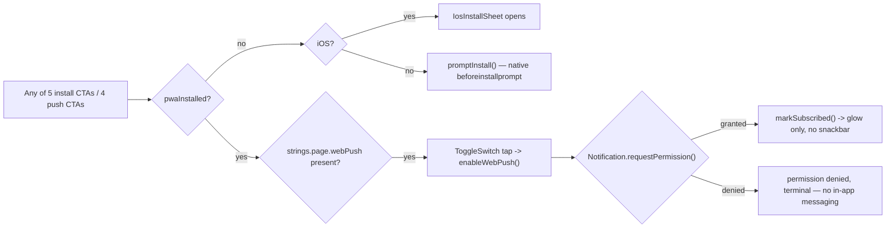
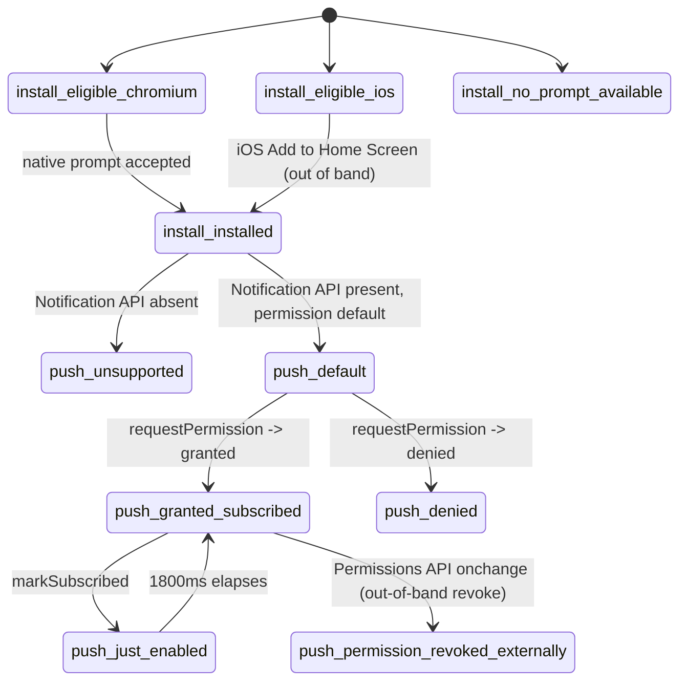

# PWA Install + Web Push

> Install-to-home-screen (Android native prompt / iOS instruction sheet) and the post-install web-push opt-in, across 5 install surfaces and 4 general push surfaces (Gifts banner, story slide, Order Complete bar, nav drawer) — a task-gated 5th entry point (TaskGiftSheet) belongs to a separate reward-gift flow.

**This file is generated.** Every resolved token value below was read from the actual CSS in `src/tokens/` at export time — never hand-transcribed. Regenerate with `npm run handoff:export`. The live, always-current version of everything here is at `/handoff/pwa-web-push` in the running prototype.

## 1. Components

### ToggleSwitch
Source: `src/components/ToggleSwitch.vue`

Fully controlled switch. Every call site ignores the emitted value and calls toggleWebPush() instead — visual state is driven purely by the shared useWebPush().subscribed ref, not by v-model round-tripping.

| Token | CODASHOP | CODM | DIABLOIMMORTAL | EFOOTBALL | FCM | MGSSE | PVZ3 | ROGUETRADER | TDR | YGODL | YGOMD | ZZZ |
|---|---|---|---|---|---|---|---|---|---|---|---|---|
| `--x-size-control-xs` | `24px` | `24px` | `24px` | `24px` | `24px` | `24px` | `24px` | `24px` | `24px` | `24px` | `24px` | `24px` |
| `--x-pad-surface-xxs` | `2px` | `2px` | `2px` | `2px` | `2px` | `2px` | `2px` | `2px` | `2px` | `2px` | `2px` | `2px` |
| `--x-radius-badge-full` | `999px` | `999px` | `999px` | `999px` | `999px` | `0px` | `999px` | `999px` | `999px` | `999px` | `999px` | `999px` |
| `--border-weight-default` | `1px` | `1px` | `1px` | `1px` | `1px` | `1px` | `1px` | `1px` | `1px` | `1px` | `1px` | `1px` |
| `--x-surface-ghost-4` | `oklch(1 0 0 / 0.12)` | `oklch(1 0 0 / 0.12)` | `oklch(1 0 0 / 0.12)` | `oklch(1 0 0 / 0.12)` | `oklch(1 0 0 / 0.12)` | `oklch(1 0 0 / 0.12)` | `oklch(1 0 0 / 0.12)` | `oklch(1 0 0 / 0.12)` | `oklch(1 0 0 / 0.12)` | `oklch(1 0 0 / 0.12)` | `oklch(1 0 0 / 0.12)` | `oklch(1 0 0 / 0.12)` |
| `--x-surface-ghost-2` | `oklch(1 0 0 / 0.08)` | `oklch(1 0 0 / 0.08)` | `oklch(1 0 0 / 0.08)` | `oklch(1 0 0 / 0.08)` | `oklch(1 0 0 / 0.08)` | `oklch(1 0 0 / 0.08)` | `oklch(1 0 0 / 0.08)` | `oklch(1 0 0 / 0.08)` | `oklch(1 0 0 / 0.08)` | `oklch(1 0 0 / 0.08)` | `oklch(1 0 0 / 0.08)` | `oklch(1 0 0 / 0.08)` |
| `--x-bg-control-active` | `oklch(0.620 0.245 293)` | `oklch(0.919 0.192 101.8)` | `oklch(0.768 0.095 75.1)` | `oklch(0.968 0.211 109.8)` | `oklch(0.857 0.234 150)` | `oklch(0.583 0.198 142.5)` | `oklch(0.72 0.19 142.5)` | `oklch(0.672 0.142 133.1)` | `oklch(0.720 0.195 48)` | `oklch(0.550 0.215 264)` | `oklch(0.843 0.106 88.3)` | `oklch(0.910 0.246 128.9)` |
| `--x-border-control-active` | `oklch(0.620 0.245 293)` | `oklch(0.919 0.192 101.8)` | `oklch(0.768 0.095 75.1)` | `oklch(0.968 0.211 109.8)` | `oklch(0.857 0.234 150)` | `oklch(0.583 0.198 142.5)` | `oklch(0.72 0.19 142.5)` | `oklch(0.672 0.142 133.1)` | `oklch(0.720 0.195 48)` | `oklch(0.550 0.215 264)` | `oklch(0.843 0.106 88.3)` | `oklch(0.910 0.246 128.9)` |
| `--x-size-icon-m` | `20px` | `20px` | `20px` | `20px` | `20px` | `20px` | `20px` | `20px` | `20px` | `20px` | `20px` | `20px` |
| `--x-bg-action-neutral` | `oklch(1.000 0.000 305)` | `oklch(0.992 0.003 286.4)` | `oklch(0.993 0.001 56.0)` | `oklch(1 0 0)` | `oklch(1 0 0)` | `oklch(0.975 0 0)` | `oklch(0.975 0.005 140)` | `oklch(0.972 0.03 80)` | `oklch(0.992 0.002 258)` | `oklch(0.992 0.002 255)` | `oklch(0.995 0.0024 279.3)` | `oklch(1 0 0)` |
| `--x-shadow-story-card` | `0 2px 5px oklch(0.12 0.01 273 / 0.31), 0 8px 8px oklch(0.12 0.01 273 / 0.27), 0 19px 11px oklch(0.12 0.01 273 / 0.16)` | `0 2px 5px oklch(0.12 0.01 273 / 0.31), 0 8px 8px oklch(0.12 0.01 273 / 0.27), 0 19px 11px oklch(0.12 0.01 273 / 0.16)` | `0 2px 5px oklch(0.12 0.01 273 / 0.31), 0 8px 8px oklch(0.12 0.01 273 / 0.27), 0 19px 11px oklch(0.12 0.01 273 / 0.16)` | `0 2px 5px oklch(0.12 0.01 273 / 0.31), 0 8px 8px oklch(0.12 0.01 273 / 0.27), 0 19px 11px oklch(0.12 0.01 273 / 0.16)` | `0 2px 5px oklch(0.12 0.01 273 / 0.31), 0 8px 8px oklch(0.12 0.01 273 / 0.27), 0 19px 11px oklch(0.12 0.01 273 / 0.16)` | `0 2px 5px oklch(0.12 0.01 273 / 0.31), 0 8px 8px oklch(0.12 0.01 273 / 0.27), 0 19px 11px oklch(0.12 0.01 273 / 0.16)` | `0 2px 5px oklch(0.12 0.01 273 / 0.31), 0 8px 8px oklch(0.12 0.01 273 / 0.27), 0 19px 11px oklch(0.12 0.01 273 / 0.16)` | `0 2px 5px oklch(0.12 0.01 273 / 0.31), 0 8px 8px oklch(0.12 0.01 273 / 0.27), 0 19px 11px oklch(0.12 0.01 273 / 0.16)` | `0 2px 5px oklch(0.12 0.01 273 / 0.31), 0 8px 8px oklch(0.12 0.01 273 / 0.27), 0 19px 11px oklch(0.12 0.01 273 / 0.16)` | `0 2px 5px oklch(0.12 0.01 273 / 0.31), 0 8px 8px oklch(0.12 0.01 273 / 0.27), 0 19px 11px oklch(0.12 0.01 273 / 0.16)` | `0 2px 5px oklch(0.12 0.01 273 / 0.31), 0 8px 8px oklch(0.12 0.01 273 / 0.27), 0 19px 11px oklch(0.12 0.01 273 / 0.16)` | `0 2px 5px oklch(0.12 0.01 273 / 0.31), 0 8px 8px oklch(0.12 0.01 273 / 0.27), 0 19px 11px oklch(0.12 0.01 273 / 0.16)` |
| `--x-motion-toggle` | `200ms cubic-bezier(0.4, 0, 0.2, 1)` | `200ms cubic-bezier(0.4, 0, 0.2, 1)` | `200ms cubic-bezier(0.4, 0, 0.2, 1)` | `200ms cubic-bezier(0.4, 0, 0.2, 1)` | `200ms cubic-bezier(0.4, 0, 0.2, 1)` | `200ms cubic-bezier(0.4, 0, 0.2, 1)` | `200ms cubic-bezier(0.4, 0, 0.2, 1)` | `200ms cubic-bezier(0.4, 0, 0.2, 1)` | `200ms cubic-bezier(0.4, 0, 0.2, 1)` | `200ms cubic-bezier(0.4, 0, 0.2, 1)` | `200ms cubic-bezier(0.4, 0, 0.2, 1)` | `200ms cubic-bezier(0.4, 0, 0.2, 1)` |
| `--x-motion-control-press-scale` | `0.98` | `0.98` | `0.98` | `0.98` | `0.98` | `0.98` | `0.98` | `0.98` | `0.98` | `0.98` | `0.98` | `0.98` |

### IosInstallSheet
Source: `src/components/IosInstallSheet.vue`

Media half (assets.content.iosInstallDemo, or a grey placeholder box) + a real numbered <ol> of strings.page.pwaInstall.iosSteps + a "Got it" footer CTA that closes the sheet. Registered in useCloseAllOverlays.js — a real overlay, not scaffolding.

| Token | CODASHOP | CODM | DIABLOIMMORTAL | EFOOTBALL | FCM | MGSSE | PVZ3 | ROGUETRADER | TDR | YGODL | YGOMD | ZZZ |
|---|---|---|---|---|---|---|---|---|---|---|---|---|
| `--x-bg-sheet` | `linear-gradient(0deg, oklch(0.377 0.010 278 / 0.08), oklch(0.786 0.006 275 / 0.08))` | `linear-gradient(0deg, oklch(0.377 0.010 278 / 0.08), oklch(0.786 0.006 275 / 0.08))` | `url("data:image/svg+xml,%3Csvg%20xmlns%3D%22http%3A//www.w3.org/2000/svg%22%20width%3D%2296%22%20height%3D%2296%22%3E%3Cfilter%20id%3D%22n%22%3E%3CfeTurbulence%20type%3D%22fractalNoise%22%20baseFrequency%3D%220.75%22%20numOctaves%3D%222%22%20stitchTiles%3D%22stitch%22%20result%3D%22t%22/%3E%3CfeColorMatrix%20in%3D%22t%22%20type%3D%22matrix%22%20values%3D%220%200%200%200%200%20%200%200%200%200%200%20%200%200%200%200%200%20%200.9%200.9%200.9%200%200%22/%3E%3CfeComponentTransfer%3E%3CfeFuncA%20type%3D%22linear%22%20slope%3D%220.09%22/%3E%3C/feComponentTransfer%3E%3C/filter%3E%3Crect%20width%3D%22100%25%22%20height%3D%22100%25%22%20filter%3D%22url%28%23n%29%22/%3E%3C/svg%3E"), linear-gradient(0deg, oklch(0.239 0.059 33.9), oklch(0.239 0.059 33.9))` | `linear-gradient( oklch(0.304 0.211 264.1 / 0.60), oklch(0.304 0.211 264.1 / 0.60) )` | `linear-gradient(180deg, oklch(0.95 0 0 / 0.08) 0%, oklch(0.81 0 0 / 0.08) 100%), linear-gradient(180deg, oklch(0.047 0 0 / 0.6), oklch(0.047 0 0 / 0.6))` | `oklch(0.225 0 0)` | `linear-gradient(0deg, oklch(0.377 0.010 278 / 0.08), oklch(0.786 0.006 275 / 0.08))` | `linear-gradient(0deg, oklch(0.225 0.011 80 / 0.55), oklch(0.3 0.011 80 / 0.55))` | `linear-gradient(0deg, oklch(0.370 0.009 258 / 0.08), oklch(0.786 0.005 258 / 0.08))` | `linear-gradient(to bottom, oklch(0 0 0 / 0.56) 24.519%, oklch(0 0 0 / 0.88))` | `oklch(0.228 0.0301 279.3)` | `oklch(0 0 0)` |
| `--x-text-header-default` | `oklch(1.000 0.000 305)` | `oklch(0.992 0.003 286.4)` | `oklch(0.993 0.001 56.0)` | `oklch(1 0 0)` | `oklch(1 0 0)` | `oklch(0.975 0 0)` | `oklch(0.975 0.005 140)` | `oklch(0.972 0.03 80)` | `oklch(0.992 0.002 258)` | `oklch(0.992 0.002 255)` | `oklch(0.995 0.0024 279.3)` | `oklch(1 0 0)` |
| `--x-text-hyperlink-default` | `oklch(0.905 0.195 116)` | `oklch(0.919 0.192 101.8)` | `oklch(0.768 0.095 75.1)` | `oklch(0.968 0.211 109.8)` | `oklch(0.857 0.234 150)` | `oklch(0.583 0.198 142.5)` | `oklch(0.72 0.19 142.5)` | `oklch(0.672 0.142 133.1)` | `oklch(0.720 0.195 48)` | `oklch(0.550 0.215 264)` | `oklch(0.843 0.106 88.3)` | `oklch(0.910 0.246 128.9)` |
| `--x-pad-surface-l` | `16px` | `16px` | `16px` | `16px` | `16px` | `16px` | `16px` | `16px` | `16px` | `16px` | `16px` | `16px` |
| `--x-pad-surface-m` | `12px` | `12px` | `12px` | `12px` | `12px` | `12px` | `12px` | `12px` | `12px` | `12px` | `12px` | `12px` |
| `--x-gap-content-default` | `8px` | `8px` | `8px` | `8px` | `8px` | `8px` | `8px` | `8px` | `8px` | `8px` | `8px` | `8px` |

## 2. State inventory

| State | Description | Entry | Exit |
|---|---|---|---|
| `install_eligible_chromium` | beforeinstallprompt captured; CTA triggers the native install prompt. | deferredPrompt set (usePwaInstall.js module-scope listener) | promptInstall() resolves, or app is installed by another path |
| `install_eligible_ios` | No native prompt exists on iOS; CTA opens IosInstallSheet instead. | device is iPhone (or forceIosInstallSheet flag) and not yet standalone | sheet closed ("Got it" or scrim/close) or app added to home screen |
| `install_no_prompt_available` | Not iOS, no beforeinstallprompt fired yet (or fired-then-consumed) — CTA is visually identical but promptInstall() silently no-ops. Not modelled as a distinct visual state in the prototype today; the production rebuild MUST distinguish this from install_eligible_chromium via canPrompt, or ship the same dead-button bug (see prototypeOnly note). | no deferred prompt captured and device is not iOS | a beforeinstallprompt event fires |
| `install_installed` | Every install CTA across all 5 surfaces hides; web-push CTAs become reachable. | isStandalone() true OR the dev-only pwaInstalledState flag is "installed" | never, within a session (no uninstall detection) |
| `push_unsupported` | Notification API absent from the browser. No push UI should render (contract: isSupported). | !("Notification" in window) | never (not a runtime-changeable condition) |
| `push_default` | Toggle renders off; tapping it will trigger the one-shot permission prompt. | Notification.permission === "default" and app installed | user taps the toggle |
| `push_granted_subscribed` | Toggle on. NO confirmation snackbar fires (removed on purpose — the browser's own permission prompt already told the user something happened; see gotchas) — a glow highlight still plays on the surface that changed, for 1800ms. The Gifts banner's toggle disappears entirely once this state is reached (nothing left to invite); the nav-drawer row is the only surface that still shows a toggle here, so the user has somewhere to turn it back off. | Notification.requestPermission() resolves "granted" (or the dev-only simulateWebPushGranted flag is "on") | permission is revoked externally (see push_permission_revoked_externally) — never revocable from in-app UI beyond the local opt-out (see contract) |
| `push_denied` | No push UI anywhere states why nothing happened — no toggle-disabled styling, no hint text (a blockedHint string existed briefly and was deliberately deleted, not just left unwired; see gotchas). Permission is a terminal browser decision the page cannot re-prompt for. | Notification.requestPermission() resolves "denied", or permission was already denied at page load | never from in-app; only from the browser's own site-settings UI |
| `push_permission_revoked_externally` | User changes the notification permission in the browser's own site-settings UI while the tab stays open. The prototype DOES detect this now (see contract's permission_changed_externally row) via the Permissions API's change event, and flips the in-store `subscribed` flag back off to match — this was an open gap in the previous handoff pass and is now closed. | navigator.permissions.query({name:"notifications"}) PermissionStatus fires its onchange event with a non-"granted" value | user re-grants via the browser's own UI (fires onchange again, but `subscribed` is NOT automatically re-enabled — only ever turned off by this listener, never on) |
| `push_just_enabled` | Transient 1800ms window after subscribing, used to drive the glow-highlight animation on whichever surface the user interacted with. | markSubscribed() called | 1800ms timer elapses (JUST_ENABLED_DURATION) |

Total states: **10**

## 3. Transitions

| From | To | Trigger | Motion tokens |
|---|---|---|---|
| `install_eligible_chromium` | `install_installed` | promptInstall() → userChoice "accepted", or user installs via the browser's own UI |  |
| `install_eligible_ios` | `install_installed` | user completes Share → Add to Home Screen outside the sheet's control (the sheet cannot detect this directly; isInstalled is re-evaluated on next isStandalone() check) |  |
| `install_eligible_ios` | `install_eligible_ios` | "Got it" / scrim tap / close button — sheet dismisses, install state unchanged |  |
| `push_default` | `push_granted_subscribed` | toggle tapped, requestPermission() → "granted" (or simulateWebPushGranted flag flipped "on" — no tap needed, previews instantly) | `--x-motion-toggle` |
| `push_default` | `push_denied` | toggle tapped, requestPermission() → "denied" |  |
| `push_granted_subscribed` | `push_just_enabled` | markSubscribed() (same event as the grant) |  |
| `push_just_enabled` | `push_granted_subscribed` | 1800ms timer elapses, glow fades out | `--x-motion-sys-ease-decelerate` |
| `push_granted_subscribed` | `push_permission_revoked_externally` | Permissions API onchange fires with a non-"granted" value while the tab is open |  |

## 4. Choreography

| Beat | Delay | Duration token | Resolved (per store) | Easing token | Resolved (per store) | Target |
|---|---|---|---|---|---|---|
| Toggle flips on, thumb slides | 0ms | `--x-motion-toggle` | codashop: 200ms cubic-bezier(0.4, 0, 0.2, 1); codm: 200ms cubic-bezier(0.4, 0, 0.2, 1); diabloimmortal: 200ms cubic-bezier(0.4, 0, 0.2, 1); efootball: 200ms cubic-bezier(0.4, 0, 0.2, 1); fcm: 200ms cubic-bezier(0.4, 0, 0.2, 1); mgsse: 200ms cubic-bezier(0.4, 0, 0.2, 1); pvz3: 200ms cubic-bezier(0.4, 0, 0.2, 1); roguetrader: 200ms cubic-bezier(0.4, 0, 0.2, 1); tdr: 200ms cubic-bezier(0.4, 0, 0.2, 1); ygodl: 200ms cubic-bezier(0.4, 0, 0.2, 1); ygomd: 200ms cubic-bezier(0.4, 0, 0.2, 1); zzz: 200ms cubic-bezier(0.4, 0, 0.2, 1) | `--x-motion-sys-ease-decelerate` | codashop: cubic-bezier(0, 0, 0.2, 1); codm: cubic-bezier(0, 0, 0.2, 1); diabloimmortal: cubic-bezier(0, 0, 0.2, 1); efootball: cubic-bezier(0, 0, 0.2, 1); fcm: cubic-bezier(0, 0, 0.2, 1); mgsse: cubic-bezier(0, 0, 0.2, 1); pvz3: cubic-bezier(0, 0, 0.2, 1); roguetrader: cubic-bezier(0, 0, 0.2, 1); tdr: cubic-bezier(0, 0, 0.2, 1); ygodl: cubic-bezier(0, 0, 0.2, 1); ygomd: cubic-bezier(0, 0, 0.2, 1); zzz: cubic-bezier(0, 0, 0.2, 1) | ToggleSwitch thumb |
| Surface glow ramps to peak opacity — NO confirmation snackbar accompanies this (removed on purpose, see gotchas) | 0ms | `--x-motion-sys-duration-slowest` | codashop: 1800ms; codm: 1800ms; diabloimmortal: 1800ms; efootball: 1800ms; fcm: 1800ms; mgsse: 1800ms; pvz3: 1800ms; roguetrader: 1800ms; tdr: 1800ms; ygodl: 1800ms; ygomd: 1800ms; zzz: 1800ms | `--x-motion-sys-ease-decelerate` | codashop: cubic-bezier(0, 0, 0.2, 1); codm: cubic-bezier(0, 0, 0.2, 1); diabloimmortal: cubic-bezier(0, 0, 0.2, 1); efootball: cubic-bezier(0, 0, 0.2, 1); fcm: cubic-bezier(0, 0, 0.2, 1); mgsse: cubic-bezier(0, 0, 0.2, 1); pvz3: cubic-bezier(0, 0, 0.2, 1); roguetrader: cubic-bezier(0, 0, 0.2, 1); tdr: cubic-bezier(0, 0, 0.2, 1); ygodl: cubic-bezier(0, 0, 0.2, 1); ygomd: cubic-bezier(0, 0, 0.2, 1); zzz: cubic-bezier(0, 0, 0.2, 1) | gifts-banner__webpush-glow / nav-drawer__webpush-glow (2 near-duplicate blocks — was 3 before the Order Complete bar's own glow was removed, see gotchas) |
| Glow fades out, justEnabled clears | 1800ms | `--x-motion-sys-duration-slowest` | codashop: 1800ms; codm: 1800ms; diabloimmortal: 1800ms; efootball: 1800ms; fcm: 1800ms; mgsse: 1800ms; pvz3: 1800ms; roguetrader: 1800ms; tdr: 1800ms; ygodl: 1800ms; ygomd: 1800ms; zzz: 1800ms | `--x-motion-sys-ease-decelerate` | codashop: cubic-bezier(0, 0, 0.2, 1); codm: cubic-bezier(0, 0, 0.2, 1); diabloimmortal: cubic-bezier(0, 0, 0.2, 1); efootball: cubic-bezier(0, 0, 0.2, 1); fcm: cubic-bezier(0, 0, 0.2, 1); mgsse: cubic-bezier(0, 0, 0.2, 1); pvz3: cubic-bezier(0, 0, 0.2, 1); roguetrader: cubic-bezier(0, 0, 0.2, 1); tdr: cubic-bezier(0, 0, 0.2, 1); ygodl: cubic-bezier(0, 0, 0.2, 1); ygomd: cubic-bezier(0, 0, 0.2, 1); zzz: cubic-bezier(0, 0, 0.2, 1) | same glow element |

## 5. User flow

## 6. State diagram

## 7. Notes (authored)

**Rationale:** Both features share one shape (an install-or-subscribe CTA repeated across 5 surfaces, gated by a shared composable singleton) and were built together, so they're handed off together. Every component already exists in production — see targets — making this a token/behaviour-reconciliation task, not new-component work.

**Build order:**
1. T1 — Wire install eligibility correctly: canPrompt-gated Chromium CTA, iOS sheet, install_no_prompt_available handled as a real distinct state (hide or disable the CTA, don't leave it dead).
2. T2 — Wire the push toggle to the real permission_granted / permission_denied / permission_already_denied_on_load contract rows, including the disabled-on-denied state the prototype is missing. Do NOT add a confirmation snackbar for the granted case (see gotchas) — the prototype tried one and removed it.
3. T3 — Wire subscribe_fails and unsubscribe_requested against whatever the production push backend turns out to be (see open questions).
4. T4 — Wire permission_changed_externally via the Permissions API's onchange (the prototype already does this — port the same approach rather than re-deriving it; see contract).
5. T5 — Glow choreography, consolidated into one shared implementation rather than the prototype's remaining 2-way copy-paste; decide whether the invite-only/manage-anywhere toggle-visibility split (see gotchas/open questions) carries over.

**Gotchas:**
- A confirmation snackbar on grant was built, then deliberately removed. It stacked a second "something happened" moment on top of the browser's own permission-grant UI — with the toggle animation and the glow already firing, that read as one moving part too many. Don't re-add one; `justEnabled` (the transient glow trigger) is treated as sufficient ambient confirmation on its own.
- The blocked/denied state shows NOTHING in the prototype — not even a hint. A `blockedHint` string and a snackbar for it existed for one release, then were deliberately deleted (not just left unwired) once the decision was made not to editorialize on top of the browser's own denial. Don't treat this prototype silence as an intentional production spec for that state either — the contract's `permission_denied` row is the actual requirement; the prototype just doesn't attempt it visually at all right now.
- Two near-identical glow CSS blocks remain (App.vue gifts banner / NavDrawer) — down from three; the Order Complete bar's own glow+icon wrapper was removed entirely (see the next gotcha) along with its near-duplicate block. Still worth consolidating into one shared implementation in production rather than porting the remaining duplication.
- Push toggles now hide themselves once already subscribed, on every surface EXCEPT the nav drawer. The Gifts-category banner's action slot renders nothing at all post-subscription (previously showed the toggle in both states); the Order Complete bar's toggle already only existed pre-subscription structurally (its parent step-state leaves "push" the moment subscribed flips true) and lost its icon+glow wrapper in the same pass, down to a bare toggle. The nav drawer is now the ONLY surface a user can find to turn push back off after granting it — this asymmetry (invite-only on 3 surfaces, manage-anywhere on 1) is deliberate, not an oversight; carry it forward rather than "fixing" it into symmetry.
- The NavBar bell touchpoint was added, then fully removed, within the same release that produced this handoff revision — grep the prototype's current NavBar.vue and you will find no push/install code there at all despite earlier trace notes (and an earlier revision of this very file) referencing it. Don't resurrect it from an older spec snapshot.
- JUST_ENABLED_DURATION = 1800 is a hand-typed JS constant duplicating --x-motion-sys-duration-slowest's resolved value. The prototype has cssTimeToMs() (already imported in NavDrawer.vue) for exactly this and doesn't use it here — production should read the token, not retype the number.
- promptInstall() silently returns null when there is no deferred prompt (not iOS, beforeinstallprompt never fired) — the CTA renders anyway, making it a dead button. This is the install_no_prompt_available state; production should gate visibility/enablement on canPrompt instead of always showing the CTA.
- isStandalone() is a plain function invoked inside a computed with no reactive dependency, and there's no appinstalled listener updating isInstalled — a mid-session install doesn't flip the UI without an unrelated re-render.
- No dismissal, cooldown, or frequency cap on install CTAs — all 5 install surfaces are simultaneously and permanently visible pre-install. Intentional in the prototype (see usePwaInstall.js's own doc comment) but very unlikely to be what production wants shipped as-is; flagged as an open question below.
- A reward-gift flow (TaskGiftSheet/useTaskGiftClaim, new since the previous handoff pass) now also consumes useWebPush() directly — its own "Turn on notifications" footer button calls enable() the same way every toggle does. That flow gates a claimable reward on completing install + push together and is documented separately; it is NOT part of this handoff's scope, but it means useWebPush.js now has a consumer whose UI is a plain button, not a ToggleSwitch — the contract rows above still apply to it unchanged.
- The story-carousel's pre-install slide (one of the 5 install surfaces) sometimes points at the reward-gift flow above instead of triggering install directly — when the store's copy data includes a `giftTask` block (COD:M does), the slide's CTA opens TaskGiftSheet instead of calling promptInstall()/opening the iOS sheet. A store with pwaInstall copy but no giftTask block still gets the original direct-install slide unchanged.

**Prohibitions:**
- Never port the localStorage-boolean `subscribed` as if it were a real subscription — it must be backed by an actual PushManager subscription in production.
- Never leave permission_denied visually unhandled the way the prototype currently does (it shows nothing at all, not even the hint it briefly had) — that gap is documented here precisely so it isn't silently re-created as "matching the prototype".
- Never add a confirmation snackbar/toast for the permission-granted case — one was built and deliberately removed (see gotchas); the browser's own permission UI plus the glow highlight is the intended full feedback.
- Never add a new semantic token for this feature without design-system sign-off (see docs/Handoff/pwa-web-push/for-codashop-client/tokens.md once generated) — use the listed fallback until then.

**Open questions:**
- No COD:M or FCM theme preset exists in codapayments-codashop-client's presets.scss (only "codashop" + generic named themes). Where should COD:M-specific token VALUES for this feature live given brand CSS is injected at runtime as a remote URL (storeConfig.style), not committed to the repo? Blocking for anyone trying to preview this under the COD:M brand in that codebase.
- Who owns the actual push-subscription backend (VAPID key issuance, subscription storage, send pipeline)? Neither repo has this today; the contract section above describes only the UI-facing states.
- Is the simultaneous 5-surface always-on install CTA pattern (no dismissal/cooldown) intentional for production, or should it inherit a frequency cap? Not specified anywhere the trace could find.
- Should the "invite-only on 3 surfaces, manage-anywhere on 1 (nav drawer)" toggle-visibility asymmetry (see gotchas) carry over to production as-is, or does production want a settings-style surface where push can always be managed regardless of which page the user is on?

## 8. Constraints & prohibitions

- Never hardcode a resolved literal that a token above already provides — map to the equivalent semantic token in your system.
- Every state in §2 must be reachable in your rebuild. A missing state is an incomplete task.
- Cross-check the live oracle at `/handoff/pwa-web-push` in the running prototype before treating this static export as final — it is a snapshot, the live surface is the source of truth at any given moment.

## 9. Verification

| # | State | Reachable | Matches reference |
|---|---|---|---|
| 1 | `install_eligible_chromium` | ☐ | ☐ |
| 2 | `install_eligible_ios` | ☐ | ☐ |
| 3 | `install_no_prompt_available` | ☐ | ☐ |
| 4 | `install_installed` | ☐ | ☐ |
| 5 | `push_unsupported` | ☐ | ☐ |
| 6 | `push_default` | ☐ | ☐ |
| 7 | `push_granted_subscribed` | ☐ | ☐ |
| 8 | `push_denied` | ☐ | ☐ |
| 9 | `push_permission_revoked_externally` | ☐ | ☐ |
| 10 | `push_just_enabled` | ☐ | ☐ |

## Integration contract

What the UI needs FROM the platform. This section is silent on HOW any of it is
implemented (no backend/endpoint shape is prescribed) — that's this repo's call.

| State | Trigger | Required UI outcome | |
|---|---|---|---|
| `permission_granted` | Notification.requestPermission() resolves "granted" | Subscribe to push (however the production stack does it), persist the subscription, flip the toggle on, start the 1800ms glow. Do NOT add a confirmation snackbar/toast on top of this — the prototype deliberately removed one it briefly had; the browser's own permission-grant UI is treated as sufficient feedback on its own (see gotchas for the reasoning). |  |
| `permission_denied` | Notification.requestPermission() resolves "denied" | Toggle must render disabled/inert (--x-opacity per ToggleSwitch's existing :disabled styling) for the rest of the session. Never re-prompt from in-app — browsers hard-block a second requestPermission() call once denied. The prototype surfaces NOTHING for this state today (no disabled styling, no hint copy — a hint string existed briefly and was deliberately deleted); production should design this state fresh rather than treat prototype silence as the spec. | ⚠️ error/terminal branch |
| `permission_already_denied_on_load` | Notification.permission === "denied" at mount | Same as permission_denied — render disabled immediately, no prompt available. | ⚠️ error/terminal branch |
| `permission_changed_externally` | User changes the notification permission in browser site settings while the tab is open | UI must reflect the new state without a reload. **The prototype now does this**: a module-level navigator.permissions.query({name:"notifications"}).onchange listener updates `permission` live and turns `subscribed` back off if the new value isn't "granted" — this closes a gap flagged as unimplemented in the previous handoff pass. Carry the same Permissions-API approach to production rather than re-deriving it; it only ever turns subscribed OFF on an external change, never back on (a re-grant still requires the user to interact with the toggle again). |  |
| `subscribe_fails` | Permission granted but the actual push-subscription call fails (network, expired VAPID key, browser quota) | Toggle must NOT show as on. Surface a retry path or an error state — undefined in the prototype (localStorage write always "succeeds"); this is a genuine gap the production team decides how to handle. | ⚠️ error/terminal branch |
| `unsubscribe_requested` | User turns the toggle off after having subscribed | Unsubscribe the actual push subscription (PushManager.getSubscription().then(s => s.unsubscribe())) in addition to flipping local state. The prototype's disable() only flips a boolean — nothing is actually subscribed, so there is nothing to unsubscribe. Production MUST NOT copy this no-op. |  |
