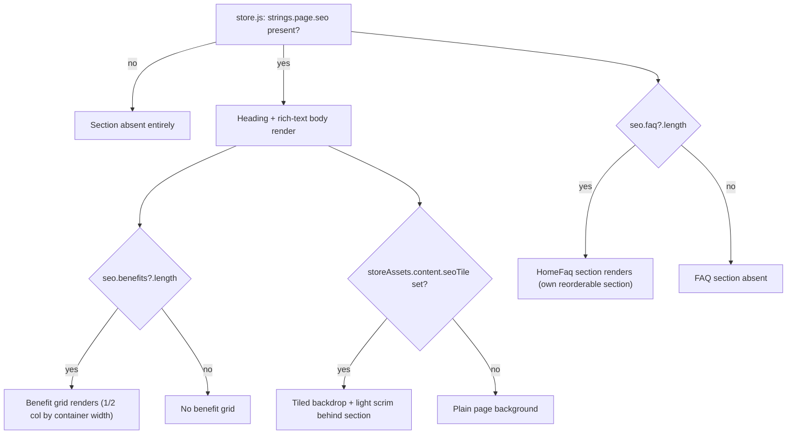
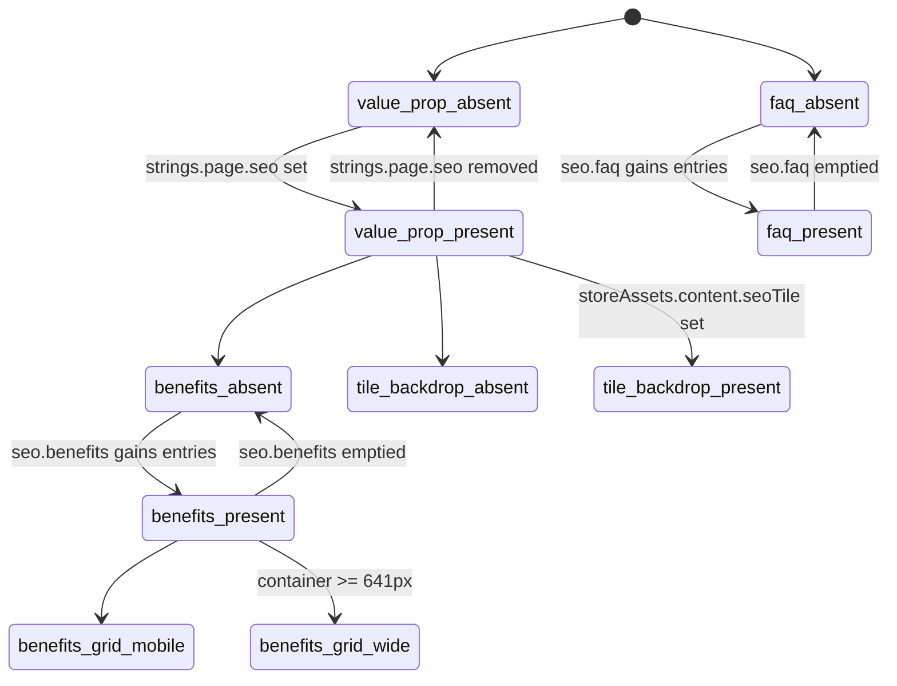

# SEO Value-Prop Block

> Heading/body + benefit grid + FAQ accordion, gated purely on strings.page.seo presence — currently ZZZ and Diablo Immortal only.

**This file is generated.** Every resolved token value below was read from the actual CSS in `src/tokens/` at export time — never hand-transcribed. Regenerate with `npm run handoff:export`. The live, always-current version of everything here is at `/handoff/seo-block` in the running prototype.

## 1. Components

### Full section (composed, live theme)
Source: `src/App.vue:2190-2270 (value-prop), 2366-2379 (FAQ), 2712-2908 (shared CSS)`

Composed preview only — no extracted component exists in the real app (this is inline App.vue markup, shared by every store), so this mounts a handoff-only wrapper (SeoValuePropComposed.vue) that mirrors that markup/CSS verbatim and reads the REAL strings.page.seo / storeAssets.content.seoTile live. Switch the theme picker above to ZZZ or Diablo Immortal to see it populated — every other store correctly renders nothing, matching value_prop_absent. Not a real app component — no separate token contract of its own (covered by the two entries below).

### SeoValueProp
Source: `src/App.vue:2196-2277`

Heading + v-html rich-text body + optional benefit grid. Renders only when strings.page.seo is truthy; the benefit grid independently gates on seo.benefits?.length. Centred heading/body (44ch/90ch measure), left-aligned benefit grid (1 col mobile, 2 col at container ≥641px).

**Same value at every store:**

| Token | Value |
|---|---|
| `--x-gap-content-loose` | `12px` |
| `--x-gap-content-default` | `8px` |
| `--x-gap-content-narrow` | `4px` |
| `--x-gap-content-separation` | `16px` |
| `--x-gap-content-tight` | `2px` |
| `--x-size-img-xl` | `64px` |
| `--x-radius-circle` | `50%` |

**Diverges per store:**

| Token | CODASHOP | CODM | DIABLOIMMORTAL | EFOOTBALL | FCM | MGSSE | PVZ3 | ROGUETRADER | TDR | YGODL | YGOMD | ZZZ |
|---|---|---|---|---|---|---|---|---|---|---|---|---|
| `--x-text-header-default` | `oklch(1.000 0.000 305)` | `oklch(0.992 0.003 286.4)` | `oklch(0.993 0.001 56.0)` | `oklch(1 0 0)` | `oklch(1 0 0)` | `oklch(0.975 0 0)` | `oklch(0.975 0.005 140)` | `oklch(0.972 0.03 80)` | `oklch(0.992 0.002 258)` | `oklch(0.992 0.002 255)` | `oklch(0.995 0.0024 279.3)` | `oklch(1 0 0)` |
| `--x-text-body-default` | `oklch(1.000 0.000 305)` | `oklch(0.992 0.003 286.4)` | `oklch(0.993 0.001 56.0)` | `oklch(1 0 0)` | `oklch(1 0 0)` | `oklch(0.975 0 0)` | `oklch(0.975 0.005 140)` | `oklch(0.972 0.03 80)` | `oklch(0.992 0.002 258)` | `oklch(0.992 0.002 255)` | `oklch(0.995 0.0024 279.3)` | `oklch(1 0 0)` |
| `--x-text-body-soft` | `oklch(0.909 0.004 305)` | `oklch(0.719 0.006 274.9)` | `oklch(0.893 0.001 56.0)` | `oklch(0.738 0.088 284.0)` | `oklch(0.571 0.008 106.6)` | `oklch(0.73 0 0)` | `oklch(0.73 0.01 140)` | `oklch(0.725 0.016 80)` | `oklch(0.718 0.006 258)` | `oklch(0.720 0.007 255)` | `oklch(0.723 0.0117 279.3)` | `oklch(0.790 0 0)` |
| `--x-bg-indicator-neutral-subtle` | `oklch(0.431 0.024 305)` | `oklch(0.310 0.011 271.0)` | `oklch(0.349 0.007 56.0)` | `oklch(0.335 0.216 266.4)` | `oklch(0.158 0.002 197)` | `oklch(0.3 0 0)` | `oklch(0.3 0.02 140)` | `oklch(0.3 0.011 80)` | `oklch(0.300 0.010 258)` | `oklch(0.290 0.016 255)` | `oklch(0.293 0.0268 279.3)` | `oklch(0.205 0 0)` |

### SeoTileBackdrop
Source: `src/App.vue:2200-2207, 2376-2380, 2793-2811`

Optional full-bleed repeating texture (storeAssets.content.seoTile) behind BOTH the value-prop section and the FAQ section — same asset, two independent mount points since the sections can reorder around the download banner. Diablo Immortal supplies seo-tile.png (leather/mortar); ZZZ supplies none, so its SEO sections render on the plain page background. Uses a lighter scrim (--x-scrim-strong) than a photo backdrop would, since the default 88%-dark scrim reads as solid black over a subtle tiled grain.

| Token | CODASHOP | CODM | DIABLOIMMORTAL | EFOOTBALL | FCM | MGSSE | PVZ3 | ROGUETRADER | TDR | YGODL | YGOMD | ZZZ |
|---|---|---|---|---|---|---|---|---|---|---|---|---|
| `--x-scrim-strong` | `color-mix(in oklab, oklch(0.180 0.035 305) 72%, transparent)` | `color-mix(in oklab, oklch(0.166 0.017 273.5) 72%, transparent)` | `color-mix(in oklab, oklch(0.207 0.006 56.0) 72%, transparent)` | `color-mix(in oklab, oklch(0.231 0.160 264.1) 72%, transparent)` | `color-mix(in oklab, oklch(0 0 0) 72%, transparent)` | `color-mix(in oklab, oklch(0.134 0.0 0) 72%, transparent)` | `color-mix(in oklab, oklch(0.2 0.02 140) 72%, transparent)` | `color-mix(in oklab, oklch(0.147 0.003 17.6) 72%, transparent)` | `color-mix(in oklab, oklch(0.165 0.012 258) 72%, transparent)` | `color-mix(in oklab, oklch(0.160 0.020 255) 72%, transparent)` | `color-mix(in oklab, oklch(0.163 0.033 279.3) 72%, transparent)` | `color-mix(in oklab, oklch(0 0 0) 72%, transparent)` |

### HomeFaq
Source: `src/components/home/HomeFaq.vue`

Same strings.page.seo.faq data, rendered as its own section so it can independently reorder around the download banner. Gets a visible card border here (--x-home-surface-border overridden to --x-border-card-default by .section--seo) — the only other HomeFaq consumer besides HomeVisual to override that fallback.

**Same value at every store:**

| Token | Value |
|---|---|
| `--home-faq-cols` | _(resolve live)_ |
| `--x-bg-tag-neutral` | `oklch(0 0 0 / 0.10)` |
| `--x-gap-content-default` | `8px` |
| `--x-home-surface-blur` | _(resolve live)_ |
| `--x-home-surface-border` | _(resolve live)_ |
| `--x-pad-surface-l` | `16px` |
| `--x-shadow-card` | `0 4px 4px oklch(0 0 0 / 0.25)` |

**Diverges per store:**

| Token | CODASHOP | CODM | DIABLOIMMORTAL | EFOOTBALL | FCM | MGSSE | PVZ3 | ROGUETRADER | TDR | YGODL | YGOMD | ZZZ |
|---|---|---|---|---|---|---|---|---|---|---|---|---|
| `--x-bg-card-default` | `linear-gradient(0deg, oklch(0.377 0.010 278 / 0.08), oklch(0.786 0.006 275 / 0.08))` | `linear-gradient(0deg, oklch(0.377 0.010 278 / 0.08), oklch(0.786 0.006 275 / 0.08))` | `url("data:image/svg+xml,%3Csvg%20xmlns%3D%22http%3A//www.w3.org/2000/svg%22%20width%3D%2296%22%20height%3D%2296%22%3E%3Cfilter%20id%3D%22n%22%3E%3CfeTurbulence%20type%3D%22fractalNoise%22%20baseFrequency%3D%220.75%22%20numOctaves%3D%222%22%20stitchTiles%3D%22stitch%22%20result%3D%22t%22/%3E%3CfeColorMatrix%20in%3D%22t%22%20type%3D%22matrix%22%20values%3D%220%200%200%200%200%20%200%200%200%200%200%20%200%200%200%200%200%20%200.9%200.9%200.9%200%200%22/%3E%3CfeComponentTransfer%3E%3CfeFuncA%20type%3D%22linear%22%20slope%3D%220.09%22/%3E%3C/feComponentTransfer%3E%3C/filter%3E%3Crect%20width%3D%22100%25%22%20height%3D%22100%25%22%20filter%3D%22url%28%23n%29%22/%3E%3C/svg%3E"), linear-gradient(0deg, oklch(0.239 0.059 33.9), oklch(0.239 0.059 33.9))` | `linear-gradient( oklch(0.304 0.211 264.1 / 0.60), oklch(0.304 0.211 264.1 / 0.60) )` | `linear-gradient(180deg, oklch(0.95 0 0 / 0.08) 0%, oklch(0.81 0 0 / 0.08) 100%), linear-gradient(180deg, oklch(0.047 0 0 / 0.6), oklch(0.047 0 0 / 0.6))` | `oklch(0.225 0 0)` | `linear-gradient(0deg, oklch(0.377 0.010 278 / 0.08), oklch(0.786 0.006 275 / 0.08))` | `linear-gradient(0deg, oklch(0.225 0.011 80 / 0.55), oklch(0.3 0.011 80 / 0.55))` | `linear-gradient(0deg, oklch(0.370 0.009 258 / 0.08), oklch(0.786 0.005 258 / 0.08))` | `linear-gradient(to bottom, oklch(0 0 0 / 0.56) 24.519%, oklch(0 0 0 / 0.88))` | `oklch(0.228 0.0301 279.3)` | `oklch(0 0 0)` |
| `--x-radius-container-s` | `8px` | `8px` | `0px` | `8px` | `8px` | `0px` | `8px` | `0px` | `8px` | `8px` | `0px` | `8px` |
| `--x-text-body-default` | `oklch(1.000 0.000 305)` | `oklch(0.992 0.003 286.4)` | `oklch(0.993 0.001 56.0)` | `oklch(1 0 0)` | `oklch(1 0 0)` | `oklch(0.975 0 0)` | `oklch(0.975 0.005 140)` | `oklch(0.972 0.03 80)` | `oklch(0.992 0.002 258)` | `oklch(0.992 0.002 255)` | `oklch(0.995 0.0024 279.3)` | `oklch(1 0 0)` |
| `--x-text-header-default` | `oklch(1.000 0.000 305)` | `oklch(0.992 0.003 286.4)` | `oklch(0.993 0.001 56.0)` | `oklch(1 0 0)` | `oklch(1 0 0)` | `oklch(0.975 0 0)` | `oklch(0.975 0.005 140)` | `oklch(0.972 0.03 80)` | `oklch(0.992 0.002 258)` | `oklch(0.992 0.002 255)` | `oklch(0.995 0.0024 279.3)` | `oklch(1 0 0)` |

## 2. State inventory

| State | Description | Entry | Exit |
|---|---|---|---|
| `value_prop_absent` | Section does not mount at all. | strings.page.seo is falsy (every store except ZZZ / Diablo Immortal today) | store config adds a seo object |
| `value_prop_present` | Heading + rich-text body render, centred, 44ch/90ch max-width. | strings.page.seo truthy | seo removed from config |
| `benefits_absent` | No benefit grid — value-prop section is just heading + body. | seo.benefits missing or empty array | benefits array gains ≥1 entry |
| `benefits_present` | Benefits heading + optional desc + icon/title/desc card grid render below the body. | seo.benefits?.length > 0 | benefits array emptied |
| `benefits_grid_mobile` | Single-column card stack. | container width < 641px | container widens past 641px |
| `benefits_grid_wide` | 2-column card grid. | container width ≥ 641px | container narrows below 641px |
| `tile_backdrop_absent` | Plain page background behind both SEO sections (ZZZ today). | storeAssets.content.seoTile is null | store supplies a seoTile asset |
| `tile_backdrop_present` | Repeating texture + light scrim fill both sections' full-bleed background (Diablo Immortal today). | storeAssets.content.seoTile set | asset removed |
| `faq_absent` | FAQ section does not mount. | seo.faq missing or empty array | faq array gains ≥1 entry |
| `faq_present` | HomeFaq renders in grid layout, bordered card. | seo.faq?.length > 0 | faq array emptied |
| `group_order_default` | Value-prop section then FAQ section, in that order, before the download banner. | config.content?.downloadBannerFirst is falsy (ZZZ, Diablo Immortal today) | flag flips true |
| `group_order_banner_first` | Download banner sits between the value-prop section and the FAQ section instead; divider moves accordingly. | config.content?.downloadBannerFirst is true (COD:M today, which has no seo config so this state is currently unreachable FOR this feature — noted for when a store combines both) | flag flips false |

Total states: **12**

## 3. Transitions

| From | To | Trigger | Motion tokens |
|---|---|---|---|

## 4. Choreography

| Beat | Delay | Duration token | Resolved (per store) | Easing token | Resolved (per store) | Target |
|---|---|---|---|---|---|---|

## 5. User flow

## 6. State diagram

## 7. Notes (authored)

**Rationale:** Purely config-driven content block, not a feature with a state machine to build — the point of this handoff is the DATA CONTRACT (what strings.page.seo/benefits/faq/storeAssets.content.seoTile must shape up as) and the TOKEN CONTRACT (what each rendered piece consumes), not choreography. Documented ZZZ + Diablo Immortal together because they are, today, the only two stores exercising every gate (tile present/absent, benefits present, faq present) between them.

**Build order:**
1. T1 — Static structure: heading + v-html body, content-gated on seo presence, correct max-width/centring.
2. T2 — Benefit grid: icon/title/desc cards, content-gated on benefits?.length, 1/2-column responsive breakpoint at 641px.
3. T3 — FAQ section: HomeFaq in grid layout, content-gated on faq?.length, bordered-card override.
4. T4 — Tiled backdrop: full-bleed repeating texture + light scrim, gated on storeAssets.content.seoTile, applied to both sections independently.
5. T5 — Section reordering: config.content.downloadBannerFirst swapping the download banner between the two SEO sections.

**Gotchas:**
- The value-prop section and the FAQ section are two INDEPENDENT sections sharing one data object (seo) and one asset (seoTile) — they can reorder around the download banner independently (config.content.downloadBannerFirst), so never assume they are adjacent in the DOM.
- seo.body is rendered with v-html — it is trusted rich text (short 
 paragraphs, <strong> for emphasis), not plain copy. A production port must keep it a sanitised-HTML field, not flatten it to a plain string.
- --x-home-surface-border is normally transparent for every other HomeFaq consumer; this section is one of only two places (with HomeVisual) that overrides it to a visible card border. Do not "fix" this to match the transparent default elsewhere.
- The tiled backdrop bleeds behind the FULL section, not just the copy column — it reuses the same section__bg layer other categories use for a cover photo, just repeating instead of cover-fit.
- ZZZ has no seoTile asset at all — this is the graceful-absent path, not a missing asset to backfill. Do not require a tile texture for every store that adopts this block.

**Prohibitions:**
- Never require benefits or faq for the section to render — both are independently optional; heading+body alone is a valid, complete state.
- Never treat seo.body as plain text — it carries real markup (paragraphs, <strong>) via v-html.
- Never hardcode a resolved token value — every value in the token contract is read live per store theme.
- Never assume a tile backdrop is required — ZZZ's absence of one is the graceful-absent default, not a gap.

**Open questions:**
- Should benefits/faq ever be independently absent while the other is present in a NEW store's config (today both ZZZ and Diablo Immortal supply all three: body, benefits, faq)? The gating code supports it; no store currently exercises that combination to verify against.
- group_order_banner_first (config.content.downloadBannerFirst) has no store today combining it with a populated seo config — worth a design check before a future store tries both flags together.

## 8. Constraints & prohibitions

- Never hardcode a resolved literal that a token above already provides — map to the equivalent semantic token in your system.
- Every state in §2 must be reachable in your rebuild. A missing state is an incomplete task.
- Cross-check the live oracle at `/handoff/seo-block` in the running prototype before treating this static export as final — it is a snapshot, the live surface is the source of truth at any given moment.

## 9. Verification

| # | State | Reachable | Matches reference |
|---|---|---|---|
| 1 | `value_prop_absent` | ☐ | ☐ |
| 2 | `value_prop_present` | ☐ | ☐ |
| 3 | `benefits_absent` | ☐ | ☐ |
| 4 | `benefits_present` | ☐ | ☐ |
| 5 | `benefits_grid_mobile` | ☐ | ☐ |
| 6 | `benefits_grid_wide` | ☐ | ☐ |
| 7 | `tile_backdrop_absent` | ☐ | ☐ |
| 8 | `tile_backdrop_present` | ☐ | ☐ |
| 9 | `faq_absent` | ☐ | ☐ |
| 10 | `faq_present` | ☐ | ☐ |
| 11 | `group_order_default` | ☐ | ☐ |
| 12 | `group_order_banner_first` | ☐ | ☐ |
