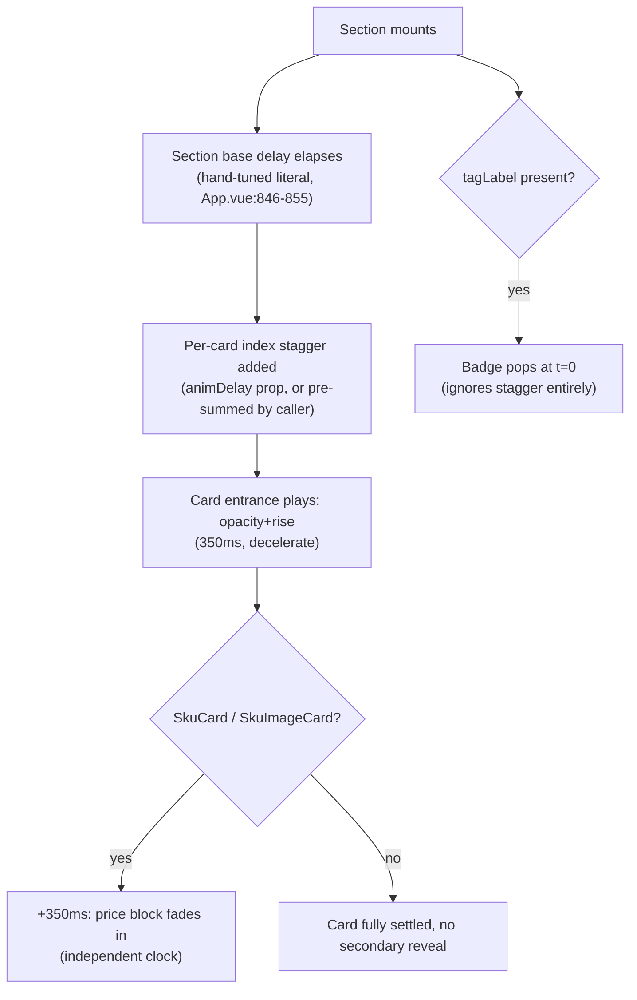
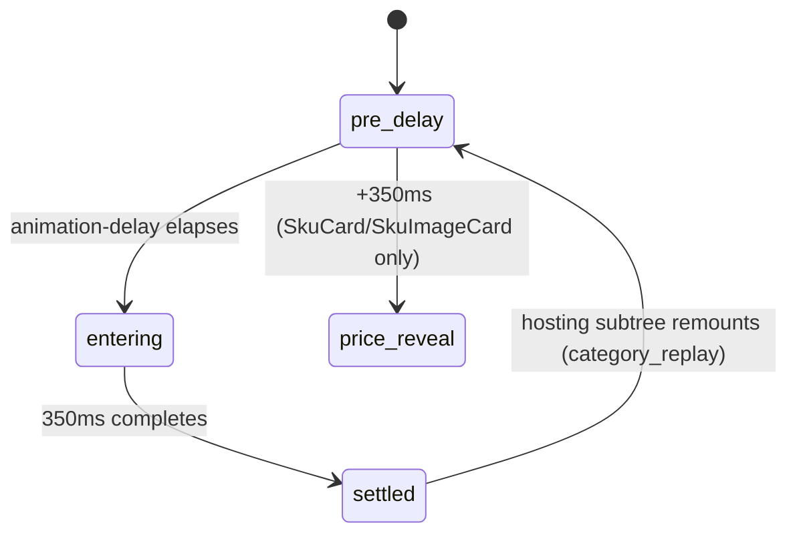

# SKU Card Family — Staggered Entrance (Loading) Animation

> Two-axis mount cascade (section base delay + per-card index stagger) shared by every SKU-shaped card. Pure opacity/transform — no colour or typography axis.

**This file is generated.** Every resolved token value below was read from the actual CSS in `src/tokens/` at export time — never hand-transcribed. Regenerate with `npm run handoff:export`. The live, always-current version of everything here is at `/handoff/sku-card-entrance-stagger` in the running prototype.

## 1. Components

### SkuCard / SkuImageCard
Source: `src/components/SkuCard.vue:44,107-109,138-139,331-332; src/components/SkuImageCard.vue:~93-96,232-238,497-501`

The only two families with an `animDelay` prop and a secondary `priceStyle` computed (`baseDelay + animDelay + 350ms`) — the price block fades in on its own clock, 350ms (one full entrance duration) after the card itself settles, so the price never competes visually with the card's own rise. Badge pop (`tagLabel || isBestValue`) has NO animation-delay at all — every badge in a staggered grid pops at the same instant, independent of its card's stagger position. Verified, not assumed: no static value or `:style` binding sets a delay on `.sku-card__badge` anywhere.

**Same value at every store:**

| Token | Value |
|---|---|
| `--x-motion-sys-duration-slow` | `350ms` |
| `--x-motion-sys-ease-decelerate` | `cubic-bezier(0, 0, 0.2, 1)` |
| `--x-motion-sys-ease-spring` | `cubic-bezier(0.34, 1.56, 0.64, 1)` |

### BundleSkuCard / GiftSkuCard
Source: `src/components/BundleSkuCard.vue:~59,219-222,382-388; src/components/GiftSkuCard.vue:~48,158-161,302-305`

No `animDelay` prop — the caller folds the per-card index step directly into `baseDelay` (`DELAY_BUNDLE + i*120`, `DELAY_GIFTS + i*120`). No secondary price-reveal delay — the whole card fades/rises as one animation. `bundle-enter`'s `to` keyframe deliberately omits `transform` (unlike `sku-enter`'s `translateY(0)`) — a documented fix so `fill-mode: both` doesn't pin a compositor layer that would block a child `backdrop-filter` from sampling the banner image beneath it. Do not "complete" this keyframe to match `sku-enter`.

**Same value at every store:**

| Token | Value |
|---|---|
| `--x-motion-sys-duration-slow` | `350ms` |
| `--x-motion-sys-ease-decelerate` | `cubic-bezier(0, 0, 0.2, 1)` |

### HeroSkuCard
Source: `src/components/HeroSkuCard.vue:~55,143-146`

Uses the shared `sku-enter` keyframe (6px rise) like SkuCard, but — like Bundle/Gift — has no `animDelay` prop and no secondary price-reveal delay. `CategoryCatalog.vue` computes its full stagger (`baseDelay + si*80 + i*120`) and passes it as one `baseDelay`.

**Same value at every store:**

| Token | Value |
|---|---|
| `--x-motion-sys-duration-slow` | `350ms` |
| `--x-motion-sys-ease-decelerate` | `cubic-bezier(0, 0, 0.2, 1)` |

### BestSellerCard / BestSellerCarousel
Source: `src/components/BestSellerCard.vue:~78,295-298; src/components/BestSellerCarousel.vue:~132`

Takes only `baseDelay` (no `animDelay` prop), shared `sku-enter` keyframe. As a single hero instance: one section-level delay (`DELAY_BESTSELLER`). In the carousel: `BestSellerCarousel.vue` mounts multiple instances and pre-sums each one's stagger itself (`baseDelay + i*90`) — the SAME 90ms step as SkuCard/SkuImageCard, despite BestSellerCard having no `animDelay` prop of its own to receive it. Perpetual running-border/shimmer/bloom effects on this component are a SEPARATE, independent loop — out of scope for this flow.

**Same value at every store:**

| Token | Value |
|---|---|
| `--x-motion-sys-duration-slow` | `350ms` |
| `--x-motion-sys-ease-decelerate` | `cubic-bezier(0, 0, 0.2, 1)` |

## 2. State inventory

| State | Description | Entry | Exit |
|---|---|---|---|
| `pre_delay` | Card fully transparent, offset by its family's entrance translate (6px for sku-enter, 12px for bundle-enter/gift-enter) — held by animation-fill-mode: both reading the keyframe's `from`. | Component mounts | animation-delay (baseDelay [+ animDelay]) elapses |
| `entering` | Card fades in and rises/settles to its resting position. | Delay elapses | --x-motion-sys-duration-slow (350ms) completes |
| `settled` | Fully opaque, transform at rest; fill-mode: both holds this indefinitely, no cleanup needed. | Entrance animation completes | Component unmounts, or hosting subtree remounts (category_replay) |
| `price_reveal` | SkuCard/SkuImageCard ONLY — a parallel state of the price block, not the card root. Price fades in (opacity only, no transform) after the card has already settled. | baseDelay + animDelay + 350ms elapses | fade-in animation completes |
| `category_replay` | HeroSkuCard/BundleSkuCard hosted inside CategoryCatalog only. The entire :key="category.id" subtree unmounts and remounts, so every hosted card's animation-delay restarts from baseDelay + si*80 + i*120 and replays from pre_delay. | User switches category | New category's subtree finishes mounting |

Total states: **5**

## 3. Transitions

| From | To | Trigger | Motion tokens |
|---|---|---|---|
| `pre_delay` | `entering` | animation-delay elapses (browser-timed, not JS) | `--x-motion-sys-duration-slow`, `--x-motion-sys-ease-decelerate` |
| `entering` | `settled` | animation duration completes |  |
| `settled` | `pre_delay` | Hosting subtree remounts (category_replay, or any parent re-keying the card) — Vue destroys/recreates the DOM node, resetting all CSS animation state |  |
| `pre_delay` | `price_reveal` | Same mechanism, offset +350ms later, SkuCard/SkuImageCard only | `--x-motion-sys-duration-slow`, `--x-motion-sys-ease-decelerate` |

## 4. Choreography

| Beat | Delay | Duration token | Resolved (per store) | Easing token | Resolved (per store) | Target |
|---|---|---|---|---|---|---|
| Section constants defined (hardcoded top-to-bottom mount order in App.vue:846-855) | 0ms | `` | codashop: (resolve live); codm: (resolve live); diabloimmortal: (resolve live); efootball: (resolve live); fcm: (resolve live); mgsse: (resolve live); pvz3: (resolve live); roguetrader: (resolve live); tdr: (resolve live); ygodl: (resolve live); ygomd: (resolve live); zzz: (resolve live) | `` | codashop: (resolve live); codm: (resolve live); diabloimmortal: (resolve live); efootball: (resolve live); fcm: (resolve live); mgsse: (resolve live); pvz3: (resolve live); roguetrader: (resolve live); tdr: (resolve live); ygodl: (resolve live); ygomd: (resolve live); zzz: (resolve live) | DELAY_STORY=100 · DELAY_ACCOUNT=180 · DELAY_BESTSELLER=250 · DELAY_BS_CAROUSEL=450 · DELAY_BUNDLE=550 · DELAY_GIFTS=620 · DELAY_PROMO=720 · DELAY_CP=950 · DELAY_CP_IMG_NEW=1050 · DELAY_CP_IMG=1150 |
| Card i's entrance plays (opacity 0→1, translateY→0) | 0ms | `--x-motion-sys-duration-slow` | codashop: 350ms; codm: 350ms; diabloimmortal: 350ms; efootball: 350ms; fcm: 350ms; mgsse: 350ms; pvz3: 350ms; roguetrader: 350ms; tdr: 350ms; ygodl: 350ms; ygomd: 350ms; zzz: 350ms | `--x-motion-sys-ease-decelerate` | codashop: cubic-bezier(0, 0, 0.2, 1); codm: cubic-bezier(0, 0, 0.2, 1); diabloimmortal: cubic-bezier(0, 0, 0.2, 1); efootball: cubic-bezier(0, 0, 0.2, 1); fcm: cubic-bezier(0, 0, 0.2, 1); mgsse: cubic-bezier(0, 0, 0.2, 1); pvz3: cubic-bezier(0, 0, 0.2, 1); roguetrader: cubic-bezier(0, 0, 0.2, 1); tdr: cubic-bezier(0, 0, 0.2, 1); ygodl: cubic-bezier(0, 0, 0.2, 1); ygomd: cubic-bezier(0, 0, 0.2, 1); zzz: cubic-bezier(0, 0, 0.2, 1) | baseDelay + animDelay (relative) |
| Price block fades in independently (SkuCard/SkuImageCard only) | 350ms | `--x-motion-sys-duration-slow` | codashop: 350ms; codm: 350ms; diabloimmortal: 350ms; efootball: 350ms; fcm: 350ms; mgsse: 350ms; pvz3: 350ms; roguetrader: 350ms; tdr: 350ms; ygodl: 350ms; ygomd: 350ms; zzz: 350ms | `--x-motion-sys-ease-decelerate` | codashop: cubic-bezier(0, 0, 0.2, 1); codm: cubic-bezier(0, 0, 0.2, 1); diabloimmortal: cubic-bezier(0, 0, 0.2, 1); efootball: cubic-bezier(0, 0, 0.2, 1); fcm: cubic-bezier(0, 0, 0.2, 1); mgsse: cubic-bezier(0, 0, 0.2, 1); pvz3: cubic-bezier(0, 0, 0.2, 1); roguetrader: cubic-bezier(0, 0, 0.2, 1); tdr: cubic-bezier(0, 0, 0.2, 1); ygodl: cubic-bezier(0, 0, 0.2, 1); ygomd: cubic-bezier(0, 0, 0.2, 1); zzz: cubic-bezier(0, 0, 0.2, 1) | baseDelay + animDelay + 350 (relative) — always exactly one entrance-duration after the card's own delay |
| Badge pop plays — NO delay applied, always t=0 regardless of the card's own stagger | 0ms | `--x-motion-sys-duration-slow` | codashop: 350ms; codm: 350ms; diabloimmortal: 350ms; efootball: 350ms; fcm: 350ms; mgsse: 350ms; pvz3: 350ms; roguetrader: 350ms; tdr: 350ms; ygodl: 350ms; ygomd: 350ms; zzz: 350ms | `--x-motion-sys-ease-spring` | codashop: cubic-bezier(0.34, 1.56, 0.64, 1); codm: cubic-bezier(0.34, 1.56, 0.64, 1); diabloimmortal: cubic-bezier(0.34, 1.56, 0.64, 1); efootball: cubic-bezier(0.34, 1.56, 0.64, 1); fcm: cubic-bezier(0.34, 1.56, 0.64, 1); mgsse: cubic-bezier(0.34, 1.56, 0.64, 1); pvz3: cubic-bezier(0.34, 1.56, 0.64, 1); roguetrader: cubic-bezier(0.34, 1.56, 0.64, 1); tdr: cubic-bezier(0.34, 1.56, 0.64, 1); ygodl: cubic-bezier(0.34, 1.56, 0.64, 1); ygomd: cubic-bezier(0.34, 1.56, 0.64, 1); zzz: cubic-bezier(0.34, 1.56, 0.64, 1) | SkuCard / SkuImageCard / GiftSkuCard badge, when tagLabel present |

## 5. User flow

## 6. State diagram

## 7. Notes (authored)

**Rationale:** Migrated from the hand-written docs/Handoff/sku-card-entrance-stagger/ (re-traced 2026-09-12, zero drift found against v0.49.2's documented state — see file header). Pure opacity/transform entrance shared by 6 component families with 2 verified, deliberate quirks (badge ignores stagger; only 2 of 6 families get a secondary price-reveal delay) that must be carried forward, not "corrected" during a rebuild.

**Build order:**
1. Shared entrance mechanism (opacity + rise), parameterized by delay and rise distance — every family shares duration/easing, differs only in rise distance (6px vs 12px) and whether the rest state keeps a transform value.
2. Two-axis delay composition — section offset (one module, never inline-recomputed) + per-card index step, keeping the 90ms and 120ms steps distinct.
3. Price-reveal secondary delay, SkuCard/SkuImageCard only — fade the price block in 350ms after the card's own delay, never on Bundle/Gift/Hero.
4. Badge pop with zero delay, independent of the card's own stagger position.

**Gotchas:**
- The badge's zero-delay pop is verified from source (no animation-delay set anywhere on .sku-card__badge), not an assumption — do not stagger it when rebuilding unless a reviewer confirms it should change (see openQuestions).
- Price-reveal offset (+350ms) exists ONLY on SkuCard/SkuImageCard. Do not add it to BundleSkuCard/GiftSkuCard/HeroSkuCard — they fade their price in as part of the single card-level entrance.
- bundle-enter's `to` keyframe deliberately omits `transform: translateY(0)` — a fix for a backdrop-filter compositing bug where fill-mode:both would otherwise pin a GPU compositor layer that blocks a child element's backdrop-filter sampling. Preserve this asymmetry with sku-enter; do not "complete" it.
- Two DIFFERENT per-card index stagger steps exist for different families: 90ms (SkuCard/SkuImageCard/BestSellerCard-in-carousel) vs 120ms (Bundle/Gift/Hero within CategoryCatalog) — carry both distinctly, never unify into one constant.
- The 10 section-level DELAY_* constants (App.vue:846-855) are hand-tuned literals with no formula or token backing — carry the values, not a derived pattern.
- Category switch (CategoryCatalog's :key="category.id" remount) replays the FULL cascade from scratch for every hosted card — never resume mid-animation or skip straight to settled.
- prefers-reduced-motion is NOT handled anywhere in this feature (no @media override on sku-enter/bundle-enter/gift-enter/fade-in/pop) — a real, verified gap, not an oversight to silently fix.

**Prohibitions:**
- Never stagger the badge pop to match its card's own delay.
- Never add a secondary price-reveal delay to BundleSkuCard/GiftSkuCard/HeroSkuCard.
- Never "complete" bundle-enter's to keyframe with a transform value that matches sku-enter's.
- Never unify the 90ms and 120ms per-card stagger steps into one constant.
- Never add a prefers-reduced-motion override that doesn't exist in the reference without first flagging it to a reviewer as a deliberate improvement, not a silent fix.

**Open questions:**
- Is the badge's zero-delay pop (ignoring the card's own stagger) intentional, or an oversight where the delay was never wired up? No blocking impact — carry as-is until a reviewer weighs in.
- Is the 90ms/120ms split between families' per-index stagger intentional (different pacing for different content densities), given a --motion-sku-stagger token exists at 50ms and neither family consumes it? No blocking impact — carry both distinct hardcoded values.
- Are the ten hand-tuned DELAY_* section constants still accurate to the current section order, or have sections been reordered/added since they were last tuned? Maintainability note, not a spec ambiguity — carry current values.

## 8. Constraints & prohibitions

- Never hardcode a resolved literal that a token above already provides — map to the equivalent semantic token in your system.
- Every state in §2 must be reachable in your rebuild. A missing state is an incomplete task.
- Cross-check the live oracle at `/handoff/sku-card-entrance-stagger` in the running prototype before treating this static export as final — it is a snapshot, the live surface is the source of truth at any given moment.

## 9. Verification

| # | State | Reachable | Matches reference |
|---|---|---|---|
| 1 | `pre_delay` | ☐ | ☐ |
| 2 | `entering` | ☐ | ☐ |
| 3 | `settled` | ☐ | ☐ |
| 4 | `price_reveal` | ☐ | ☐ |
| 5 | `category_replay` | ☐ | ☐ |
