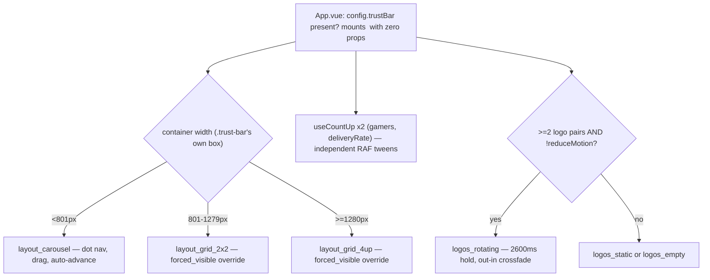
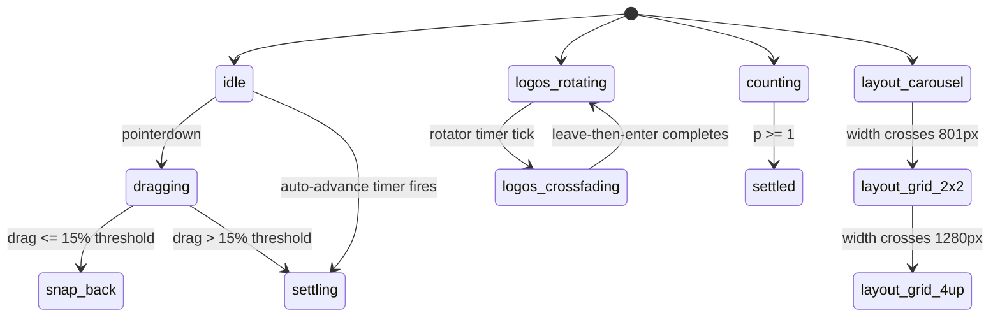

# Trust Bar — Codashop Trust Carousel Card

> Four-card trust-signal row (partnerships, gamer count, delivery speed, payment methods). Codashop only. Self-scoped container query, drag-to-swipe carousel, publisher-logo crossfade rotator, count-up stats.

**This file is generated.** Every resolved token value below was read from the actual CSS in `src/tokens/` at export time — never hand-transcribed. Regenerate with `npm run handoff:export`. The live, always-current version of everything here is at `/handoff/trust-bar` in the running prototype.

## 1. Components

### TrustBar — responsive layout
Source: `src/components/TrustBar.vue:255-256,447,474 (self-scoped @container trust-bar rules)`

Driven entirely by CSS @container queries against .trust-bar's OWN rendered width — TrustBar names itself as a query container (container-type: inline-size; container-name: trust-bar), not this repo's usual anonymous-binding-to-.device__screen convention. Deliberate: TrustBar mounts in App.vue's sticky lead rail (~4/12 columns, ~400px at a 1280px frame) alongside CompactHero, not the full-width main column — an anonymous rule would still fire off SCREEN width even though .trust-bar's own box never reaches 801px there. Practical consequence: layout-grid-2x2/-4up are part of the general contract and MUST still be implemented/verified, but are not reachable via window resize in the shipped page today — verify by widening .trust-bar's own box directly.

**Same value at every store:**

| Token | Value |
|---|---|
| `--x-gap-content-default` | `8px` |
| `--x-gap-content-loose` | `12px` |
| `--border-weight-default` | `1px` |

**Diverges per store:**

| Token | CODASHOP | CODM | DIABLOIMMORTAL | EFOOTBALL | FCM | MGSSE | PVZ3 | ROGUETRADER | TDR | YGODL | YGOMD | ZZZ |
|---|---|---|---|---|---|---|---|---|---|---|---|---|
| `--x-border-navbar` | `oklch(0.636 0.016 305)` | `oklch(0.310 0.011 271.0)` | `oklch(0.349 0.007 56.0)` | `oklch(0.335 0.216 266.4)` | `oklch(0.158 0.002 197)` | `oklch(0.3 0 0)` | `oklch(0.3 0.02 140)` | `oklch(0.3 0.011 80)` | `oklch(0.300 0.010 258)` | `oklch(0.290 0.016 255)` | `oklch(0.293 0.0268 279.3)` | `oklch(0.205 0 0)` |

### TrustBar — carousel interaction (XS/S)
Source: `src/components/TrustBar.vue:64-122 (drag/timer logic), :156-234 (template/dots)`

Drag-to-swipe (pointerdown/move/up, 15% of track clientWidth threshold) + dot pagination + auto-advance timer, all independent of the publisher-logo rotator's own timer. Auto-advance WRAPS (modulo); manual drag/dot-click CLAMPS to [0, cardCount-1] — asymmetric by design (autoplay loops to stay alive; drag past an end is the user testing the boundary). Every path that changes activeCard also calls resetCarouselTimer(), which clears any existing timer before arming a new one — no duplicate timers can accumulate.

**Same value at every store:**

| Token | Value |
|---|---|
| `--x-motion-trust-slide` | `500ms cubic-bezier(0, 0, 0.2, 1)` |
| `--x-motion-sys-duration-fast` | `150ms` |

**Diverges per store:**

| Token | CODASHOP | CODM | DIABLOIMMORTAL | EFOOTBALL | FCM | MGSSE | PVZ3 | ROGUETRADER | TDR | YGODL | YGOMD | ZZZ |
|---|---|---|---|---|---|---|---|---|---|---|---|---|
| `--x-bg-indicator-neutral-default` | `oklch(0.539 0.020 305)` | `oklch(0.377 0.010 278.3)` | `oklch(0.444 0.006 56.0)` | `oklch(0.364 0.217 268.7)` | `oklch(0.199 0.002 197)` | `oklch(0.375 0 0)` | `oklch(0.375 0.018 140)` | `oklch(0.375 0.011 80)` | `oklch(0.370 0.009 258)` | `oklch(0.360 0.014 255)` | `oklch(0.363 0.0234 279.3)` | `oklch(0.290 0 0)` |
| `--x-bg-indicator-selected-default` | `oklch(0.905 0.195 116)` | `oklch(0.916 0.115 196.7)` | `oklch(0.402 0.118 33.9)` | `oklch(0.646 0.261 1.8)` | `oklch(0.948 0.22 117)` | `oklch(0.876 0.099 127.5)` | `oklch(0.85 0.17 95)` | `oklch(0.759 0.084 73.8)` | `oklch(0.780 0.115 205)` | `oklch(0.460 0.195 27)` | `oklch(0.586 0.238 26.4)` | `oklch(0.686 0.107 61.9)` |
| `--x-radius-badge-full` | `999px` | `999px` | `999px` | `999px` | `999px` | `0px` | `999px` | `999px` | `999px` | `999px` | `999px` | `999px` |
| `--x-radius-container-xs` | `4px` | `4px` | `0px` | `4px` | `4px` | `0px` | `4px` | `0px` | `4px` | `4px` | `0px` | `4px` |

### TrustBar — publisher-logo rotator (card 1)
Source: `src/components/TrustBar.vue:35-61,173-185,400-407`

Chunks assets.content.publisherLogos into pairs; crossfades on a timer using Transition mode="out-in" — a REAL unmount gap, not mode="default", chosen to fix a confirmed bug where both pairs present briefly caused the card's height to jiggle (combined heights briefly exceeding either alone). Costs a doubled 350ms fade (leave then enter) in exchange. Every logo gets a solid light tile behind it (--x-bg-card-default) regardless of its own source colour, since real third-party logos aren't guaranteed light-on-dark polarity the way this repo's own first-party assets are.

**Same value at every store:**

| Token | Value |
|---|---|
| `--x-motion-trust-rotate-interval` | `2600ms` |
| `--x-motion-trust-rotate-fade` | `350ms` |
| `--x-pad-surface-xxs` | `2px` |
| `--x-pad-surface-s` | `8px` |
| `--x-gap-content-default` | `8px` |
| `--x-size-icon-m` | `20px` |

**Diverges per store:**

| Token | CODASHOP | CODM | DIABLOIMMORTAL | EFOOTBALL | FCM | MGSSE | PVZ3 | ROGUETRADER | TDR | YGODL | YGOMD | ZZZ |
|---|---|---|---|---|---|---|---|---|---|---|---|---|
| `--x-bg-card-default` | `linear-gradient(0deg, oklch(0.377 0.010 278 / 0.08), oklch(0.786 0.006 275 / 0.08))` | `linear-gradient(0deg, oklch(0.377 0.010 278 / 0.08), oklch(0.786 0.006 275 / 0.08))` | `url("data:image/svg+xml,%3Csvg%20xmlns%3D%22http%3A//www.w3.org/2000/svg%22%20width%3D%2296%22%20height%3D%2296%22%3E%3Cfilter%20id%3D%22n%22%3E%3CfeTurbulence%20type%3D%22fractalNoise%22%20baseFrequency%3D%220.75%22%20numOctaves%3D%222%22%20stitchTiles%3D%22stitch%22%20result%3D%22t%22/%3E%3CfeColorMatrix%20in%3D%22t%22%20type%3D%22matrix%22%20values%3D%220%200%200%200%200%20%200%200%200%200%200%20%200%200%200%200%200%20%200.9%200.9%200.9%200%200%22/%3E%3CfeComponentTransfer%3E%3CfeFuncA%20type%3D%22linear%22%20slope%3D%220.09%22/%3E%3C/feComponentTransfer%3E%3C/filter%3E%3Crect%20width%3D%22100%25%22%20height%3D%22100%25%22%20filter%3D%22url%28%23n%29%22/%3E%3C/svg%3E"), linear-gradient(0deg, oklch(0.239 0.059 33.9), oklch(0.239 0.059 33.9))` | `linear-gradient( oklch(0.304 0.211 264.1 / 0.60), oklch(0.304 0.211 264.1 / 0.60) )` | `linear-gradient(180deg, oklch(0.95 0 0 / 0.08) 0%, oklch(0.81 0 0 / 0.08) 100%), linear-gradient(180deg, oklch(0.047 0 0 / 0.6), oklch(0.047 0 0 / 0.6))` | `oklch(0.225 0 0)` | `linear-gradient(0deg, oklch(0.377 0.010 278 / 0.08), oklch(0.786 0.006 275 / 0.08))` | `linear-gradient(0deg, oklch(0.225 0.011 80 / 0.55), oklch(0.3 0.011 80 / 0.55))` | `linear-gradient(0deg, oklch(0.370 0.009 258 / 0.08), oklch(0.786 0.005 258 / 0.08))` | `linear-gradient(to bottom, oklch(0 0 0 / 0.56) 24.519%, oklch(0 0 0 / 0.88))` | `oklch(0.228 0.0301 279.3)` | `oklch(0 0 0)` |
| `--x-radius-container-xs` | `4px` | `4px` | `0px` | `4px` | `4px` | `0px` | `4px` | `0px` | `4px` | `4px` | `0px` | `4px` |

### TrustBar — count-up stats (cards 2 & 3)
Source: `src/composables/useCountUp.js (full file); called at TrustBar.vue:31-32`

useCountUp(target, duration=2800) — a composable, not a component prop; framework-agnostic requestAnimationFrame tween, not CSS-token-driven (easeOutCubic is a hand-rolled JS formula, no --motion-sys-ease-* token applies here). Rapid re-trigger is NOT a smooth reroute: watch(target, run) restarts the eased curve from 0→newTarget regardless of the currently-displayed value, causing a visible snap-to-0-then-recount rather than a continuation. Displayed value is always Math.round()'d, never fractional.

### TrustBar — payment icons row (card 4)
Source: `src/components/TrustBar.vue:147-152,213-217`

Renders unconditionally (no v-if gate, no empty state) — 4 hardcoded icon slots, only the logo URLs are sourced from assets.pc.*. No guard at all on a missing asset.pc.* entry — renders a broken  icon. This is a REAL REFERENCE GAP, not a designed state — carried forward as an open question, not silently fixed (see notes.openQuestions and the MUST-harden note).

**Same value at every store:**

| Token | Value |
|---|---|
| `--x-size-icon-m` | `20px` |

### InfoTag — success variant (delivery badge, card 3)
Source: `src/components/InfoTag.vue (full file); used at TrustBar.vue:206`

Small, stateless presentational component — no interaction states. TrustBar usage: <InfoTag icon="verified_user" variant="success" :label="t.deliveryBadge" />. The neutral variant (used by CompactHero) is out of scope for this flow. Doc gap closed on re-trace: InfoTag's own padding (--x-pad-surface-xs) was never tabled in the legacy spec — added here.

**Same value at every store:**

| Token | Value |
|---|---|
| `--border-weight-default` | `1px` |
| `--x-pad-surface-xs` | `4px` |
| `--x-gap-content-narrow` | `4px` |

**Diverges per store:**

| Token | CODASHOP | CODM | DIABLOIMMORTAL | EFOOTBALL | FCM | MGSSE | PVZ3 | ROGUETRADER | TDR | YGODL | YGOMD | ZZZ |
|---|---|---|---|---|---|---|---|---|---|---|---|---|
| `--x-bg-tag-success` | `oklch(0.205 0.030 152)` | `oklch(0.211 0.027 131.4)` | `oklch(0.140 0.026 143.1)` | `oklch(0.182 0.053 138.3)` | `oklch(0.31 0.069 151.9)` | `oklch(0.165 0.079 142.5)` | `oklch(0.212 0.109 142.5)` | `oklch(0.19 0.07 132.1)` | `oklch(0.211 0.027 131.4)` | `oklch(0.211 0.027 131.4)` | `oklch(0.304 0.053 164.1)` | `oklch(0.166 0.037 152.5)` |
| `--x-border-tag-success` | `oklch(0.532 0.126 152)` | `oklch(0.584 0.150 137.5)` | `oklch(0.430 0.106 143.1)` | `oklch(0.419 0.133 144.3)` | `oklch(0.593 0.152 150.2)` | `oklch(0.397 0.169 142.5)` | `oklch(0.46 0.190 142.5)` | `oklch(0.523 0.149 132.1)` | `oklch(0.584 0.150 137.5)` | `oklch(0.584 0.150 137.5)` | `oklch(0.536 0.113 164.1)` | `oklch(0.494 0.130 152.5)` |
| `--x-text-success-default` | `oklch(0.750 0.190 152)` | `oklch(0.880 0.246 138.2)` | `oklch(0.623 0.147 143.1)` | `oklch(0.593 0.189 144.4)` | `oklch(0.782 0.2 150.2)` | `oklch(0.583 0.198 142.5)` | `oklch(0.72 0.19 142.5)` | `oklch(0.790 0.175 132.1)` | `oklch(0.880 0.246 138.2)` | `oklch(0.880 0.246 138.2)` | `oklch(0.722 0.132 164.1)` | `oklch(0.803 0.191 152.5)` |
| `--x-radius-badge-s` | `4px` | `4px` | `0px` | `4px` | `4px` | `0px` | `4px` | `0px` | `4px` | `4px` | `999px` | `4px` |
| `--x-sys-weight-bold` | `700` | `700` | `700` | `700` | `500` | `700` | `700` | `600` | `700` | `700` | `700` | `700` |

## 2. State inventory

| State | Description | Entry | Exit |
|---|---|---|---|
| `layout_carousel` | One full-width card visible, flex track, dot nav visible, no dividers. The only state reachable via the shipped page's own layout (see components note above). | container width < 801px | width ≥ 801px |
| `layout_grid_2x2` | display: grid, repeat(2,1fr), dot nav hidden, right-divider on odd cards, bottom-divider on the top row, opacity:1 !important forces every card visible. | 801px ≤ width < 1280px | width leaves that range |
| `layout_grid_4up` | repeat(4,1fr), left-divider on every card but the first, no bottom-divider. | width ≥ 1280px | width < 1280px |
| `idle` | Track sits at translateX(-activeCard * 100%). | default, no pointer down, no timer firing | drag starts / auto-advance fires |
| `dragging` | Track transition disabled, follows the pointer 1:1 via a --drag px offset. | pointerdown on the track | pointerup / pointercancel |
| `settling` | Track animates from the drag-released position to the next/previous card's resting position. | pointerup after a drag that crossed the 15% threshold | the slide transition completes |
| `snap_back` | Track animates back to the current card's resting position. | pointerup after a drag that did NOT cross the 15% threshold | transition completes |
| `forced_visible` | Not a carousel state, a cross-cutting override — every card's opacity is pinned to 1 regardless of activeCard. | container enters layout_grid_2x2/-4up | container returns to layout_carousel |
| `logos_empty` | The entire logo row is absent — title/sub still render. | assets.content.publisherLogos is absent or [] | logos become available (theoretical — not reachable via any in-app control) |
| `logos_static` | One pair renders, no rotation, no timer armed. | exactly one logo pair (1 or 2 logos total) | a second pair becomes available |
| `logos_rotating` | Pairs crossfade on a timer. | ≥2 logo pairs (4+ logos) and motion not reduced | reduceMotion becomes true, or unmount |
| `logos_crossfading` | Outgoing pair fades out fully, THEN incoming pair fades in (mode="out-in") — sub-state of logos_rotating. | the rotator timer fires while logos_rotating | the Transition's after-leave/after-enter completes |
| `counting` | Displayed integer climbs from 0 toward the target via easeOutCubic. | component mount, or the watched target ref changes | p >= 1 (elapsed ≥ duration) |
| `settled` | Displayed integer equals the target exactly. | counting completes | target changes again |
| `reduced_motion_countup` | Value jumps straight to target, no animation frames scheduled. | matchMedia reduce is true at run-time | media query no longer matches (live change listener) |
| `payments_default` | 4 icons in a wrapping row. | always — the row renders unconditionally, no v-if gate | never (no empty state exists) |
| `payments_asset_missing` | Gap, not a designed state — broken-image icon renders in that slot. | any of assets.pc.{googleApple,creditCard,paypalVenmo,cashApp} is undefined/null | asset becomes available |
| `infotag_success` | Bordered pill with a checkmark icon + bold label. | always, given variant="success" | N/A (single state) |

Total states: **18**

## 3. Transitions

| From | To | Trigger | Motion tokens |
|---|---|---|---|
| `layout_carousel` | `layout_grid_2x2` | container width crosses 801px |  |
| `layout_grid_2x2` | `layout_grid_4up` | container width crosses 1280px |  |
| `idle` | `dragging` | pointerdown (any pointer type; e.button check excludes non-primary mouse buttons) |  |
| `dragging` | `settling` | pointerup, \|dragPx\| > 0.15 * trackRef.clientWidth | `--x-motion-trust-slide` |
| `dragging` | `snap_back` | pointerup, \|dragPx\| ≤ 0.15 * trackRef.clientWidth | `--x-motion-trust-slide` |
| `idle` | `settling` | carousel timer fires (nextCard), auto-advance | `--x-motion-trust-slide` |
| `logos_rotating` | `logos_crossfading` | rotator timer tick | `--x-motion-trust-rotate-fade` |
| `logos_crossfading` | `logos_rotating` | Transition leave-then-enter completes | `--x-motion-trust-rotate-fade` |
| `counting` | `settled` | requestAnimationFrame loop reaches p >= 1 |  |
| `idle` | `reduced_motion_countup` | prefers-reduced-motion: reduce matches at mount |  |

## 4. Choreography

| Beat | Delay | Duration token | Resolved (per store) | Easing token | Resolved (per store) | Target |
|---|---|---|---|---|---|---|
| Count-up starts for both stat cards | 0ms | `` | codashop: (resolve live); codm: (resolve live); diabloimmortal: (resolve live); efootball: (resolve live); fcm: (resolve live); mgsse: (resolve live); pvz3: (resolve live); roguetrader: (resolve live); tdr: (resolve live); ygodl: (resolve live); ygomd: (resolve live); zzz: (resolve live) | `` | codashop: (resolve live); codm: (resolve live); diabloimmortal: (resolve live); efootball: (resolve live); fcm: (resolve live); mgsse: (resolve live); pvz3: (resolve live); roguetrader: (resolve live); tdr: (resolve live); ygodl: (resolve live); ygomd: (resolve live); zzz: (resolve live) | requestAnimationFrame loop, no CSS token — useCountUp.js |
| Publisher-rotator timer arms (if ≥2 logo pairs and motion not reduced) | 0ms | `` | codashop: (resolve live); codm: (resolve live); diabloimmortal: (resolve live); efootball: (resolve live); fcm: (resolve live); mgsse: (resolve live); pvz3: (resolve live); roguetrader: (resolve live); tdr: (resolve live); ygodl: (resolve live); ygomd: (resolve live); zzz: (resolve live) | `` | codashop: (resolve live); codm: (resolve live); diabloimmortal: (resolve live); efootball: (resolve live); fcm: (resolve live); mgsse: (resolve live); pvz3: (resolve live); roguetrader: (resolve live); tdr: (resolve live); ygodl: (resolve live); ygomd: (resolve live); zzz: (resolve live) | --x-motion-trust-rotate-interval (2600ms hold) |
| Carousel auto-advance timer arms (if motion not reduced) | 0ms | `` | codashop: (resolve live); codm: (resolve live); diabloimmortal: (resolve live); efootball: (resolve live); fcm: (resolve live); mgsse: (resolve live); pvz3: (resolve live); roguetrader: (resolve live); tdr: (resolve live); ygodl: (resolve live); ygomd: (resolve live); zzz: (resolve live) | `` | codashop: (resolve live); codm: (resolve live); diabloimmortal: (resolve live); efootball: (resolve live); fcm: (resolve live); mgsse: (resolve live); pvz3: (resolve live); roguetrader: (resolve live); tdr: (resolve live); ygodl: (resolve live); ygomd: (resolve live); zzz: (resolve live) | --x-motion-trust-carousel-interval (5000ms hold) |
| Stat values tween 0 → target, easeOutCubic | 0ms | `2800` | codashop: (resolve live); codm: (resolve live); diabloimmortal: (resolve live); efootball: (resolve live); fcm: (resolve live); mgsse: (resolve live); pvz3: (resolve live); roguetrader: (resolve live); tdr: (resolve live); ygodl: (resolve live); ygomd: (resolve live); zzz: (resolve live) | `easeOutCubic (hand-rolled JS)` | codashop: (resolve live); codm: (resolve live); diabloimmortal: (resolve live); efootball: (resolve live); fcm: (resolve live); mgsse: (resolve live); pvz3: (resolve live); roguetrader: (resolve live); tdr: (resolve live); ygodl: (resolve live); ygomd: (resolve live); zzz: (resolve live) | both stat cards, independent instances |
| Publisher logo pair crossfades to the next pair | 2600ms | `--x-motion-trust-rotate-fade` | codashop: 350ms; codm: 350ms; diabloimmortal: 350ms; efootball: 350ms; fcm: 350ms; mgsse: 350ms; pvz3: 350ms; roguetrader: 350ms; tdr: 350ms; ygodl: 350ms; ygomd: 350ms; zzz: 350ms | `default CSS ease (no token specified)` | codashop: (resolve live); codm: (resolve live); diabloimmortal: (resolve live); efootball: (resolve live); fcm: (resolve live); mgsse: (resolve live); pvz3: (resolve live); roguetrader: (resolve live); tdr: (resolve live); ygodl: (resolve live); ygomd: (resolve live); zzz: (resolve live) | card 1 logo row |
| Carousel auto-advances to the next card (XS/S only — inert at M/L) | 5000ms | `--x-motion-trust-slide` | codashop: 500ms cubic-bezier(0, 0, 0.2, 1); codm: 500ms cubic-bezier(0, 0, 0.2, 1); diabloimmortal: 500ms cubic-bezier(0, 0, 0.2, 1); efootball: 500ms cubic-bezier(0, 0, 0.2, 1); fcm: 500ms cubic-bezier(0, 0, 0.2, 1); mgsse: 500ms cubic-bezier(0, 0, 0.2, 1); pvz3: 500ms cubic-bezier(0, 0, 0.2, 1); roguetrader: 500ms cubic-bezier(0, 0, 0.2, 1); tdr: 500ms cubic-bezier(0, 0, 0.2, 1); ygodl: 500ms cubic-bezier(0, 0, 0.2, 1); ygomd: 500ms cubic-bezier(0, 0, 0.2, 1); zzz: 500ms cubic-bezier(0, 0, 0.2, 1) | `` | codashop: (resolve live); codm: (resolve live); diabloimmortal: (resolve live); efootball: (resolve live); fcm: (resolve live); mgsse: (resolve live); pvz3: (resolve live); roguetrader: (resolve live); tdr: (resolve live); ygodl: (resolve live); ygomd: (resolve live); zzz: (resolve live) | track transform + card opacity crossfade |
| On drag release: snaps to nearest card if drag exceeded 15% of track width, else snaps back | 0ms | `--x-motion-trust-slide` | codashop: 500ms cubic-bezier(0, 0, 0.2, 1); codm: 500ms cubic-bezier(0, 0, 0.2, 1); diabloimmortal: 500ms cubic-bezier(0, 0, 0.2, 1); efootball: 500ms cubic-bezier(0, 0, 0.2, 1); fcm: 500ms cubic-bezier(0, 0, 0.2, 1); mgsse: 500ms cubic-bezier(0, 0, 0.2, 1); pvz3: 500ms cubic-bezier(0, 0, 0.2, 1); roguetrader: 500ms cubic-bezier(0, 0, 0.2, 1); tdr: 500ms cubic-bezier(0, 0, 0.2, 1); ygodl: 500ms cubic-bezier(0, 0, 0.2, 1); ygomd: 500ms cubic-bezier(0, 0, 0.2, 1); zzz: 500ms cubic-bezier(0, 0, 0.2, 1) | `` | codashop: (resolve live); codm: (resolve live); diabloimmortal: (resolve live); efootball: (resolve live); fcm: (resolve live); mgsse: (resolve live); pvz3: (resolve live); roguetrader: (resolve live); tdr: (resolve live); ygodl: (resolve live); ygomd: (resolve live); zzz: (resolve live) | 15% threshold has no token (see notes.gotchas) |

## 5. User flow

## 6. State diagram

## 7. Notes (authored)

**Rationale:** Migrated from the hand-written docs/Handoff/trust-bar/ (status: draft, re-traced 2026-09-12 — token names updated to the --x- prefix, structure/behaviour otherwise unchanged from the legacy doc's account). TrustBar is its own orchestrator — all state and timing live in the component itself, not an external composable. Two independent, deliberately non-synchronised timers (carousel 5000ms, publisher rotator 2600ms) plus two independent useCountUp RAF tweens run concurrently.

**Build order:**
1. Static structure, 4-up layout, and token wiring — all 4 cards in a static row, icon bubble/title/description/card-specific content, no rotation/count-up/carousel yet.
2. Responsive layout switch (2×2 and carousel breakpoints) — driven by the component's own rendered width via a self-scoped/named container query, not viewport/screen width.
3. Carousel interaction: dots, drag, auto-advance — the full XS/S interaction model plus the forced_visible override at M/L.
4. Publisher-logo rotator — pair-chunking, out-in crossfade sequencing, timer.
5. Count-up stat animation — the reusable tween primitive, wired to both stat cards.

**Gotchas:**
- The card track MUST be display:flex, not display:grid, even though grid seems the more natural fit for "N equal-width slides" — a grid container's own box stays block-width regardless of percentage track sizes, forcing an earlier draft into width:max-content, which then made percentage tracks resolve circularly against their own now-intrinsic width, breaking text wrapping. Flex sidesteps this: its box stays a definite 100% of the parent regardless of children.
- Column dividers default to content:none (off) and are turned ON per @container query, never the reverse — an earlier "on by default, off per breakpoint" draft lost the CSS specificity cascade (a :not(:first-child)::before selector beats a plain ::before one) and dividers leaked into the mobile carousel.
- Publisher logo tiles always get a solid light backing (--x-bg-card-default) regardless of the logo's own source colour — required for any third-party/user-supplied logo row on a dark surface, since (unlike this repo's own pre-selected light/dark payment icons) third-party logos aren't guaranteed to be polarity-matched.
- TrustBar names its OWN query container (container-type: inline-size; container-name: trust-bar) rather than using this repo's usual anonymous-binding-to-.device__screen convention — required because it mounts in a rail (~400px) reliably narrower than the screen at every breakpoint. Give an equivalent component the same self-scoped container ONLY when its placement can no longer guarantee near-full-screen width.
- The 12px side inset at S-and-smaller lives in the HOST (App.vue's .trust-bar-section wrapper), not inside TrustBar itself — the component takes no side-inset prop and applies no horizontal margin/padding of its own; it fills whatever box its host gives it.
- Never parse a computed <time> value with bare parseInt — getComputedStyle normalizes whole-second values to "s" units (a 5000ms token computes back as "5s"), and parseInt("5s",10) returns a truthy 5, silently defeating a `|| fallback`. A previously-shipped bug from exactly this caused both timers to fire ~1000x too fast. Fixed via useCssTimeMs.js's cssTimeToMs helper (unit-aware) — reproduce the same conversion, never assume getComputedStyle returns the token's authored unit.
- Auto-advance WRAPS (modulo cardCount); manual drag/dot-click CLAMPS to [0, cardCount-1] — this asymmetry is intentional, not a bug to unify.
- prefers-reduced-motion is handled at TWO independent levels: the global CSS collapse (reduced-motion.css) for the two CSS transitions, AND explicit matchMedia JS guards in TrustBar.vue and useCountUp.js for the two setInterval timers plus the RAF loop. A rebuild handling only one half leaves the other running under reduced motion.
- Never use the transition/animation SHORTHAND with a comma-bearing easing token inline — safe here only because --x-motion-trust-slide already bundles duration+easing space-separated as one custom property, not because the shorthand itself is safe with cubic-bezier(...) literals.

**Prohibitions:**
- Never hardcode a resolved literal that has a mapped token.
- Never substitute a visually-similar token for a missing semantic role — add the role.
- Never silently "fix" the two reference gaps (dot hover/focus-visible absence; ungraceful payment-icon/string fallback) without flagging them for design review — implement a reasonable default AND note it, per the harden-as-MUST requirement.
- Never use the transition/animation shorthand with a comma-bearing easing token.
- Never animate layout properties (width/height/top/left) on the carousel's hot path — only transform/opacity.
- Never assume a supplied third-party logo asset is polarity-matched to its background the way this repo's own first-party assets are.

**Open questions:**
- BLOCKING — Is "0" an acceptable rendered value for a stat card when config.trustBar.stats.gamers/.deliveryRate is missing, or should the whole stat card hide itself (matching the publisher-logo row's graceful-absent pattern)? STILL UNRESOLVED in current code — verified on re-trace, Number(target.value) || 0 still renders "0" unconditionally. Owner: design/PM.
- BLOCKING — Should the dot pagination get a designed hover/focus-visible treatment, and should the payment-icon row gracefully hide a missing icon instead of rendering a broken ? Both are gaps in the reference, not deliberate omissions. STILL UNRESOLVED in current code — verified on re-trace, neither .trust-bar__dot nor the payment  tags have any such handling. Owner: design/PM.
- Non-blocking: --x-border-navbar's resolved value on Codashop may diverge from a comment in the theme file describing a different intended role-ramp step — flagged as a probable pre-existing theme-file bug outside this feature's own code, not something this flow can verify without re-auditing codashop.css directly.
- Non-blocking: layout_grid_2x2/layout_grid_4up stay part of the contract even though the shipped page's current placement never reaches them — a future placement or different store could still need them; treat dropping them as an explicit design/PM scope-narrowing decision, not something to infer from one integration's layout choice.

## 8. Constraints & prohibitions

- Never hardcode a resolved literal that a token above already provides — map to the equivalent semantic token in your system.
- Every state in §2 must be reachable in your rebuild. A missing state is an incomplete task.
- Cross-check the live oracle at `/handoff/trust-bar` in the running prototype before treating this static export as final — it is a snapshot, the live surface is the source of truth at any given moment.

## 9. Verification

| # | State | Reachable | Matches reference |
|---|---|---|---|
| 1 | `layout_carousel` | ☐ | ☐ |
| 2 | `layout_grid_2x2` | ☐ | ☐ |
| 3 | `layout_grid_4up` | ☐ | ☐ |
| 4 | `idle` | ☐ | ☐ |
| 5 | `dragging` | ☐ | ☐ |
| 6 | `settling` | ☐ | ☐ |
| 7 | `snap_back` | ☐ | ☐ |
| 8 | `forced_visible` | ☐ | ☐ |
| 9 | `logos_empty` | ☐ | ☐ |
| 10 | `logos_static` | ☐ | ☐ |
| 11 | `logos_rotating` | ☐ | ☐ |
| 12 | `logos_crossfading` | ☐ | ☐ |
| 13 | `counting` | ☐ | ☐ |
| 14 | `settled` | ☐ | ☐ |
| 15 | `reduced_motion_countup` | ☐ | ☐ |
| 16 | `payments_default` | ☐ | ☐ |
| 17 | `payments_asset_missing` | ☐ | ☐ |
| 18 | `infotag_success` | ☐ | ☐ |
